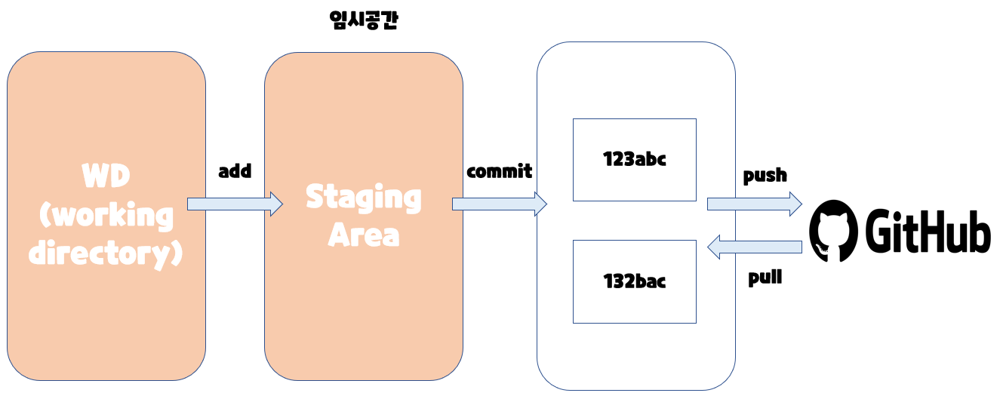
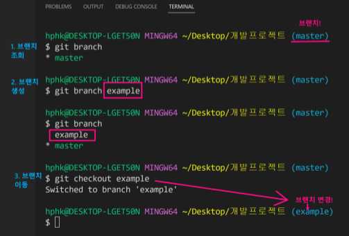

# Remind



모든 명령어 뒤에 상태를 확인하자!

> $ git status


***


# 저장소를 로컬에 복제


1. 클론(clone)하면 원격저장소 이름의 폴더가 생성

   - `$ git clone <주소>`

2. 클론은 깃 저장소를 가져옴

3. 압축파일로 받으면 최신버전의 파일/폴더만 가져옴

4. 클론은 .git과 master가 없음

   => **무조건 clone 해야한다**


# 협업

## Git Flow

> Git을 활용하여 협업하는 흐름으로 `branch`를 활용하는 전략을 의미

=> 독립적인 버전들을 만들어 나갈 수 있도록


### Branch merge

각 Branch에서 작업을 한 이후 이력을 합치기 위해서는 일반적으로 merge 명령어를 사용

병합을 진행할 때, 만약 서로 다른 이력(commit)에서 동일한 파일을 수정한 경우 충돌이 발생할 수 있다. 이 경우에은 반드시 직접 수정을 진행 해야 한다.

```bash
$ git branch (master) #브랜치 조회
* master

$ git branch example (master) #브랜치 생성

$ git barnch (master)
  example
* master

$ git checkout example (example) # 브랜치 변경
Switched to branch 'example'
```

​																										**VSCode에서**




​												**이후에 다시 barnch를 master로 변경하면 example.txt는 안보임**


```bash
#master에서
$ git merge example #master에서 example을 병합
```


### Branch merge -fast-forward

기존 master 브랜치에 변경사항이 없어 단순히 앞으로 이동


### Branch merge - merge commit

기존 master 브랜치에 변경사항이 있어 병합 커밋 발생

- 같은 파일 수정(=>충돌 해결)
- 수정 없으면 그냥 작업 하면 된다.


# Github 2가지 경우

## 1. Feature Barnch Workflow (저장소의 소유권이 있는 경우)

	1. 클론 명령어를 통해 저장소를 로컬에 복제
	2. 기능 추가를 위해 branch 생성 및 기능 구현(branch)
	3. 기능 구현 후 원격 저장소에 브랜치 반영(push)
	4. Pull Request
	5. 병합 완료, 병합 완료 후 브랜치 삭제
	6. master 브랜치로 switch
	7. 병합된 master의 내용을 pull
	8. 원격 저장소에 병합 완료 된 로컬 브랜치 삭제
	9. Branch 생정 및 과정 반복


## 2. Forking Workflow (저장소의 소유권이 없는 경우)


	1. 소유권이 없는 원격 저장소를 fork를 통해 복제
	2. 추후 로컬 저장소를 원본 원격 저장소와 동기화하기 위해 URL을 연결
	3. 기능 추가를 위해 branch 생성 및 기능 구현
	4. 기능 구현 후 원격 저장소에 브랜치 반영(push)
	5. Pull Request
	6. 병합 완료 된 브랜치 삭제
	7. master 브랜치로 switch
	8. 병합된 master의 내용을 pull
	9. 원격 저장소에서 병합 완료 된 로컬 브랜치 삭제
	10. 새로운 기능 추가를 위해 branch 생성 및 과정 반복


