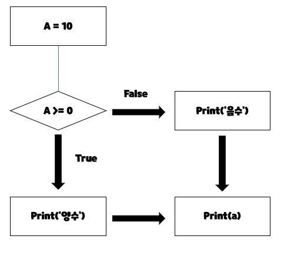
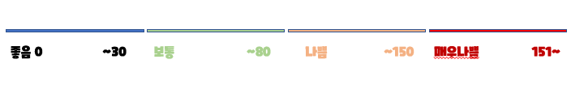
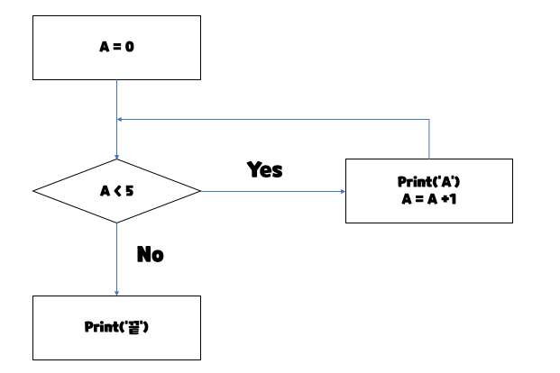
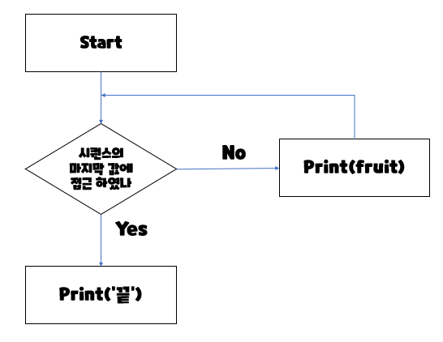

# 제어문

## 제어문이란

- 파이썬은 기본적으로 위에서부터 아래로 순차적으로 명령을 수행
- 특정 상황에 따라 코드를 선택적으로 실행(분기/조건)하거나 계속하여 실행(반복)하는 제어가 필요함
- 제어문은 순서도(flow chart)로 표현이 가능


# 조건문 

## 조건문 

- 조건문은 참/거짓을 판단할 수 있는 조건식과 함께 사용


## 기본형식

- expression에는 참/거짓에 대한 조건식

  - 조건이 참인 경우 이후 들여쓰기 되어있는 코드 블럭을 실행

  - 이외에 경우 else 이후 들여쓰기 되어있는 코드 블럭을 실행

    - else는 선택적으로 활용 가능함

    ```python
    if < expression > :
        # Run this code block <- 참일때
    else:
    	# Run this Code block
    ```


## 예제



```python
a = 10
if a >= 0:
	print('양수') # True
else:
	print('음수')	# False
print(a)

```


## 실습 문제

- 조건물을 통해 변수 num의 값의 홀수/짝수 여부를 출력
  - 이때 num은 input을 통해 사용자로부터 입륵을 받으시오.

```python
num = int(input())
if num % 2 == 1:
	print('홀')
else:
	print('짝')
```


# 복수 조건문

## 복수의 조건식을 활용할 경우 elif를 활용하여 표현함

- 복수 조건문

```python
if <expression>:
    # Code block
elif <expression>:
    # Code block
elif <expression>:
    # Code block
elif <expression>:
    # Code block    
```


## 실습문제

- 다음은 미세먼지 농도에 따른 등급일 때,

  dust 값에 따라 등급을 출력하는 조건식을 작성




```python
dust = 80

if dust > 150:
	print('매우 나쁨')
elif dust > 80:
	print('나쁨')
elif dust > 30:
	print('보통')
else:
	print('좋음')
print('미세먼지 확인 완료')
```

<span style="color:red;font-weight:bold">조건식을 동시에 검사하는 것이 아니라 순차적으로 비교</span>


# 중첩 조건문

## 중첩 조건문

- 조건문은 다른 조건문에 중첩되어 사용될 수 있음

  - 들여쓰기를 유의하여 작성할 것

  ```python
  if <expression>:
  # Code block
  if <expression>:
  # Code block
  else:
  # Code block
  ```


## 실습 문제

- 아래의 코드에서 중첩조건문을 활용하여 미세먼지 농도(dust 값)이 300이 넘는 경우 ‘실외 활동을 자제하세요’를 추가적으로 출력하고 음수인 경우 ‘값이 잘못 되었습니다’를 출력하시오.

```python
dust = -10

if dust > 150:
	print('매우 나쁨')
	if dust > 300:
		print('실외 활동을 자제하세요.')
elif dust > 80:
	print('나쁨')
elif dust > 30:
	print('보통')
else:
	if dust >= 0:
		print('좋음')
	else:
		print('값이 잘못되었습니다.')
```


# 조건 표현식

## 조건 표현식이란?

- 조건 표현식을 일반적으로 조건에 따라 값을 정할 때 사용
  - 조건 표현식을 일반적으로 조건에 따라 값을 할당 할 때 활dyd

```python
<true인 경우 값> if <expression> else <false인 경우 값>
```


## 실습문제

- num이 정수일 때, 아래의 코드는 무엇을 위한 코드일까요?

  ```python
  	value = num if num >= 0 else -num
  #		  참일경우 <expression>    거짓일경우
  # 절대값을 저장하기 위한 코드
  ```

  

- 예시

```python
num = 2
if num % 2:
	result = '홀'
else:
	result = '짝'
print(result)
########################################같은 표현식
num = 2
result = '홀' if num % 2 else '짝'
print(result)

#######################################반대로 조건표현식 먼저
num = -5
value = num if num >= 0 else 0
print(value)
######################################조건문으로
num = -5
if num >= 0:
	value = num
else:
	value = 0
print(value)
```


# 반복문

## 반복문

- 특정 조건을 도달할 때까지, 계속 반복되는 일련의 문장

## 반복문의 종류

- while문
  - 종료조건에 해당하는 코드를 통해 반복문을 종료시켜야함
- for문
  - 반복가능한 객체를 모두 순회하면 종료 (별도의 종료조건이 필요 없음)
- 반복 제어
  - break, continue, for-else


# while

## while

- while문은 조건식이 참인 경우 반복적으로 코드를 실행

  - 조건이 참인 경우 들여쓰기 되어 있는 코드 블록이 실행됨

  - 코드 블록이 모두 실행되게, 다시 조건식을 검사하며 반복적으로 실행됨

  - while문은 무한 루프를 하지 않도록 종료조건이 반드시 필요

    ```python
    while <expression>:	#참일때
        # Code block
    ```


## 실습 예제 (아래의 순서도를 코드로 나타내기)




```python
a = 0
while a < 5:	#종료조건
	print(a)
	a += 1		#종료조건 - 반복 시행시 a가 계속 증가
print('끝')
```


# for문

## for

- for문은 시퀀스(string, tuple, list, range)를 포함한 순회가능한 객체(iterable)  요소를 모두 순회함

  - 처음부터 끝까지 모두 순회하므로 별도의 종료조건이 필요하지 않음

  ```python
  for <변수명> in <iterable>:
  # Code block
  ```

  

## 실습 예제(아래의 순서도를 코드로 나타내기)




```python
for fruit in ['apple', 'mango', 'banana']:
	print(fruit)
print('끝')
#apple
#mango
#banana
```


## For문 일반 형식

- Iterable
  - 순회할 수 있는 자료형(str,list, dict 등)
  - 순회형 함수(range, enumerate)


## 문자열 순회

- 사용자가 입력한 문자를 한 글자씩 세로로 출력하시오.

```python
chars = input()	#hi
for char in chars:
	print(char)
# h
# i
```

- range를 활용

```python
chars = input() #hi
for idx in range(len(chars)):
	print(chars[idx])
# h
# i
```

- enumerate 순회

  - 인덱스와 객체를 쌍으로 담은 열거형(enumerate) 객체 반환

    - (index, value) 형태의 tuple로 구성된 열거 객체를 반환

    ```python
    members = ['민수', '영희', '철수']
    
    for i in range(len(members)):
    	print(f’{i} {members[i]}')         
    for i, member in enumerate(members):
    	print(i, member)
    
    enumerate(members)
    # <enumerate at 0x105d3e100>
    list(enumerate(members))
    # [(0, '민수'), (1, '영희'), (2, '철수')]	숫자와 값의 튜플
    list(enumerate(members, start=1))
    # [(1, '민수'), (2, '영희'), (3, '철수')	
    #기본값 0, start를 지정하면 해당 값부터 순차적으로 증가
    ```

    

- 딕셔너리 순회

  - 딕셔너리는 기본적으로 key를 순회하며, key를 통해 값을 활용

  ```python
  grades = {'john': 80, 'eric': 90}
  for name in grades:
  	print(name)
  # john    
  # eric
  
  grades = {'john': 80, 'eric': 90}
  for name in grades:
  	print(name, grades[name])
  # john 80 
  # eric 90


# 반복문 제어

## 반복문 제어

- break
  - 반복문을 종료
- continue
  - continue 이후의 코드 블록은 수행하지 않고, 다음 반복을 수행
- for-else
  - 끝까지 반복문을 실행한 이후에 else문 실행
    - break를 통해 중간에 종료되는 경우 else 문은 실행되지 않음


## break

- break문을 만나면 반복문은 종료됨

```python
n = 0
while True:
	if n == 3:
		break
	print(n)
	n += 1
# 0
# 1
# 2
#########################################
for i in range(10):
	if i > 1:
		print('0과 1만 필요해!')
		break
	print(i)
# 0
# 1
# 0과 1만 필요해
```


## continue

```python
for i in range(6):
if i % 2 == 0:
continue
print(i)

# 1
# 3
# 5
```

<span style="color:red;font-weight:bold">continue를 만나면, 이후 코드인 print(i)가 실행되지 않고 바로 다음 반복을 시행</span>


## for-else

```python
for char in 'apple':
	if char == 'b':
		print('b!')
		break
else:
	print('b가 없습니다.')
# b가 없습니다.
##############################
for char in 'banana':
	if char == 'b':
		print('b!')
		break
else:
	print('b가 없습니다.')
# b!
```

<span style="color:red;font-weight:bold">else 문은 break로 중단되었는지 여부에 따라 실행</span>


