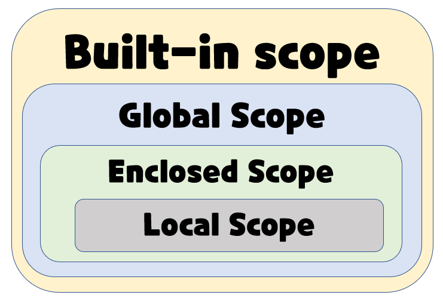

# 함수

Decomposition - 기능을 분해, 재사용 가능

Abstraction - 복잡한 내용을 숨기고, 기능에 집중하여 사용할 수 있음.(블랙박스)

​													재사용성, 가독성, 생산성

추상 - 사물이 지니고 있는 여러 가지 측면 가운데서 특정한 측면만을 가려내어 포착하는 것

함수(function) - 기능


## 함수의 정의

- 함수(Function)
  - 특정한 기능을 하는 코드의 조각(묶음)
  - 특정 명령을 수행하는 코드를 매번 다시 작성하지 않고, 필요 시에만 호출하여 간편히 사용 
  
  - [내장함수]([내장 함수 — Python 3.10.5 문서](https://docs.python.org/ko/3/library/functions.html))

- 사용자 함수
  - 구현되어 있는 함수가 없는 경우, 사용자가 직접 함수를 작성 가능
  
  ```python
  def function_name(parameter):
  	# code block
  	return returning_value
  ```


## 함수를 사용해야 하는 이유

- 내장함수(Built-in Function) 활용
  - sum, len ...등
- pstdev 함수 (파이썬 표준 라이브러리 - statistics)
  - 코드 중복 방지, 재사용 용이


## 함수 기본 구조

- 선언과 호출(define & call)
- 입력(input)
- 범위(scope)
- 결과값(output)


## 선언과 호출

- 함수의 선언은 def 키워드를 활용함
- 들여쓰기를 통해 Function body(실행될 코드 블록)를 작성함
  - Docstring은 함수 body 앞에 선택적으로 작성 가능
  - 작성시에는 반드시 첫 번째 문장에 문자열 ''' '''

- 함수는 parameter를 넘겨줄 수 있음
- 함수는 동작 후에 return을 통해 결과값을 전달함


## 선언 및 호출

- 함수는 함수명 () 으로 호출

  - parameter가 있는 경우, 함수명(값1, 값2, ...)로 호출

    ```python
    # 선언
    def foo():
        return True
    # 호출 
    foo()
    ################################
    # 예시
    def add(x, y):
        return x + y
    add (2,3)
    ```

    

## 예시

```python
num1 = 0
num2 = 1

def func1(a, b):
	return a + b
def func2(a, b):
	return a - b
def func3(a, b):
    return func1(a, 5) + func2(5, b)
result = func3(num1, num2)
print(result)
# 9
```

[Python Tutor를 이용한 과정 보기](https://pythontutor.com/visualize.html#mode=edit)


# 함수의 결과값(Output)

## return

- 함수는 반드시 값을 하나만 return 한다.
  - 명시적인 return이 없는 경우에도 None을 반환한다.
- 함수는 return과 동시에 실행이 종료된다.


```python
# 절대로 실행되지 않는 return
def minus_and_product(x, y):
	return x - y
	return x * y
minus_and_product(4, 5)
# -1
# 한개의 함수에는 반드시 하나만 리턴

#############################
# return문을 한번만 사용하면서 두 개 이상의 값을 반환하는 방법
def minus_and_product(x, y):
	return x - y, x * y
minus_and_product(4, 5)
# (-1, 20)
```


## return vs print

- return은 함수 안에서 값을 반환하기 위해 사용되는 키워드
- print는 출력을 위해 사용되는 함수


# 함수의 입력

## parameter vs argument

- parameter : 함수를 실행할 때, 함수 내부에서 사용되는식별자
- argument : 함수를 호출 할 때, 넣어주는 값

```python
def function(ham): # parameter : ham
	return ham
function('spam') # argument: 'spam'
```


## argument

- Argument란?
  - 함수 호출 시 함수의 parameter를 통해 전돨되는 값
  - Argument는 소괄호 안에 할당 func_name(argument)
    - 필수 Argument : 반드시 전달되어야 하는 argument
    - 선택 Argument : 값을 전달하지 않아도 되는 경우는 기본 값이 전달


## positional arguments

- 기본적으로 함수 호출 시 Argument는 **위치**에 따라 함수 내에 전달됨

```python
def add(x, y):				add(2, 3)
    return x + y
```


## keyword arguments

- 직접 변수의 이름으로 특정 Argument를 전달할 수 있음
- Keyword Argument 다음에 Positional Argument를 활용할 수 없음

```python
def add(x, y):				add(x=2, y=5)
    return x + y			add(2, y=5)
							#add(x=2, 5)
    						#이건에러(positional arguments뒤에 keyword arguments가 올 수 없다)
```


## Default Arguments Values

- 기본값을 지정하여 함수 호출 시 argument 값을 설정하지 않도록 함
  - 정의된 것 보다 더 적은 개수의 argument들로 호출 될 수 있음

```python
def add(x, y=0):			add(2)
    return x + y
```


## 정해지지 않은 개수의 keywor arguments

- 여러 개의 Positional Argument를 하나의 필수 parameter로 받아서 사용
  - 몇 개의 Positional Argument를 받을지 모르는 함수를 정의할 때 유용

- Argument들은 튜플로 묶여 처리되며, parameter에 *를 붙여 표현

```python
def add(*args):				add(2)
    for arg in args:		add(2, 3, 4, 5)
        print arg
```


- 함수가 임의의 개수 Argument를 Keyword Argument로 호출될 수 있도록 지정
- Argument들은 딕셔너리로 묶여 처리되며, parameter에 **를 붙여 표현

```python
def family(**kwargs):
	for key, value in kwargs:
		print(key, ":", value)
####################################
def family(**kwargs):
	for father, value in kwargs.items():
		print(father, ":", value)
family(father='john', mother='jane')
# father : john
# mother : jane
```


# 함수의 범위

## 함수의 scope

- 함수는 코드 내부에 local scope를 생성하며, 그 외의 공간인 global scope로 구분
- scope
  - global scope : 코드 어디에서든 참조할 수 있는 공간
  - local scope : 함수가 만든 scope. 함수 내부에서만 참조 가능
- variable
  - global variable : global scope에 정의된 변수
  - local variable : local scope에 정의된 변수


## 객체 생명주기

- 객체는 각자의 수명주기(lifecycle)가 존재

  - built-in scope(print, sum, len...- 원래 내장되어있는거)
    - 파이썬이 실행된 이후부터 영원히 유지
  - global scope
    - 모듈이 호출된 시점 이후 혹은 인터프리터가 끝날 때까지 유지
  - local scope
    - 함수가 호출될 때 생성되고, 함수가 종료될 때까지 유지
- 예시

```python
def func():
	a = 20
	print('local', a)
func()
print('global', a)
# local 20
# a는 Local scope에서만 존재
```


## 이름 검색 규칙(Name Resolution) 

- 파이썬에서 사용되는 이름(식별자)들은 이름공간(name space)에 저장되어 있음
- 아래와 같은 순서로 이름을 찾아나가며,LEGB Rule이라고 부름
  - Local scope : 함수
  - Enclosed scope : 특정 함수의 상위 함수
  - Global scope : 함수 밖의 변수, Import 모듈
  - Built-in scope : 파이썬 안에 내장되어 있는 함수 또는 속성

- 즉, 함수 내에서는 바깥 Scope의 변수에 접근 가능하나 수정은 할 수 없음





# 함수 응용

## 내장 함수 응용

- 파이썬 인터프리터에는 사용할 수 있는 많은 함수와 형(type)이 내장되어 있음

## map

- map(function, iterable)

  - 순회 가능한 데이터구조(iterable)의 모든 요소에 함수(function)적용하고, 그 결과를 map object로 반환

    => 어떤 함수를 반복가능한 것들의 요소에 모두 적용시킨 결과!

```python
numbers = ['1', '2', '3']

# 숫자로 바꿔서 쓰고 싶다?
# 리스트를 숫자로 형 변환은 불가능하다.
# 다만, 숫자 형태의 문자를 변환할 수는 있다.
# n = int(numbers)

# 밑에처럼은 가능! 하지만, 100개, 100개 일때는?
a = int(numbers[0])
b = int(numbers[1])
c = int(numbers[2])

# 반복문!
new_numbers = []
for number in numbers:
    new_numbers.append(int(number))
print(new_numbers)
# [1, 2, 3] (원래는 ['1', '2', '3'])

# map!
new_numbers = map(int, numbers)
print(new_numbers) # <map object at ~~~~~> : 이미 함수가 모두 적용 
print(list(new_numbers)) #리스트로 형변환해서보면 바뀌어있다.
# [1, 2, 3]
```


## map

- 알고리즘 문제 풀이시


