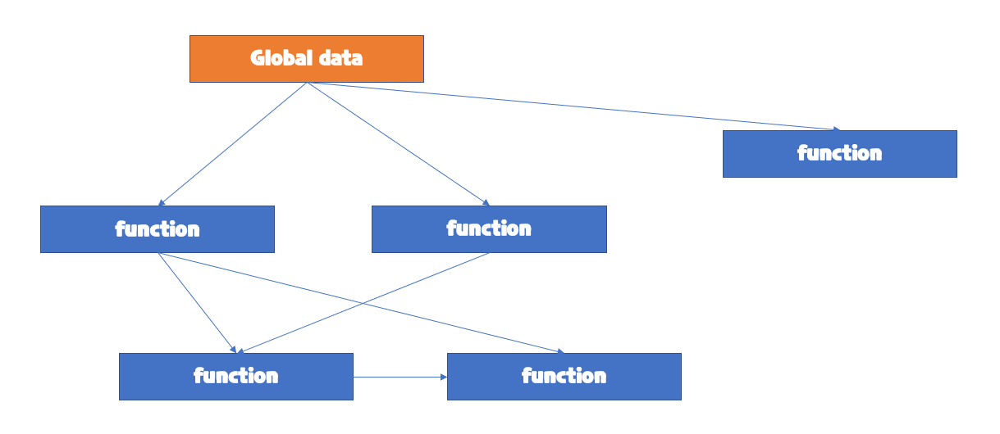

# OOP

> 파이썬은 모든 것이 객체(object)로 이루어짐.


객체(컴퓨터 과학)

- 컴퓨터 과학에서 객체 또는 오브젝트는 클래스에서 정의한 것을 토대로 메모리

객체지향 프로그래밍

- 객체지향 프로그래밍은 컴퓨터 프로그래밍의 패러다임 중 하나이다
- 객체 지향 프로그래밍은 컴퓨터 프로그램을 명령어의 목록으로 보는 시각에서 벗어나
- 여러 개의 독립된 단위, 즉, 객체들의 모임으로 파악하고자 하는 것이다. 
- 각각의 객체는 메시지를 주고받고, 데이터를 처리할 수 있다.


객체는 특정 타입(클래스)의 인스턴스(사례,예시)이다.

- 123, 900, 5는 모드 int의 인스턴스
- 'hello', 'bye'는 모두 string의 인스턴스
- [232,89,1],[]은 모두 list의 인스턴스


## 객체

- 객체의 특징
  - 타입(type) : 어떤 연산자와 조직이 가능한가?
  - 속성(attribute) : 어떤 상태(데이터)를 가지는가?
  - 조작법(method) : 어떤 행위(함수)를 할 수 있는가?
- 객체지향 프로그래밍이란?
  - 프로그램 여러 개의 독립된 객체들과 그 객체들 간의 상호작용으로 파악하는 프로그래밍 방법


## 절차지향 프로그래밍




<span style="color:red;font-weight:bold">데이터와 함수로 인한 변화</span>


## 객체 지향 프로그램


<span style="color:red;font-weight:bold">데이터와 기능(메소드) 분리, 추상화된 구조(인터페이스)</span>


- 현실 세계를 프로그램 설계에 반영(추상화)

  ```python
  class Person:
  	def __init__(self, name, gender):
  		self.name = name
  		self.gender = gender
  	def greeting_message(self):
  		return f'안녕하세요, {self.name}입니다.'
  jimin = Person('지민', '남')
  print(jimin.greeting_message())
  # 안녕하세요, 지민입니다.
  jieun = Person('지은', '여')
  print(jieun.greeting_message())
  # 안녕하세요, 지은입니다.
  ```

  

## 예시 - 사각형 넓이 구하기 코드

- 절차지향 프로그래밍

```python
def area(x, y):
    return x * y
def circumference(x, y):
    return 2 * (x + y)
a = 10
b = 30
c = 300
d = 20
suqare1_area = area(a,b)
square1_circumference = circumference(a,b)
suqare2_area = area(a,b)
square2_circumference = circumference(a,b)
```

- 객체지향 프로그래밍

```python
class Rectangle:
    def __inin__(self, x, y):
        self.x = x
        self.y = y
    def area(self):
        return self.x * self.y
    def circumference(self):
        return 2 * (self.x + self.y)
r1 = Rectangle(10, 30)
r1.area()
r1.circumference()

r2 = Rectangle(300, 20)
r2.area()
r2.circumference()
```


- 사각형 - 클래스(class)
- 각 사각형 (R1,R2) – 인스턴스(instance)
- 사각형의 정보 - 속성(attribute) 
  -  가로 길이, 세로 길이
- 사각형의 행동/기능 – 메소드(method)
  - 넓이를 구한다. 높이를 구한다.


## 객체지향의 장점(위키피디아)

- 객체 지향 프로그래밍은 프로그램을 유연하고 변경이 용이하게 만들기 때문에 대규모 소프트웨어 개발에 많이 사용된다.
- 또한, 프로그래밍을 더 배우기 쉽게 하고 소프트웨어 개발과 보수를 간편하게 하며, 보다 직관적인 코드 분석을 가능하게 하는 장점을 가지고 있다.


# OOP 기초

## 기본 문법

```python
# 클래스 정의
class Myclass:
    pass
# 인스턴스 생성
my_instance = MyClass()
# 메서드 호출
my_instance.my_method()
# 속성
my_instance.my_attribute
```

- 객체의 틀(클래스)을 가지고, 객체(인스턴스)를 생성한다.


- 클래스와 인스턴스

  - 클래스 : 객체들의 분류(class)
  - 인스턴스 : 하나하나의 실체/예(instance)

  ```python
  class Person:
  	pass
  print(type(Person))
  # type
  p1 = Person() 
  type(p1)
  # __main__.Person
  isinstance(person1, Person)
  # True
  ```

<span style="color:red;font-weight:bold">파이썬은 모든 것이 객체, 모든 객체는 특정 타입의 인스턴스</span>

- 속성

  - 특정 데이터 타입/클래스의 객체들이 가지게 될 상태/데이터를 의미

  ```python
  class Person:
      def __init__(self, name):
          self.name = name
  person1 = Person('지민')
  print(person1.name)
  #'지민'
  ```

- 메소드

  - 특정 데이터 타입/클래스의 객체에 공통적으로 적용 가능한 행위(함수)

  ```python
  class Person:
      def talk(self):
          print('안녕')
      def talk(self, food):
          print(f'{food}를 냠냠')
          
  person1 = Person()
  print(person1.talk())
  # 안녕
  print(person1.eat('피자'))
  # 피자를 냠냠
  print(person1.eat('치킨'))
  # 치킨을 냠냠
  ```

- 객체 비교하기

  - ==
    - 동등한(equal)
    - 변수가 참조하는 객체가 동등한(내용이 같은) 경우 True
    - 두 객체가 같아 보이지만 실제로 동일한 대상을 가리키고 있다고 확인해 준 것은 아님
  - is
    - 동일한(identical)
    - 두 변수가 동일한 객체를 가리키는 경우 True 

- 객체 비교하기

  ```python
  a = [1, 2, 3]
  b = [1, 2, 3]
  print(a ==b, a is b)
  # True False
  
  a = [1, 2, 3]
  b = a
  print(a ==b, a is b)
  # True True
  ```

- 인스턴스 변수

  - 인스턴스가 개인적으로 가지고 있는 속성(attribute)
  - 각 인스턴스들의 고유한 변수

- 생성자 메소드에서 self.으로 정의

- 인스턴스가 생성된 이후 .으로 접근 및 할당

```python
class Person:
    def __init__(self, name):
        self.name = name	# 인스턴스 변수 정의
john = person('john')
print(person1.name)		# 인스턴스 변수 접근
# john
john.name = '지민'	#인스턴스 변수 접근 및 할당	
print(john.name)	
# 지민
```

- 인스턴스 메소드
  - 인스턴스 변수를 사용하거나, 인스턴스 변수에 값을 설정하는 메소드
  - 클래스 내부에 정의되는 메소드의 기본
  - 호출 시, 첫번째 인자로 인스턴스 자기자신(self)이 전달됨
- self
  - 인스턴스 자기자신
  - 파이썬에서 인스턴스 메소드는 호출 시 첫번째 인자로 인스턴스 자신이 전달되게 설계
    - 매개변수 이름으로 self를 첫번째 인자로 정의
    - 다른 단어로 써도 작동하지만, 파이썬의 암묵적인 규칙

- 생성자(constructor) 메소드
  - 인스턴스 객체가 생성될 때 자동으로 호출되는 메소드
  - 인스턴스 변수들의 초기값을 설정
    - 인스턴스 생성
    - `__init__`메소드 자동 호출

- 소멸자(destructor) 메소드
  - 인스턴스 객체가 소멸(파괴)되기 직전에 호출되는 메소드
