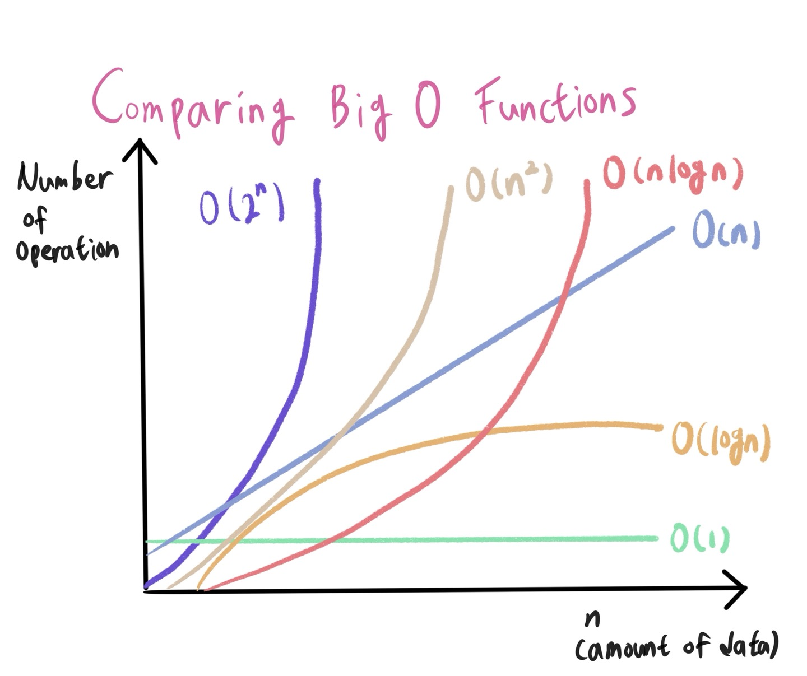

# 알고리즘의 시간 복잡도

## 🤔좋은 알고리즘이란 무엇일까?

== 🤔 효율성이 좋은 알고리즘?

== 🤔 성능이 좋은 알고리즘?

== ✔Input을 넣은 후 Output이 나오는 시간이 짧은 알고리즘!

## ⏰알고리즘의 소요 시간 측정하기

1. 개개인의 컴퓨팅 환경에 따라 같은 알고리즘이라도 측정 시간이 다르다

   환경에 영향을 받지 않는 개관적인 기준이 필요하다!

2. Input =====> Algorithm =====> Output

   객관적인 측정을 위해 알고리즘 내부에서 기본연산이 몇 번 일어나는지 살펴본다.

   기본연산 : 단위 시간 1이 소요되는 시간 ex) 할당, 산술, 비교, 반환...

   기본연산의 총 횟수 == 알고리즘 소요 시간

   ==> 따라서 성능을 측정할 때는 입력을 통일 시킨다

## 시간 복잡도

~~계산 복잡도 이론에서 시간 복잡도는 문제를 해결하는데 걸리는 시간과 입력의 함수 관계를 가리킨다~~

단순하게 알고리즘의 수행 시간을 의미한다고

시간 복잡도가 높다 => 느린 알고리즘

시간 복잡도가 낮다 => 빠른 알고리즘

## 빅오(Big-O) 표기법이란?

- 첫번째 사람 - count() ==> 6n + 4	=> O(n)

- 두번째 사람 - count() ==> 3n + 2	=> O(n)

- 세번째 사람 - count() ==> 3n2   + 6n + 1 => O(n2)

입력 n이 무한대로 커진다고 가정하고 시간 복잡도를 간단하게 표시하는 것

최고차항만 남기고 계수와 상수 제거

> O(1) : 단순 산술 계산(+, -, *, /)
>
> O(logN) : 크기 N인 리스트를 반절씩 순회/탐색 (이진탐색, 분할정복)
>
> O(N) : 크긴 N인 리스트를 순회 (1중 for문)
>
> O(NlogN) : 크기 N인 리스트를 반절씩 탐색 * 순회 (Merge/Quick/ Heap Sort)
>
> O(N2) : 크기 M, N인 2중 리스트를 순회 (2중 for문)
>
> O(N3) : 3중 리스트를 순회 (3중 for문)
>
> O(2N) : 크기 N 집합의 부분 집합
>
> O(N!) : 크기 N 리스트의 순열

## 내장 함수, 메소드의 시간 복잡도도 확인할 필요가 있다.

- for문이 1번이라고 해서 무조건 O(n)인 것은 아니다.
- for문 안에 O(n)의 내장 함수를 사용했다면
- 사실상 이중 for문과 다를 것이 없기 때문이다.

# 리스트

1. 배열 vs 연결리스트
2. 파이썬의 리스트

# 배열 vs 연결리스트

배열(Array)

> 여러 데이터들이 연속된 메모리 공간에 저장되어 있는 자료구조

- 인덱스를 통해 데이터에 빠르게 접근
- 배열의 길이는 변경 불가능 => 길이를 변경하고 싶다면 새로 생성
- 데이터 타입은 고정

| 메모리 주소 | 1000 | 1004 | 1008 | 1012 | 1016 |
| ----------- | ---- | ---- | ---- | ---- | ---- |
| 데이터      | 70   | 80   | 20   | 100  | 90   |
| 인덱스      | A[0] | A[1] | A[2] | A[3] | A[4] |

연결리스트(Linked List)

> 데이터가 담긴 여러 노드들이 순차적으로 연결된 형태의 자료구조

- 맨 처음 노드부터 순차적으로 탐색
- 연결리스트의 길이 자유롭게 변경 가능 => 삽입, 삭제가 편리
- 다양한 데이터 타입 저장
- 데이터가 메모리에 연속적으로 저장되지 않음

**파이썬의 리스트(List)**

배열의 인덱스 접근의 장점과 연결리스트의 가변길이의 장점을 모두 가지고 있다.

## 파이썬 리스트의 메소드

1) .append() - 리스트 맨 끝에 새로운 원소 삽입

2) .pop() - 특정 인덱스에 있는 원소를 삭제 및 반환

3) .count() - 리스트에서 해당 원소의 개수를 반환

4) .index() - 리스트에서 처음으로 원소가 등장하는 인덱스 반환

5) .sort() - 리스트를 오름차순으로 정렬

   reverse = True 옵션을 통해 내림차순으로 정렬 가능

6) .reverse() - 리스트의 원소들의 순서를 거꾸로 뒤집기

## 자주 쓰이는 리스트 관련 내장함수

1) len() - 리스트의 길이(원소의 개수)를 반환

2) sum() - 리스트의 모든 원소의 합을 반환

3) max() - 리스트의 원소 중 최대값을 반환

4) min() - 리스트의 원소 중 최소값을 반환

5) sorted() - 오름차순으로 정렬된 새로운 리스트 반환

   원본 리스트는 변화 없음

6) reversed() - 리스트의 순서를 거꾸로 뒤집은 새로운 객체 반환

   원본 리스트는 변화 없음

