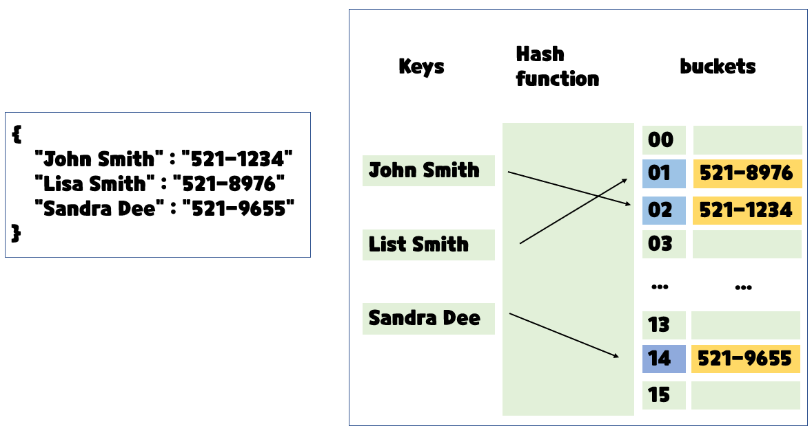

# 딕셔녀리(Dictionary)

1. 해시 테이블
2. 딕셔너리 기본 문법
3. 딕셔너리 메소드


## 해시 테이블

- 파이썬에는 딕셔너리(dict) 자료구조가 내장 되어 있다

​							Non-squence & Key-Value

```python
{
    "name" : "kyle",
    "gender" : "male",
    "address" : "Seoul"
}
# Key는 immutable(변경 불가능)
```


해시 함수 : 임의 길이의 데이터를 고정 길이의 데이터로 매핑하는 함수

해시 : 해시 함수를 통해 얻어진 값




파이썬의 딕셔너리의 특징

해시 함수와 해시 테이블을 이용하기 때문에

삽입, 삭제, 수정, 조회 연산의 속도가 리스트보다 빠르다

(Hash function을 이용한 산술 계산으로 값이 있는 위치를 바로 알 수 있기 때문에)


### ⏰딕셔너리 연산의 시간 복잡도

| 연산종류    | 시간복잡도 |
| ----------- | ---------- |
| Get Item    | O(1)       |
| Insert Item | O(1)       |
| Update Item | O(1)       |
| Delete Item | O(1)       |
| Search Item | O(1)       |

### 🆚파이썬 리스트와 딕셔너리 비교

| 연산종류    | 딕셔너리 | 리스트         |
| ----------- | -------- | -------------- |
| Get Item    | O(1)     | O(1)           |
| Insert Item | O(1)     | O(1) 또는 O(N) |
| Update Item | O(1)     | O(1)           |
| Delete Item | O(1)     | O(1) 또는 O(N) |
| Search Item | O(1)     | O(N)           |


### 🤔딕셔너리는 언제 사용해야할까?

1. 리스트를 사용하기 힘든 경우
2. 데이터에 대한 빠른 접근 탐색이 필요한 경우
3. (현실 세계의 대부분의 데이터를 다룰 경우)


## 딕셔너리 기본문법

### 기본적인 딕셔너리 사용법 (선언)

변수 = {key1 : value, key2 : value2 ...}

```python
a = {
    "name" : "kyle",
    "gender" : "male",
    "address" : "Seoul"
}
print(a)
# {'name' : 'kyle', 'gender' : 'male', 'adderss' : 'Seoul'}
```


### 기본적인 딕셔너리 사용법 (삽입/ 수정)

딕셔너리[key] = value

내부에 해당 key가 없으면 삽입, 있으면 수정

```python
# 삽입
a = {
    "name" : "kyle",
    "gender" : "male",
    "address" : "Seoul"
}

a["job"] = 'coach'

print(a)
# {'name' : 'kyle', 'gender' : 'male', 'adderss' : 'Seoul', 'job' : 'coach'}

# 수정
a = {
    "name" : "kyle",
    "gender" : "male",
    "address" : "Seoul"
}

a['name'] = 'justin'

print(a)
# {'name' : 'justin', 'gender' : 'male', 'adderss' : 'Seoul'}
```


### 기본적인 딕셔너리 사용법 (삭제)

딕셔너리.pop(key)

내부에 존재하는 key에 대한 value 삭제 및 반환, 존재하지 않는 key에 대해서는 KeyError 발생

```python
a = {
    "name" : "kyle",
    "gender" : "male",
    "address" : "Seoul"
}

gender = a.pop('gender')

print(a)
print(gender)
# {'name' : 'justin', 'adderss' : 'Seoul'}
# male

a = {
    "name" : "kyle",
    "gender" : "male",
    "address" : "Seoul"
}

phone = a.pop('phone')
print(a)
print(phone)
# ------------------------------------
# KeyError
```


### 기본적인 딕셔너리 사용법 (조회)

key에 해당하는 value 반환

**.get()을 사용했을때와 안했을때의 차이 비교**

```python
# 딕셔너리[key]
a = {
    "name" : "kyle",
    "gender" : "male",
    "address" : "Seoul"
}

print(a["name"])
# kyle
print(a["phone"])
# KeyError
# 딕셔너리 안에 없는 걸 입력했을 때 keyerror

# 딕셔너리.get(key, default)
a = {
    "name" : "kyle",
    "gender" : "male",
    "address" : "Seoul"
}

print(a.get("name"))
# kyle
print(a.get('phone','없음'))
# 없음
# 원래는 None이라고 나오지만
# 없음이라고 정해줘서 결과는 없음이라고 뜸
# .get()은 에러가 뜨진 않음
```


## 딕셔너리 메소드

1)  .keys()
2)  .values()
3)  .items()


### .keys()

딕셔너리의 key 목록이 담긴 dict_keys 객체 반환

```python
a = {
    "name" : "kyle",
    "gender" : "male",
    "address" : "Seoul"
}

print(a.keys())
# dict_keys(['name', 'gender', 'address'])

#-------------------------------------------#
a = {
    "name" : "kyle",
    "gender" : "male",
    "address" : "Seoul"
}

for key in a.keys():
    print(key)
# name
# gender
# address

#-------------------------------------------#
a = {
    "name" : "kyle",
    "gender" : "male",
    "address" : "Seoul"
}
for key in a:
    print(key)
# name
# gender
# address
```


### .values()

딕셔너리의 value 목록이 담신 dict_values 객체 반환

```python
a = {
    "name" : "kyle",
    "gender" : "male",
    "address" : "Seoul"
}

print(a.values())
# dict_values(['kyle', 'male', 'Seoul'])

#-------------------------------------------#
a = {
    "name" : "kyle",
    "gender" : "male",
    "address" : "Seoul"
}
for value in a.values():
    print(value)
# kyle
# male
# Seoul
```


### .items()

딕셔너리의 (key, value) 쌍 목록이 담긴 dict_items 객체 반환

```python
a = {
    "name" : "kyle",
    "gender" : "male",
    "address" : "Seoul"
}

print(a.items())
# dict_items[('name', 'kyle'), ('gender', 'male'), ('address', 'Seoul')]

#-------------------------------------------#
a = {
    "name" : "kyle",
    "gender" : "male",
    "address" : "Seoul"
}
for item in a.items():
    print(item)
# {'name', 'kyle'}
# {'gender', 'male'}
# {'address', 'Seoul'}

#-------------------------------------------#
a = {
    "name" : "kyle",
    "gender" : "male",
    "address" : "Seoul"
}
for key, value in a.items():
    print(key, value)
# name kyle
# gender male
# address Seoul
```


### 활용연습 -1 (게임명 : 캐릭터 조회)

```python
game = {
    "Pokemon" : 'Pikachu',
    "Digimon" : 'Agumon',
    "Yugioh" : "Black Magician"
}

user_input = input()

print(game[user_input])
# input() 값에 Pokemon(Digimon, Yugioh)을 입력하면
# Pikachu(Agumon, Black Magician)가 출력됨

# Plus (그 외에 게임을 입력했을 때)
# print(game.get[user_input],'i do not know')
# 예외처리
```


### 활용연습 -2 (나라명 : 수도)

```python
data = {}

# 정수 입력받고 해당 수 만큼 나라명, 수도 입력받을 예정
number = int(input()) 

for _ in range(number):
    user_input = input()
    # name_capital
    # ex) korea seoul

    user_input_list = user_input.split()
    # => ["korea", "seoul"]

    data[user_input_list[0]] = user_input_list[1]
    # data["korea"] = "seoul"

user_answer = input()
# korea

print(data.get(user_answer,'Unknown Country'))
# data["korea"]
```


### 활용연습 -3 (파울 최소 인원)

```python
user_input = ['jay', 'john', 'john', 'jay', 'jack', 'john']

from collections import Counter

print(Counter(user_input).most_common())

# 카운터 함수 목록
# print(dir(Counter(user_input)))


```


