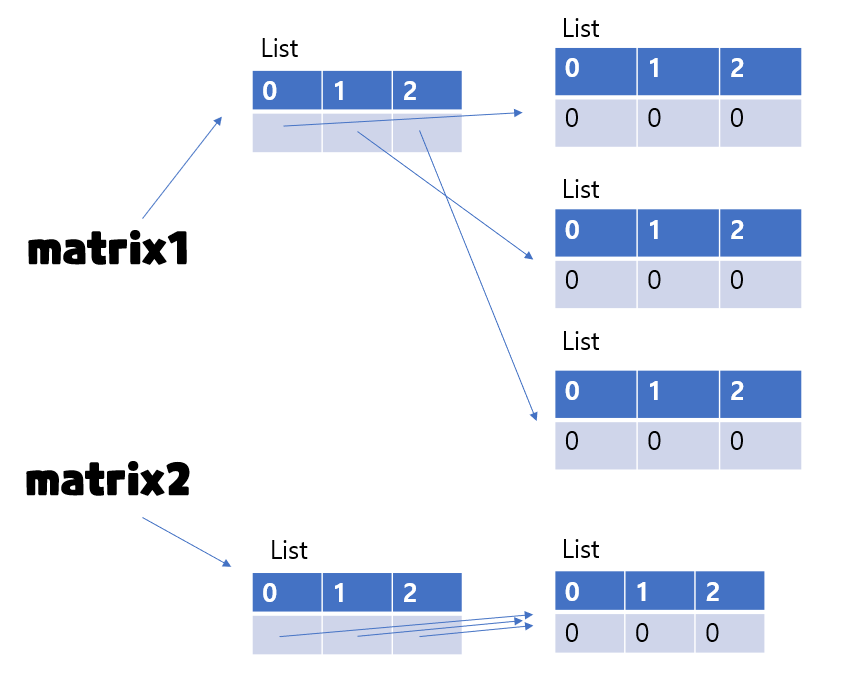
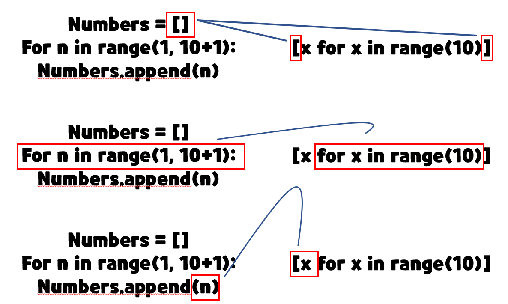

# 이차원 리스트

이차원 리스트는 리스트를 원소로 가지는 리스트일 뿐이다

이차원 리스트는 행렬이다

```python
matrix = [[1, 2, 3], [4, 5, 6], [7, 8, 9]]
# 보기좋게 변경하면 행렬의 형태가 나온다
matrix = [
    [1, 2, 3], 
    [4, 5, 6], 
    [7, 8, 9]
]

print(matrix[0][0])
# 1
print(matrix[1][2])
# 6
print(matrix[2][0])
# 7
```

|  1   |  2   |  3   |
| :--: | :--: | :--: |
|  4   |  5   |  6   |
|  7   |  8   |  9   |


## ✏특정 값으로 초기화 된 이차원 리스트 만들기

1. 직접 작성 (4 x 3 행렬)

```python
matrix = [[1, 2, 3], [4, 5, 6], [7, 8, 9], [10, 11, 12]]

matrix = [
    [1, 2, 3], 
    [4, 5, 6], 
    [7, 8, 9],
    [10, 11, 12]
]
```


2. 100 x 100 행렬이라면? - 반복문으로 작성

```python
matrix = []
for _ in range(100):
    matrix.append([0] * 100)
print(matrix)
# pprint 사용하면 좀 더 깔끔하게 볼 수 있음
# from pprint import pprint
# pprint(matrix)
```


3. n x m 행렬 (리스트 컴프리헨션으로 작성)

```python
n = 4 # 행
m = 3 # 열
matrix = []

for _ in range(n):
    matrix.append([0] * m)
# 리스트 컴프리헨션
# matrix = [[0] * m for _ in range(n)] 
print(matrix)
# [[0, 0, 0], [0, 0, 0], [0, 0, 0], [0, 0, 0]]
```


4. ❗❗[주의]❗❗ 리스트 컴프리헨션 vs 리스트 곱셈 연산

```python
n = 4 # 행
m = 3 # 열

matrix1 = [[0] * m for _ in range(n)]
matrix2 = [[0] * m] * n

print(matrix1)
# [[0, 0, 0], [0, 0, 0], [0, 0, 0], [0, 0, 0]]
print(matrix2)
# [[0, 0, 0], [0, 0, 0], [0, 0, 0], [0, 0, 0]]

# matrix1, matrix2 똑같다??
# 밑에 해설
```



정답부터 말하면 **다르다!**

```python
matrix1[0][0] = 1
matrix2[0][0] = 1
print(matrix1)
# [[1, 0, 0], [0, 0, 0], [0, 0, 0], [0, 0, 0]]
print(matrix2)
# [[1, 0, 0], [1, 0, 0], [1, 0, 0], [1, 0, 0]]

# 특정 인덱스의 값을 변경하면 이렇게 변경된다.
```


## 입력 받기

1. 일단 초기화 
   1. 8 * 8 [0]
2. 입력을 그대로 2차원 리스트로

```python
matrix = []
for _ in range(8):
    line = list(input())
    matrix.append(line)
# 리스트 컴프리헨션을 통해 이차원 리스트의 입력을
# matrix = [list(input()) for _ in range(8)]
```




### 1. 행렬의 크기가 미리 주어지는 경우


```python
# 3 x 3 크기의 입력을 받아보자
# 1 2 3
# 4 5 6
# 7 8 9

matrix = []
for _ in range(3):
    line = list(map(int, input().split()))
    matrix.append(line)

# 컴프리헨션
matrix = [list(map(int, input().split())) for _ in range(3)]

```


### 2. 행렬의 크기가 입력으로 주어지는 경우

```python
n, m = map(int, input().split()) # 8 7
matrix = []
for _ in range(n):
	line = list(map(int, input().split()))
	matrix.append(line)
# 컴프리헨션
matrix = [list(map(int, input().split())) for _ in range(n)]
```

```python
# n x m 크기의 입력을 받아보자.

n, m = map(int, input().split()) # 3 4
matrix = [list(map(int, input().split())) for _ in range(n)]
```


