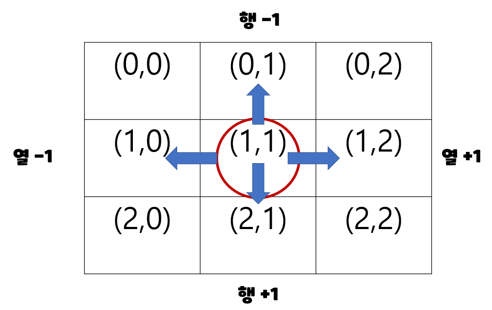
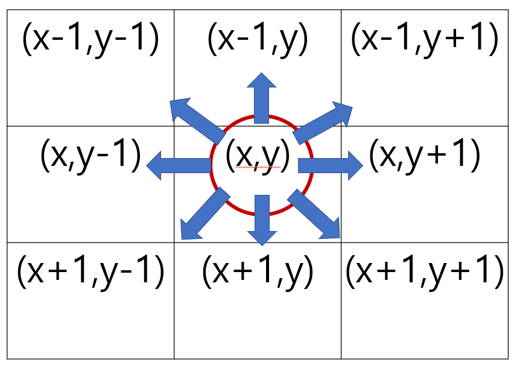

# 이차원리스트

## 회전

1. 왼쪽으로 90도 회전하기

```python
matrix = [
    [1, 2, 3],
    [4, 5, 6],
    [7, 8, 9]
]

n = 3
rotated_matrix = [[0] * n for _ in range(n)]

for i in range(n):
    for j in range(n):
        rotated_matrix[i][j] = matrix[j][n-i-1]
        
print(rotated_matrix)
# [
# 	[3, 6, 9],
# 	[2, 5, 8],
# 	[1, 4, 7] 
# ]
```

2. 오른쪽으로 90도 회전하기

```python
matrix = [
    [1, 2, 3],
    [4, 5, 6],
    [7, 8, 9]
]

n = 3
rotated_matrix = [[0] * n for _ in range(n)]

for i in range(n):
    for j in range(n):
        rotated_matrix[i][j] = matrix[n-j-1][i]
        
print(rotated_matrix)
# [
# 	[3, 6, 9],
# 	[2, 5, 8],
# 	[1, 4, 7] 
# ]
```


# 완전탐색 1 (Exhaustive Search)

1. 무식하게 풀기(Brute-force)
2. 델타 탐색(Delta Search)


## 무식하게 다해보기(Brute-force)

Brute-force는 모든 경우의 수를 탐색하여 문제를 해결하는 방식이다.

- 브루트포스(Brute-force)라고도 하며, 무식하게 밀어붙인다는 뜻이다.
- 가장 단순한 풀이 기법이며, 단순 조건문과 반복문을 이용해서 풀 수 있다.
- 복잡한 알고리즘 보다는, 아이디어를 어떻게 코드로 구현할 것인지가 중요하다.

ex) ♠[블랙잭](https://www.acmicpc.net/problem/2798)

```python
def blackjack(n, m, cards):
max_total = 0 # 현재 가장 큰 합
	# 완전탐색(Brute-force)
    for i in range(n - 2):
    	for j in range(i + 1, n - 1):
    		for k in range(j + 1, n):
				total = cards[i] + cards[j] + cards[k]
				# 현재 가장 큰 합보다는 크고, m을 넘지 않아야 갱신
				if max_total < total <= m:
					max_total = total
                # 합과 m이 같으면 더이상 탐색하는 의미가 없으므로 종료
                if total == m:
                	return total
return max_total
```


## 델타 탐색 (Delta Search)

- (0, 0)에서부터 이차원 리스트의 모든 원소를 순회하며(완전탐색) 각 지점에서 상하좌우에 위치한 다른 지점을 조회하거나 이동하는 방식이다.

- 이차원 리스트의 인덱스(좌표)의 조작을 통해서 상하좌우 탐색을 한다.

- 이때 행과 열의 변량인 -1, +1을 델타값이라 한다.



### 델타 값을 이용해 상하좌우로 이동하기

```python
# 1) 행을 x, 열을 y로 표현
dx = [-1, 1, 0, 0] 
dy = [0, 0, -1, 1]
#     위 아  왼  오
# 2) 행을 r, 열을 c로 표현
dr = [-1, 1, 0, 0]
dc = [0, 0, -1, 1]

# 행은 x혹은 r로 나타내고
# 열은 y혹은 c로 나타낸다

# 상(x-1, y)
nx = x + dx[0]
ny = y + dy[0]

# 하(x+1, y)
nx = x + dx[1]
ny = y + dy[1]

# 좌(x, y-1)
nx = x + dx[2]
ny = y + dy[2]

# 우(1, y+1)
nx = x + dx[3]
ny = y + dy[3]

# 상하좌우
# for 문을 이용해서 상하좌우 이동을 간단히 표현할 수 있다.
for i in range(4):
    nx = x + dx[i]
    ny = y + dy[i]
```


### 상하좌우로 이동 후 범위를 벗어나지 않는지 확인 및 갱신하기

```python
# 1. 델타값을 이용해 상하좌우 이동
for i in range(4):
    nx = x + dx[i]
    ny = y + dy[i]

# 2. 범위를 벗어나지 않으면 갱신
if 0 <= nx < 3 and 0<= ny < 3:
    x = nx
    y = ny
```


### 이차원 리스트의 상하좌우 탐색 정리

```python
# 1. 델타값 정의(상하좌우)
# 1) 델타설정
dx = [-1, 1, 0, 0] 
dy = [0, 0, -1, 1]

# 2. 이차원 리스트 순회
# 2) 델타 순회
for x in range(n):
    for y in range(m):
        
        # 3. 델타값을 이용해 상하좌우 이동
        for i in range(4):
            nx = x + dx[i]
    		ny = y + dy[i]
            
            # 4. 범위를 벗어나지 않으면 갱신
            # 3) 경계값
            if 0 <= nx < 3 and 0<= ny < 3:
    			x = nx
    			y = ny
```


### [참고] 상하좌우 + 대각선의 8방향 델타값

```python
# 상, 하, 좌, 우, 좌상, 좌하, 우상, 우하
dx = [-1, 1, 0, 0, -1, 1, -1, 1] 
dy = [0, 0, -1, 1 ,-1, -1, 1, 1]
```


