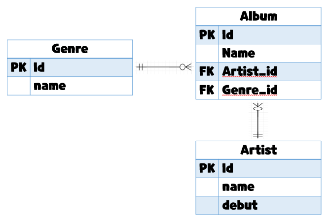

# QuerySet API

- gt
  
  ```python
  Entry.objects.filter(id__gt=4)
  -----------------------------------
  # 쿼리문 일시
  SELECT ... WHERE id > 4;
  ```

- gte
  
  ```python
  Entry.objects.filter(id__gte=4)
  -----------------------------------
  # 쿼리문 일시
  SELECT ... WHERE id >= 4;
  ```

- lt, lte
  
  ```python
  Entry.objects.filter(id__lt=4)
  Entry.objects.filter(id__lte=4)
  -----------------------------------
  # 쿼리문 일시
  SELECT ... WHERE id < 4;
  SELECT ... WHERE id <= 4;
  ```

- in
  
  ```python
  Entry.objects.filter(id__in=[1, 3, 4])
  Entry.objects.filter(headline__in='abc')
  -----------------------------------
  # 쿼리문 일시
  SELECT ... WHERE id IN (1, 3, 4);
  SELECT ... WHERE headline IN ('a', 'b', 'c');
  ```

- startswith
  
  ```python
  Entry.objects.filter(headline__startswith='Lennon')
  -----------------------------------
  # 쿼리문 일시
  SELECT ... WHERE headline LIKE 'Lennon%';
  ```

- istartswith
  
  ```python
  Entry.objects.filter(headline__istartswith='Lennon')
  -----------------------------------
  # 쿼리문 일시
  SELECT ... WHERE headline ILIKE 'Lennon%';
  ```

​                                                     **startswith 🆚  istartswith**

startswith - 대소문자 구분

istartswith - 대소문자 구분 안함

- endswith
  
  ```python
  Entry.objects.filter(headline__endswith='Lennon’)
  Entry.objects.filter(headline__iendswith='Lennon')
  -----------------------------------
  # 쿼리문 일시           
  SELECT ... WHERE headline LIKE '%Lennon';
  SELECT ... WHERE headline ILIKE '%Lennon';
  ```

- contains
  
  ```python
  Entry.objects.get(headline__contains='Lennon’)
  Entry.objects.get(headline__icontains='Lennon’)
  -----------------------------------
  # 쿼리문 일시          
  SELECT ... WHERE headline LIKE '%Lennon%’;
  SELECT ... WHERE headline ILIKE '%Lennon%';
  ```

- range
  
  ```python
  import datetime
  start_date = datetime.date(2005, 1, 1)
  end_date = datetime.date(2005, 3, 31)
  Entry.objects.filter(pub_date__range=(start_date, end_date))
  -----------------------------------
  # 쿼리문 일시           
  SELECT ... WHERE pub_date
  BETWEEN '2005-01-01' and '2005-03-31';
  ```

- 복합 활용
  
  ```python
  inner_qs = Blog.objects.filter(name__contains='Cheddar')
  entries = Entry.objects.filter(blog__in=inner_qs)
  -----------------------------------
  # 쿼리문 일시
  SELECT ... 
  WHERE blog.id IN (SELECT id FROM ... WHERE NAME
  LIKE '%Cheddar%’);
  ```

- 활용
  
  ```python
  (1)
  Entry.objects.all()[0]
  -----------------------------------
  # 쿼리문 일시
  SELECT ... 
  LIMIT 1;
  
  (2)
  Entry.objects.order_by('id')
  -----------------------------------
  # 쿼리문 일시
  SELECT ... 
  ORDER BY id;
  
  (3)
  Entry.objects.order_by('-id')
  -----------------------------------
  # 쿼리문 일시
  SELECT ... 
  ORDER BY id DESC;
  ```

# ORM 확장(1 : N)



```python
class Genre(models.Model):
    name = models.CharField(max_length=30)

class Artist(models.Model):
    name = models.CharField(max_length=30)
    debut = models.DateField()

class Album(models.Model):
    name = models.CharField(max_length=30)
    genre = models.ForeignKey('Genre', 
on_delete=models.CASCADE)
    artist = models.ForeignKey('Artist', 
on_delete=models.CASCADE)
```

- Foreign Key (외래키)
  - 키를 사용하여 부모 테이블의 유일한 값을 참조 (참조 무결성)
    - 데이터베이스 관계 모델에서 관련된 2개의 테이블 간의 일관성
  - 외래 키의 값이 반드시 부모 테이블의 기본 키일 필요는 없지만 유일한 값이어야 함

- models.ForeignKey 필드
  - 2개의 필수 위치 인자
    - Model class : 참조하는 모델
    - on_delete : 외래 키가 참조하는 객체가 삭제되었을 때 처리 방식
      - CASCADE : 부모 객체(참조 된 객체)가 삭제 됐을 때 이를 참조하는 객체도 삭제
      - PROTECT : 삭제되지 않음
      - SET_NULL : NULL 설정
      - SET_DEFAULT : 기본 값 설정

- Create
  
  ```python
  artist = Artist.objects.get(id=1)
  genre = Genre.objects.get(id=1)
  
  album = Album() 
  album.name = '앨범1'
  album.artist = artist # 1. 객체의 저장
  album.genre = genre
  album.save()
  ```

- 참조와 역참조
  
  ```python
  class Genre(models.Model):
      name = models.CharField(max_length=30)
  
  class Artist(models.Model):
      name = models.CharField(max_length=30)
      debut = models.DateField()
  
  class Album(models.Model):
      name = models.CharField(max_length=30)
      genre = models.ForeignKey('Genre’, 
  on_delete=models.CASCADE)
      artist = models.ForeignKey('Artist’, 
  on_delete=models.CASCADE)
  ```
  
  ```python
  # 1. 참조
  album = Album.objects.get(id=1)
  album.artist
  # <Artist: Artist object (1)>
  album.genre
  # <Genre: Genre object (1)>
  
  # 2. 역참조
  genre = Genre.objects.get(id=1)
  genre.album_set.all()
  # <QuerySet [<Album: Album object (1)>, <Album: 
  # Album object (2)>]>
  ```
