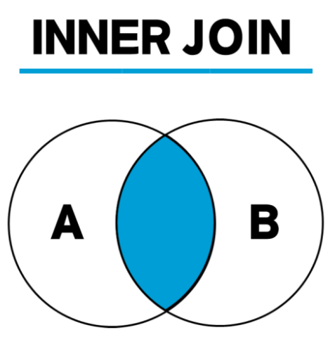
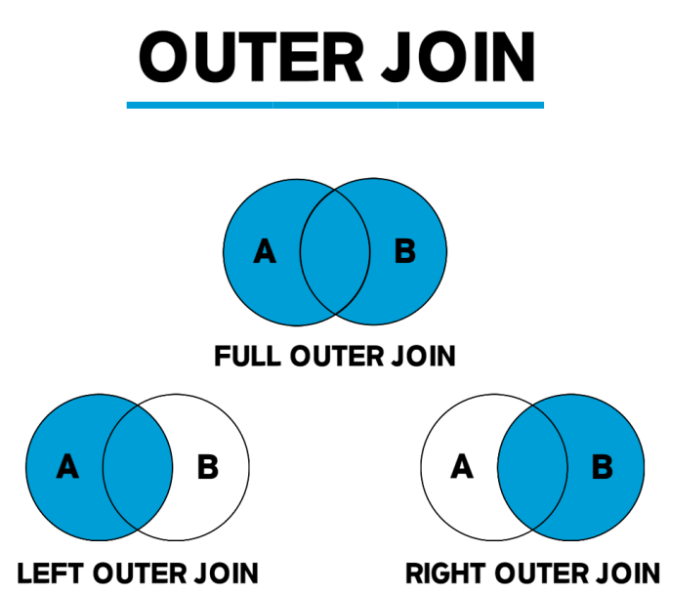
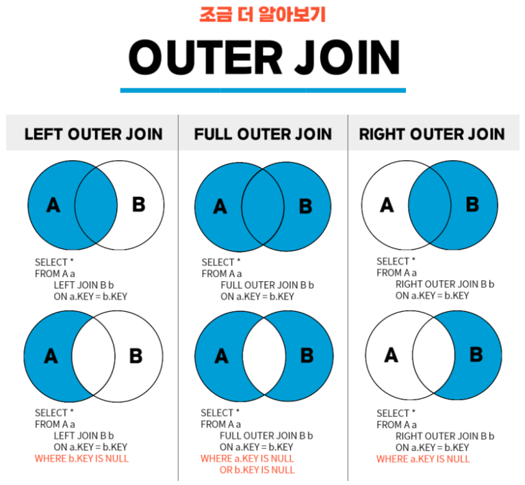
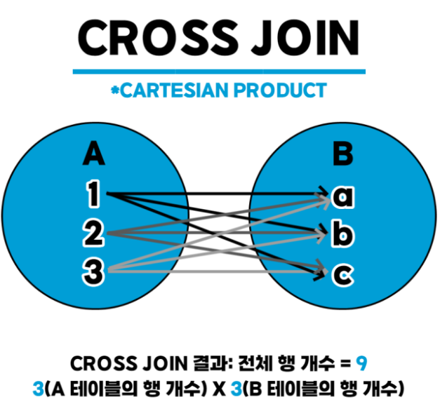

# 명령어 종류

| 명령어 종류           | 명령어                     | 설명                                                 |
| --------------------- | -------------------------- | ---------------------------------------------------- |
| 데이터 조작어<br>DDL  | SELECT                     | 데이터베이스에서 데이터를 검색                       |
|                       | INSERT<br>UPDATE<br>DELETE | 테이블에 데이터를 삽입/수정/삭제                     |
| 데이터 정의어<br>DDL  | CREATE                     | 데이터베이스의 객체를 생성                           |
|                       | ALTER                      | 데이터베이스의 구조를 변경                           |
|                       | DROP                       | 데이터베이스의 객체를 삭제                           |
| 데이터 제어어<br/>DCL | GRANT<br>REVOKE            | 데이터베이스에 대한 사용자의 액세스 권한을 제공/철회 |


## GROUP BY

- 데이터를 특정 컬럼 기준으로 그룹화시키는 명령어
- 각 그룹에 대한 연산 결과(합, 평균 등)를 산출하기 위해서는 **집계함수**가 필요
  - 집계함수란 - SUM, COUNT 와 같은 것
- GROUP BY 구에 있는 컬럼은 **반드시 SELECT 절에도 존재해야** 한다


## ORDER BY

- 테이블을 특정 컬럼값을 기준으로 정렬하기 위한 명령어

- 즉, **정렬**의 역할

- 기본 정렬값은 **ASC(오름차순)**로 설정되어있으므로 오름차순 정렬시에는 입력 필요 X

  **내림차순**의 경우 **DESC**


## HAVING

- GROUP BY 절에 대한 조건을 걸고 싶을 때 사용하는 명령어
- 그룹화 된 결과에 조건을 걸어주는 역할
- HAVING 뒤에는 SELECT 구문에서 사용하는 AS 별칭 사용 불가

💡**WHERE절과 헷갈리지 않게 조심하기**💡

- 처음부터 테이블 자체에 조건을 걸고 싶다면? → WHERE 절
- 그룹별로 묶인 컬럼에 조건을 걸고 싶다면? → HAVING 절


# JOIN

- 조인은 두개 이상의 테이블을 서로 묶어서 하나의 결과를 만들어 내는 것
- **INNER JOIN(내부 조인)**은 두 테이블을 조인할 때, 두 테이블에 모두 지정한 열의 데이터가 있어야 한다.

- **OUTER JOIN(외부 조인)**은 두 테이블을 조인할 때, 1개의 테이블에만 데이터가 있어도 결과가 나온다.
- **CROSS JOIN(상호 조인)**은 한쪽 테이블의 모든 행과 다른 쪽 테이블의 모든 행을 조인하는 기능이다.
- **SELF JOIN(자체 조인)**은 자신이 자신과 조인한다는 의미로, 1개의 테이블을 사용한다.


## INNER JOIN

```sqlite
SELECT <열 목록>
FROM <첫 번째 테이블>
	INNER JOIN <두 번째 테이블>
    ON <조인될 조건>
[WHERE 검색 조건]
* INNER JOIN을 JOIN이라고만 써도 INNER JOIN으로 인식한다.
```





## OUTER JOIN

```sqlite
 SELECT <열 목록>
 FROM <첫 번째 테이블(LEFT 테이블)>
          <LEFT | RIGHT | FULL> OUTER JOIN <두 번째 테이블(RIGHT 테이블)>
           ON <조인될 조건>
 [WHERE 검색 조건]
 
LEFT OUTER JOIN: 왼쪽 테이블의 모든 값이 출력되는 조인
RIGHT OUTER JOIN: 오른쪽 테이블의 모든 값이 출력되는 조인
FULL OUTER JOIN: 왼쪽 또는 오른쪽 테이블의 모든 값이 출력되는 조인
```







## CROSS JOIN

```sqlite
SELECT * 
 FROM <첫 번째 테이블>
           CROSS JOIN <두 번째 테이블>
```




## SELF JOIN

```sqlite
SELECT <열 목록>
FROM <테이블> 별칭A
          INNER JOIN <테이블> 별칭B
          ON <조인될 조건>
[WHERE 검색 조건]
```


