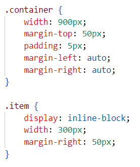
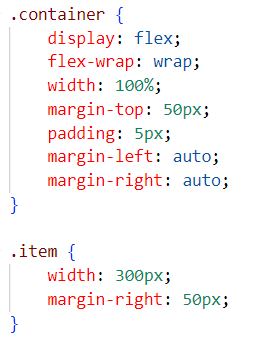
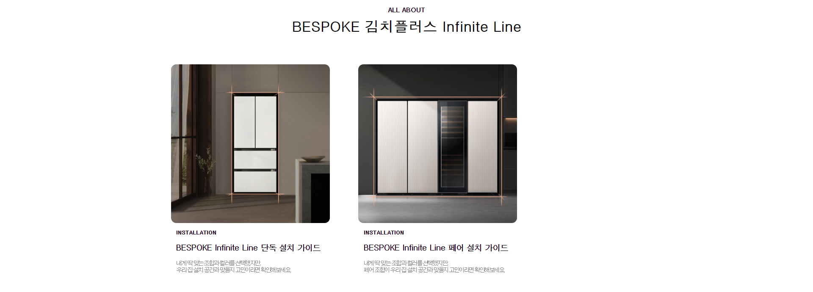
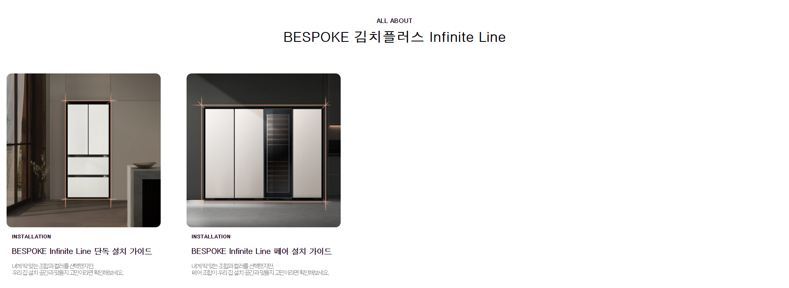

# 1. Froggy

[flex 실습(froggy)](https://flexboxfroggy.com/#ko)

# 2. 0830실습 (flex사용)

## before

## after

.item에 있는 display를 지우고 .container에 display:flex;를 추가

## before code result

## after code result

