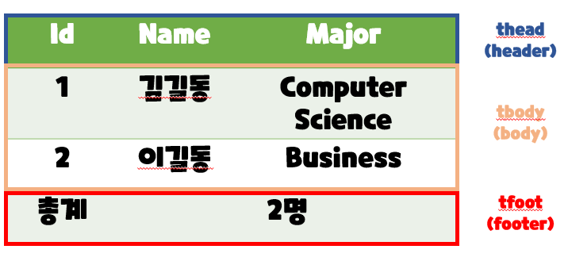
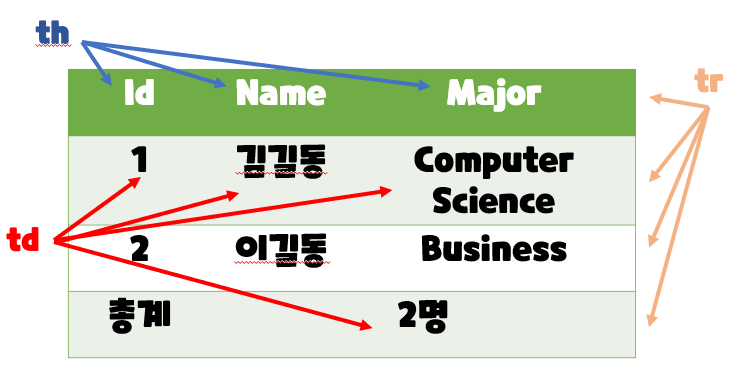
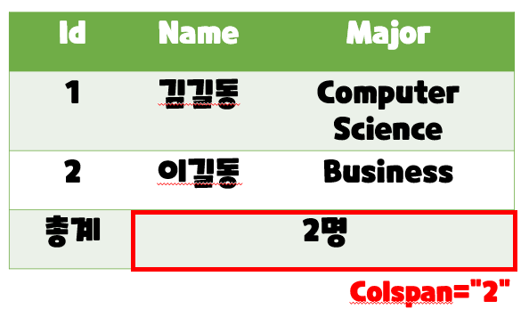
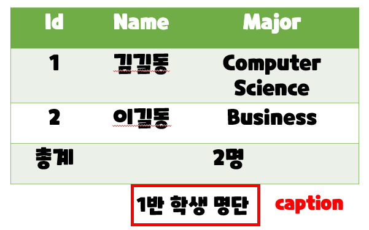
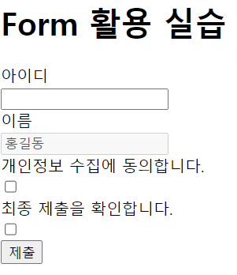
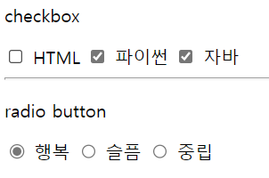
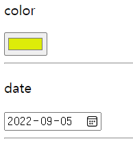
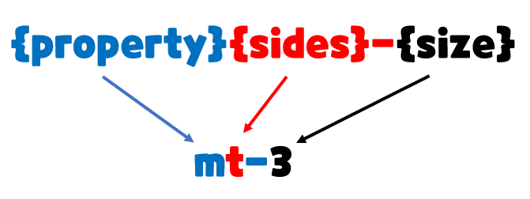
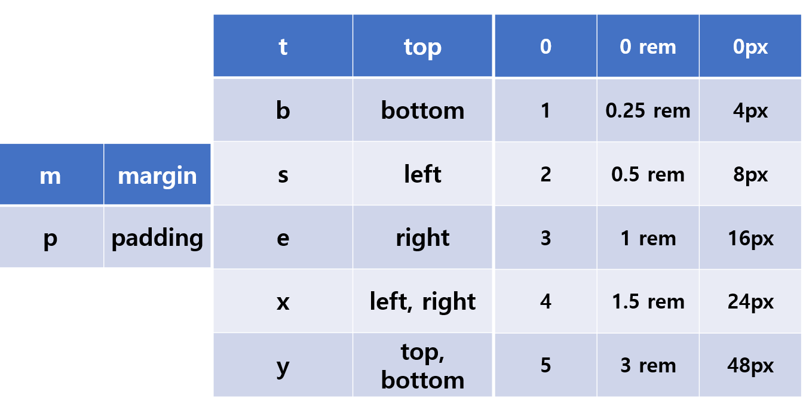

# HTML

## table

- table의 각 영역을 명시하기 위해  `<thead>` `<tbody>` `<tfoot>`  요소를 활용



- `<tr>`으로 가로 줄을 구성하고 내부에는 `<th>`혹은`<td>`로 셀을 구성



- `<colspan>` `<rowspan>`속성을 활용하여 셀 병합



- `<caption>`을 통해 표 설명 또는 제목을 나타냄



- table 태그 기본 구성
  - thead
    - tr > th
  - tbody
    - tr > td
  - tfoot
    - tr > td
  - caption


## form

- `<form>`은 정보(데이터)를 서버에 제출하기 위해 사용하는 태그

- `<form>` 기본 속성
  - action : form을 처리할 서버의 URL(데이터를 보낼 곳) 
  - method : form을 제출할 때 사용할 HTTP 메서드 (GET 혹은 POST) 
  - enctype : method가 post인 경우 데이터의 유형 
    - application/x-www-form-urlencoded : 기본값 
    - multipart/form-data : 파일 전송시 (input type이 file인 경우)
    - <span style="color:gray">text/plain : HTML5 디버깅 용 (잘 사용되지 않음)</span>


```html
<form action="/search" method="GET">
</form
```


## input

- 다양한 타입을 가지는 입력 데이터 유형과 위젯이 제공됨 
- 대표적인 속성
  - name : form control에 적용되는 이름 (이름/값 페어로 전송됨) 
  - value : form control에 적용되는 값 (이름/값 페어로 전송됨) 
  - required, readonly, autofocus, autocomplete, disabled 등

```html
<form action="/search" method="GET">
<input type="text" name="q">
</form>
```


https://www.google.com/search?q=HTML

```html
<form action="/search" method="GET">
<input type="text" name="q">
</form>
```


## input label

- label을 클릭하여 input 자체의 초점을 맞추거나 활성화 시킬 수 있음 
  - 사용자는 선택할 수 있는 영역이 늘어나 웹 / 모바일(터치) 환경에서 편하게 사용할 수 있음 
  - label과 input 입력의 관계가 시각적 뿐만 아니라 화면리더기에서도 label을 읽어 쉽게 내용을 확인 할 수 있도록 함 
- 에 id 속성을, 에는 for 속성을 활용하여 상호 연관을 시킴

```html
<label for="agreement">개인정보 수집에 동의합니다.</label>
<input type="checkbox" name="agreement" id="agreement">
```


## vscode

```html
<body>
	<h1>Form 활용 실습</h1>
		<form action="">
		<!-- autofocus 및 label 확인 -->
			<div class="input-group">
				<label for="username">아이디</label>
			</div>
			<input type="text" name="username" id="username" autofocus>
			<!-- disabled 및 value 확인 -->
			<div class="input-group">
				<label for="name">이름</label>
			</div>
			<input type="text" name="name" value="홍길동" id="name" disabled>
			<!-- label 확인 -->
			<div class="input-group">
				<label for="agreement">개인정보 수집에 동의합니다.</label>
			</div>
				<input type="checkbox" name="agreement" id="agreement">
			<div class="input-group">
				<label>최종 제출을 확인합니다.</label>
			</div>
			<input type="checkbox">
		</form>
	<input type="submit" value="제출">
</body>
```



## input 유형 - 일반

- 일반적으로 입력을 받기 위하여 제공되며 타입별로 HTML기본 검증 혹은 추가 속성을 활용할 수 있음 
  - text : 일반 텍스트 입력 
  - password : 입력 시 값이 보이지 않고 문자를 특수기호(*)로 표현 
  - email : 이메일 형식이 아닌 경우 form 제출 불가
  - number : min, max, step 속성을 활용하여 숫자 범위 설정 가능
  - file : accept 속성을 활용하여 파일 타입 지정 가능


## input 유형 - 항목 중 선택

- 일반적으로 label 태그와 함께 사용하여 선택 항목을 작성함 
- 동일 항목에 대하여는 name을 지정하고 선택된 항목에 대한 value를 지정해야 함 
  - checkbox : 다중 선택 
  - radio : 단일 선택

```html
<div>
    <p>checkbox</p>
    <input id="html" type="checkbox" name="language" value="html">
    <label for="html">HTML</label>
    <input id="python" type="checkbox" name="language" value="python">
    <label for="python">파이썬</label>
    <input id="python" type="checkbox" name="language" value="java">
    <label for="java">자바</label>
    <hr>
    <p>radio button</p>
    <input id="happy" type="radio" name="feel" value="happy">
    <label for="happy">행복</label>
    <input id="sad" type="radio" name="feel" value="sad">
    <label for="sad">슬픔</label>
    <input id="soso" type="radio" name="feel" value="soso">
    <label for="soso">중립</label>
</div>
```



## input 유형 - 기타

- 다양한 종류의 input을 위한 picker를 제공 
  - color : color picker 
  - date : date picker 
- hidden input을 활용하여 사용자 입력을 받지 않고 서버에 전송되어야 하는 값을 설정 
  - hidden : 사용자에게 보이지 않는 input

```html
<div>
    <p>color</p>
    <input id="color" type="color" name="color" value="color">
    <hr>
    <p>date</p>
    <input id="date" type="date" name="date" value="date">
    <hr>
</div>
```



# Bootstrap

## CDN

> Content Delivery(Distribution) Network

- **컨텐츠(CSS, JS, Image, Text 등)을 효율적으로 전달하기 위해 여러 노드에 가진 네트워크에 데이터를 제공하는 시스템.**

- 개별 end-user의 가까운 서버를 통해 빠르게 전달 가능(지리적 이점) 외부 서버를 활용함으로써 본인 서버의 부하가 적어짐


# spacing

## Margin and padding

```html
<div class="mt-3 ms-5">bootstrap-spacing</div>
```



### {property}

- `m` - for classes that set margin
- `p` - for classes that set padding


### {sides}

- `t` - for classes that set **margin-top** or **padding-top**

- `b` - for classes that set **margin-bottom** or **padding-bottom**

- `s` - (start) for classes that set **margin-left** or **padding-left** in LTR **margin-right** or **padding-right** in RTL
- `e` - (end) for classes that set **margin-right** or **padding-right** in LTR **margin-left** or **padding-left** in RTL
- `x` - for classes that set both ***-left** or ***-right**
- `y` - for classes that set both ***-top** or ***-bottom**
- `blank` - for classes that set a **margin** or **padding** on all 4 sides of th element


### {size}

- `0` - for classes that eliminate **margin** or **padding** by setting it to 0

- `1` - (by default) for classes that set the **margin** or **padding** to **$spacer * .25**

- `2` - (by default) for classes that set the **margin** or **padding** to **$spacer * .5**
- `3` - (by default) for classes that set the **margin** or **padding** to **$spacer**
- `4` - (by default) for classes that set the **margin** or **padding** to **$spacer * 1.5**
- `5` - (by default) for classes that set the **margin** or **padding** to **$spacer * 3**
- `auto` - for classes that set the **margin** to auto


| class name | rem  | px   |
| ---------- | ---- | ---- |
| m-1        | 0.25 | 4    |
| m-2        | 0.5  | 8    |
| m-3        | 1    | 16   |
| m-4        | 1.5  | 24   |
| m-5        | 3    | 48   |


```css
1.
.mx-0 {
	margin-right: 0 !important;
	margin-left: 0 !important;
}
가로(왼쪽, 오른쪽) margin이 0

2.
.mx-auto {
margin-right: auto !important;
margin-left: auto !important;
}
블록요소
수평 중앙 정렬
가로 가운데 정렬

3.
.py-0 {
padding-top: 0 !important;
padding-bottom: 0 !important;
}
위 아래 padding이 0
```


## spacing 종합


