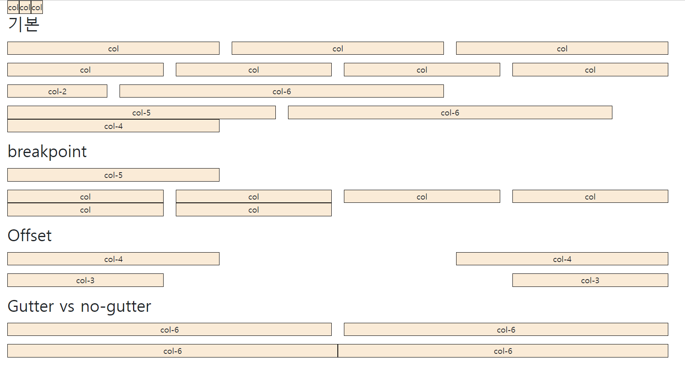

# Bootstrap Grid System

## Grid system (web design)

- 요소들의 디자인과 배치에 도움을 주는 시스템
- 기본 요소
  - Column : 실제 컨텐츠를 포함하는 부분 
  - Gutter : 칼럼과 칼럼 사이의 공간 (사이 간격) 
  - Container : Column들을 담고 있는 공간


## Bootstrap grid System

- Bootstrap Grid system은 flexbox로 제작됨 
- container, rows, column으로 컨텐츠를 배치하고 정렬 
- 반드시 기억해야 할 2가지 ! 
   	1. **12개의 column** 
   	2. **6개의 grid breakpoints**

```html
<div class="container">
	<div class="row">
		<div class="col"></div>
		<div class="col"></div>
		<div class="col"></div>
	</div>
</div>
```


## [연습_01_grid.html](./오전실습)


