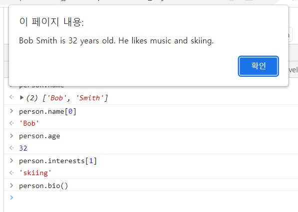
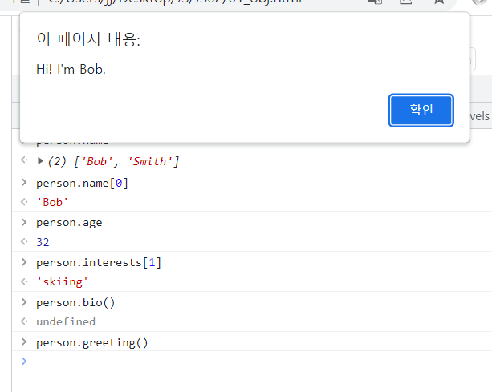
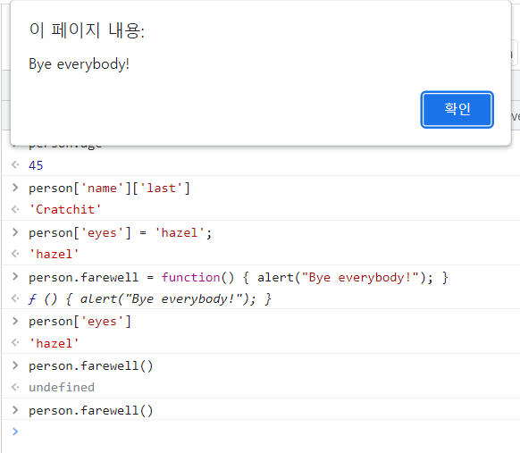

# 배열

## 설명

> JavaScript **`Array`** 클래스는 리스트 형태의 고수준 객체인 배열을 생성할 때 사용하는 전역 객체입니다.

- 배열은 리스트와 비슷한 객체로서 순회와 변형 작업을 수행하는 메서드를 갖습니다. 
- JavaScript 배열은 길이도, 각 요소의 자료형도 고정되어 있지 않습니다. 
- 배열의 길이가 언제든지 늘어나거나 줄어들 수 있고 데이터를 연속적이지 않은 곳에 저장할 수 있으므로, JavaScript 배열은 밀집성을 보장하지 않습니다. 
- 보통 이런 성질들은 편리하지만, 사용하려는 목적에 맞지 않으면 형식화 배열(typed array)을 사용하는 것을 고려해보세요.


### 자주 사용하는 연산

- **배열 만들기**

```javascript
let fruits = ['사과', '바나나']

console.log(fruits.length)
// 2
```

- **인덱스로 배열의 항목에 접근하기**

```javascript
let first = fruits[0]
// 사과

let last = fruits[fruits.length - 1]
// 바나나
```

- **배열의 항목들을 순환하며 처리하기**

```javascript
fruits.forEach(function (item, index, array) {
  console.log(item, index)
})
// 사과 0
// 바나나 1
```

- **배열 끝에 항목 추가하기**

```javascript
let newLength = fruits.push('오렌지')
// ["사과", "바나나", "오렌지"]
```

- **배열 끝에서부터 항목 제거하기**

```javascript
let last = fruits.pop() // 끝에있던 '오렌지'를 제거
// ["사과", "바나나"]
```

- **배열 앞에서부터 항목 제거하기**

```javascript
let first = fruits.shift() // 제일 앞의 '사과'를 제거
// ["바나나"]
```

- **배열 앞에 항목 추가하기**

```javascript
let newLength = fruits.unshift('딸기') // 앞에 추가
// ["딸기", "바나나"]
```

- **배열 안 항목의 인덱스 찾기**

```javascript
fruits.push('망고')
// ["딸기", "바나나", "망고"]

let pos = fruits.indexOf("바나나")
// 1
```

- **인덱스 위치에 있는 항목 제거하기**

```javascript
let removedItem = fruits.splice(pos, 1) // 항목을 제거하는 방법

// ["딸기", "망고"]
```

- **인덱스 위치에서부터 여러개의 항목 제거하기**

```javascript
let vegetables = ['양배추', '순무', '무', '당근']
console.log(vegetables)
// ["양배추", "순무", "무", "당근"]

let pos = 1
let n = 2

let removedItems = vegetables.splice(pos, n)
// 배열에서 항목을 제거하는 방법
// pos 인덱스부터 n개의 항목을 제거함

console.log(vegetables)
// ["양배추", "당근"] (원 배열 vegetables의 값이 변함)

console.log(removedItems)
// ["순무", "무"]
```

- **배열 복사하기**

```javascript
let shallowCopySpread = [...fruits]
// ["딸기", "망고"]
```


### 배열 요소에 접근하기

> JavaScript 배열의 인덱스는 0부터 시작합니다. 즉, 배열 첫 번째 요소의 인덱스는 0이고, 마지막 요소의 인덱스는 배열의 `length`속성에서 1을 뺀 것과 같습니다.
>
> 잘못된 인덱스를 사용하면 `undefined`를 반환합니다.

```javascript
let arr = ['첫 번재 요소입니다', '두 번째 요소입니다', '마지막 요소입니다']
console.log(arr[0])              // '첫 번재 요소입니다'를 기록
console.log(arr[1])              // '두 번재 요소입니다'를 기록
console.log(arr[arr.length - 1]) // '마지막 요소입니다'를 기록
```


- 모든 JavaScript 속성은 이름이 숫자로 시작할 경우 마침표 표기법으로 접근할 수 없고, 대괄호 표기법을 사용해야 합니다.

```javascript
let years = [1950, 1960, 1970, 1980, 1990, 2000, 2010]
console.log(years.0)   // 구문 오류
console.log(years[0])  // 정상 작동

renderer.3d.setTexture(model, 'character.png')     // 구문 오류
renderer['3d'].setTexture(model, 'character.png')  // 정상 작동
```


### 배열 길이와 숫자형 속성의 관계

>JavaScript 배열의`length` 속성과 숫자형 속성은 연결되어 있습니다.

```javascript
const fruits = []
fruits.push('바나나', '사과', '복숭아')

console.log(fruits.length) // 3
```

```javascript
fruits[5] = 'mango'
console.log(fruits[5])           // '망고'
console.log(Object.keys(fruits)) // ['0', '1', '2', '5']
console.log(fruits.length)       // 6

// length를 직접 늘려도 요소에 변화는 없습니다.
fruits.length = 10
console.log(fruits)              // ['바나나', '사과', '복숭아', 비어 있음 x 2, '망고', 비어 있음 x 4]
console.log(Object.keys(fruits)) // ['0', '1', '2', '5']
console.log(fruits.length)       // 10
console.log(fruits[8])           // undefined

// 하지만, length 속성을 감소시키면 요소가 지워집니다.
fruits.length = 2
console.log(Object.keys(fruits)) // ['0', '1']
console.log(fruits.length)       // 2
```


### 정규표현식 일치 결과를 이용한 배열 생성

```javascript
// 하나의 d와 하나 이상의 b에 하나의 d가 뒤따라 일치해야 함
// 일치한 b와 다음 d를 기억할 것
// 대소문자 구분 없음

const myRe = /d(b+)(d)/i
const myArray = myRe.exec('cdbBdbsbz')
```

- myArray 배열의 속성과 요소

| 속성/요소       | 설명                                                         | 예시                    |
| --------------- | ------------------------------------------------------------ | ----------------------- |
| input           | 정규표현식 일치 대상이 된 원본 문자열                        | "cdbBdbsbz"             |
| index           | 일치가 위치한 원본 문자열에서의 인덱스                       | 1                       |
| [0]             | 마지막으로 일치한 텍스                                       | "dbBd"                  |
| [1], ...<br>[n] | 존재할 경우, 정규표현식에서 괄호로 지정한 부분문자열 일치에 대응하는 요소. <br>가능한 수의 제한은 없다. | [1] : "bB"<br>[2] : "d" |


### 배열 복사하기

> 배열을 새로운 변수에 할당해도 배열이 복사되지는 않습니다. 새로운 변수에는 원본 배열을 가리키는 참조만 할당되며, 원본 배열의 값을 바꾸면 새 변수에서도 그 변경점이 반영됩니다.

```javascript
let array1 = [1,2,3]
let array1Reference = array1;
array1[1] = 9;
console.log(array1Reference);
// Array [1,9,3] - array1의 변화가 array1Reference에도 나타남 - 복사본이 아님
```


- 얕은 복사(Array.slice(), Array.form())

```javascript
let shallowCopySpread = [...fruits]
// ["Strawberry", "Mango"]

// Array.slice()
let shallowCopySlice = fruits.slice()
// ["Strawberry", "Mango"]

// Array.form()
let shallowCopyFrom = Array.from(fruits)
// ["Strawberry", "Mango"]
```


- 깊은 복사
  - `JSON.stringify()`를 사용해 배열을 JSON 문자열로 변환한 후, `JSON.parse()`로 다시 배열을 구성

```javascript
let deepCopy = JSON.parse(JSON.stringify(fruits));
// ["Strawberry", "Mango"]
```


## 생성자

> Array().
>
> Array 객체를 생성한다.


## 정적 속성

> get Array[@@species
>
> 파생 객체를 생성하는데 사용하는 생성자 함수이다.


## 정적 메소드

> Array.form()
>
> 유사 배열 또는 반복 가능한 객체로부터 새로운 `Array` 인스턴스를 생성한다.
>
> Array.isArray()
>
> 만약 매개변수가 배열이면 참을, 아니면 거짓을 반환한다.
>
> Array.of()
>
> 매개변수의 수와 자료형에 제한 없이, 지정한 값을 사용해 새 `Array` 인스턴스를 생성한다.


## 인스턴스 속성

> Array.prototype.length
>
> 배열의 원소 수를 나타냅니다.
>
> Array.prototype[@@unscopables
>
> with 결속 범위로부터 제외하려는 속성 이름이 들어있는 기호입니다.


## 인스턴스 메소드

| 메소드                           | 설명                                                         |
| -------------------------------- | ------------------------------------------------------------ |
| Array.prototype.at()             | 주어진 인덱스의 요소를 반환합니다. 음수 값을 지정할 경우 인덱스를 배열의 끝부터 셉니다. |
| Array.prototype.concat()         | 배열과 배열/값 매개변수를 이어붙인 새로운 배열을 반환합니다. |
| Array.prototype.copyWithin()     | 배열 내의 지정된 요소들을 동일한 배열 내에서 복사합니다.     |
| Array.prototype.entries()        | 배열의 각 인덱스에 대한 키/값 쌍을 가지는 새로운 배열 반복자 객체를 반환합니다. |
| Array.prototype.every()          | 배열의 모든 요소가 주어진 판별 함수를 만족할 경우 `true`를 반환합니다. |
| Array.prototype.fill()           | 배열을 시작 인덱스부터 끝 인덱스까지의 지정한 값으로 채웁니다. |
| Array.prototype.filter()         | 지정한 필터 함수의 반환 결과가 `true`인 요소만 모아서 새로운 배열을 반환합니다. |
| Array.prototype.find()           | 주어진 판별 함수를 만족하는 첫 번째 요소를 반환합니다. 만족하는 요소가 없으면 `undefined`를 반환합니다. |
| Array.prototype.findIndex()      | 주어진 판별 함수를 만족하는 첫 번째 요소의 인덱스를 반환합니다. 만족하는 요소가 없으면 `-1`를 반환합니다. |
| Array.prototype.flat()           | 배열 내의 모든 중첩 배열을 지정한 깊이까지 재귀적으로 이어붙인 새로운 배열을 반환합니다. |
| Array.prototype.flatMap()        | 배열의 모든 요소 각각에 대해 주어진 콜백 함수를 호출하고, 그 반환 값을 모아 새로운 배열을 생성한 후, 모든 중첩 배열을 이어붙여 평탄화해 반환합니다. |
| ray.prototype.forEach()          | 배열의 각각의 요소에 대해 함수를 호출합니다.                 |
| ray.prototype.includes()         | 배열이 주어진 값을 포함하는지 판별해 `true` 또는 `false`를 반환합니다. |
| ray.prototype.indexOf()          | 배열에서 주어진 값과 일치하는 제일 앞의 인덱스를 반환합니다. 없으면 `-1`을 반환합니다. |
| ray.prototype.join()             | 배열의 모든 요소를 문자열로 합칩니다.                        |
| ray.prototype.keys()             | 배열의 각 인덱스에 대한 키를 가지는 새로운 배열 반복자 객체를 반환합니다. |
| Array.prototype.lastIndexOf()    | 배열에서 주어진 값과 일치하는 제일 뒤의 인덱스를 반환합니다. 없으면 `-1`을 반환합니다. |
| ray.prototype.map()              | 배열의 모든 요소 각각에 대하여 주어진 콜백 함수를 호출하고, 그 반환 값을 모은 새로운 배열을 반환합니다. |
| ray.prototype.pop()              | 배열에서 마지막 요소를 뽑아내고, 그 요소를 반환합니다.       |
| ray.prototype.push()             | 배열의 끝에 하나 이상의 요소를 추가하고, 배열의 변경된 `length`를 반환합니다. |
| ray.prototype.reduce()           | 주어진 콜백 함수를 가산기와 요소 각각에 대해 (왼쪽에서 오른쪽으로) 호출하여 하나의 값으로 줄인 결과를 반환합니다. |
| ray.prototype.reduceRight()      | 주어진 콜백 함수를 가산기와 요소 각각에 대해 (오른쪽에서 왼쪽으로) 호출하여 하나의 값으로 줄인 결과를 반환합니다. |
| ray.prototype.reverse()          | 배열의 요소 순서를 뒤집습니다. 즉 첫 번째 요소가 마지막이 되고 마지막이 첫 번째가 됩니다. |
| ray.prototype.shift()            | 배열에서 첫 번째 요소를 삭제하고, 그 요소를 반환합니다.      |
| ray.prototype.slice()            | 배열의 일부를 추출한 새 배열을 반환합니다.                   |
| ray.prototype.some()             | 배열의 어떤 요소가 주어진 판별 함수를 만족할 경우 `true`를 반환합니다. |
| ray.prototype.sort()             | 배열의 요소를 정렬하고 그 배열을 반환합니다.                 |
| ray.prototype.splice()           | 배열에서 요소를 추가하거나 삭제합니다.                       |
| Array.prototype.toLocaleString() | 배열과 그 요소를 나타내는 지역화된 문자열을 반환합니다.<br>Object.prototype.toLocaleString() 메서드를 재정의합니다. |
| Array.prototype.toString()       | 배열과 그 요소를 나타내는 문자열을 반환합니다. Object.prototype.toString() 메서드를 재정의합니다. |
| Array.prototype.unshift()        | 배열의 앞에 하나 이상의 요소를 추가하고, 배열의 변경된 `length`를 반환합니다. |
| Array.prototype.values()         | 배열의 각 인덱스에 대한 값을 가지는 새로운 배열 반복자 객체를 반환합니다. |
| Array.prototype[@@iterator]      | 배열의 각 인덱스에 대한 값을 가지는 새로운 배열 반복자 객체를 반환합니다. |


## 예제

### 배열 생성

```javascript
// 길이 0의 배열 msgArray 을 생성하고, msgArray[0] 와 msgArray[99] 에 값을 할당하여 배열의 길이를 100으로 변경
let msgArray = []
msgArray[0] = 'Hello'
msgArray[99] = 'world'

if (msgArray.length === 100) {
  console.log('길이가 100입니다.')
}
```


### 2차원 배열 생성

```javascript
let board = [
  ['R','N','B','Q','K','B','N','R'],
  ['P','P','P','P','P','P','P','P'],
  [' ',' ',' ',' ',' ',' ',' ',' '],
  [' ',' ',' ',' ',' ',' ',' ',' '],
  [' ',' ',' ',' ',' ',' ',' ',' '],
  [' ',' ',' ',' ',' ',' ',' ',' '],
  ['p','p','p','p','p','p','p','p'],
  ['r','n','b','q','k','b','n','r'] ]

console.log(board.join('\n') + '\n\n')

// 폰을 앞으로 두 칸 전진
board[4][4] = board[6][4]
board[6][4] = ' '
console.log(board.join('\n'))

// 결과
R,N,B,Q,K,B,N,R
P,P,P,P,P,P,P,P
 , , , , , , ,
 , , , , , , ,
 , , , , , , ,
 , , , , , , ,
p,p,p,p,p,p,p,p
r,n,b,q,k,b,n,r

R,N,B,Q,K,B,N,R
P,P,P,P,P,P,P,P
 , , , , , , ,
 , , , , , , ,
 , , , ,p, , ,
 , , , , , , ,
p,p,p,p, ,p,p,p
r,n,b,q,k,b,n,r
```


### 배열을 사용하여 일련의 값을 테이블처럼 표시하기

```javascript
const values = []
for (let x = 0; x < 10; x++){
 values.push([
  2 ** x,
  2 * x ** 2
 ])
}
console.table(values)

// 결과
// 첫 번째 열은 인덱스
0  1    0
1  2    2
2  4    8
3  8    18
4  16   32
5  32   50
6  64   72
7  128  98
8  256  128
9  512  162
```


# 객체

## 객체 기본

> 객체는 관련된 데이터와 함수(일반적으로 여러 데이터와 함수로 이루어지는데, 객체 안에 있을 때는 보통 프로퍼티와 메소드라고 부릅니다)의 집합

- 객체를 생성하는 것은 변수를 정의하고 초기화하는 것으로 시작

```javascript
var person = {};

// JavaScript콘솔을 열고 person을 입력한 다음 Enter/Return을 누르면 아래 중 하나와 유사한 결과 표시
[object Object]
Object { }
{ }

// 업데이트
const person = {
  name: ['Bob', 'Smith'],
  age: 32,
  gender: 'male',
  interests: ['music', 'skiing'],
  bio: function() {
    alert(this.name[0] + ' ' + this.name[1] + ' is ' + this.age + ' years old. He likes ' + this.interests[0] + ' and ' + this.interests[1] + '.');
  },
  greeting: function() {
    alert('Hi! I\'m ' + this.name[0] + '.');
  }
};

// 출력해보기
person.name // ['Bob', 'Smith']
person.name[0] // 'Bob'
person.age // 32
person.interests[1] // 'skiing'
person.bio() // 밑에 캡처 화면
person.greeting() // 밑에 캡처화면
```







```javascript
// 객체는 각기 다른 이름(위의 예에서는 name 과 age)과 값(예제에서, ['Bob', 'Smith'] 과 32)을 갖는 복수개의 멤버로 구성됩니다. 한 쌍의 이름과 값은 ',' 로 구분되야 하고, 이름과 값은 ':' 으로 분리된다

var objectName = {
  member1Name: member1Value,
  member2Name: member2Value,
  member3Name: member3Value
};
```


## 점 표기법

> 객체내에 **캡슐화되어있는**것에 접근하려면 먼저 점을 입력해야합니다. 그 다음 점을 찍고 접근하고자 하는 항목을 적습니다. 간단한 프로퍼티의 이름일 수도 있을 것이고, 배열의 일부이거나 객체의 메소드를 호출할 수도 있습니다.

```javascript
person.age
person.interests[1]
person.bio()
```


### 하위 namespaces

```javascript
name: ['Bob', 'Smith'],
    
// 아래와 같이 변환
name : {
  first: 'Bob',
  last: 'Smith'
},
    
// 출력
person.name.first // 'Bob'
person.name.last // 'Smith'
```

- **중요** : 객체의 속성이 바뀌었으니까, 기존 메소드 코드를 바꿔 줘야 합니다.

```javascript
name[0] --> name.first
name[1] --> name.last
```


## 괄호 표기법
```javascript
person.age		   --> person['age']
person.name.first  --> person['name']['first']
```


## 객체 멤버 설정하기

> 지금까지는 객체 멤버를 단순히 가져오기만(또는 **반환**) 했습니다. 설정할 멤버를 간단히 명시하여(점이나 대괄호 표기법을 사용) 객체 멤버의 값을 **설정**(갱신)하는 것도 물론 가능합니다.

```javascript
person.age = 45;
person['name']['last'] = 'Cratchit';

//출력
person.age	// 45
person['name']['last']	//'Cratchit'
```

```javascript
person['eyes'] = 'hazel';
person.farewell = function() { alert("Bye everybody!"); }

// 출력
person['eyes']	// 'hazel'
person.farewell()	// 밑에 사진
```




## "this"는 무엇인가?

```javascript
greeting: function() {
  alert('Hi! I\'m ' + this.name.first + '.');
}
```

- `this` 키워드는 지금 동작하고 있는 코드를 가지고 있는 객체를 가리킵니다.


```javascript
var person1 = {
  name: 'Chris',
  greeting: function() {
    alert('Hi! I\'m ' + this.name + '.');
  }
}

var person2 = {
  name: 'Deepti',
  greeting: function() {
    alert('Hi! I\'m ' + this.name + '.');
  }
}

// 출력
person1.greeting()	// "Hi! I'm Chris."
person2.greeting()	// "Hi! I'm Deepti."
```


