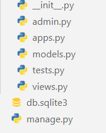

# Django Quick start

```bash
# 가상환경 생성
# 가상환경 생성 이유
# 패키지를 별도로 가져가기 위해서
python -m venv [가상환경이름]

# 가상환경 실행
# ls 명령어 입력 후 현재 경로에서 가상환경 폴더 확인
# 윈도우
source [가상환경이름]/Scripts/actiave

# 맥
. [가상환경이름]/bin/activate

# django LTS 버전 설치
pip install django==3.2.13

#프로젝트 생성
$ django-admin startproject [프로젝트이름] .

# 앱 생성
# ls 명령어 입력 후 현재 경로에서 manage.py 파일 확인
python manage.py startapp [앱이름]

# 앱 등록
# 프로젝트설정폴더/settings.py - INSTALLED_APPS 리스트에 생성한 앱 추가

# 서버 실행 테스트
python manage.py runserver
```

## LTS

- Long Term Support (장기 지원 버전) 
- 일반적인 경우보다 장기간에 걸쳐 지원하도록 고안된 소프트웨어의 버전 
- 컴퓨터 소프트웨어의 제품 수명주기 관리 정책 
- 배포자는 LTS 확정을 통해 장기적이고 안정적인 지원을 보장함


## 프로젝트 구조


- `__init__.py`
  - Python에게 이 디렉토리를 하나의 Python 패키지로 다루도록 지시 
  -  별도로 추가 코드를 작성하지 않음
- `asgi.py`
  - Asynchronous Server Gateway Interface 
  - Django 애플리케이션이 비동기식 웹 서버와 연결 및 소통하는 것을 도움 
  - 추후 배포 시에 사용하며 지금은 수정하지 않음
- `settings.py`
  - Django 프로젝트 설정을 관리
- `urls.py`
  - 사이트의 url과 적절한 views의 연결을 지정
- `wsgi.py`
  - Web Server Gateway Interface 
  - Django 애플리케이션이 웹서버와 연결 및 소통하는 것을 도움 
  - 추후 배포 시에 사용하며 지금은 수정하지 않음
- `manage.py`
  - Django 프로젝트와 다양한 방법으로 상호작용 하는 커맨드라인 유틸리티


## Django Application

## 애플리케이션 폴더 생성

```bash
1. 먼저 가상환경을 실행
jj@DESKTOP-5N8TM5H MINGW64 ~/Desktop/hyper/server
$ source server-venv/Scripts/activate 
(server-venv)

2. 애플리케이션 폴더 생성
jj@DESKTOP-5N8TM5H MINGW64 ~/Desktop/hyper/server
$ python manage.py startapp articles
(server-venv)
⚠ 일반적으로 애플리케이션 이름은 ‘복수형’으로 작성하는 것을 권장
```

- 가상환경 실행
- $ . server-venv/Scripts/activate 이렇게도 가능

## 앱등록

1. settings.py
2. setting.py파일안에 INSTALLED_APPS부분에
3. 생성한 폴더 작성(위에 예시로 보면 articles폴더 작성)


## 애플리케이션 삭제시(잘못만들거나 등등)

1. settings.py
2. INSTALLED_APPS 부분에 작성했던 삭제
3. 생성한 폴더 삭제 (위에 예시로 보면 articles폴더 삭제)


## 애플리케이션 구조




- `admin.py`
  - 관리자용 페이지를 설정 하는 곳
- `apps.py`
  - 앱의 정보가 작성된 곳 
  - 별도로 추가 코드를 작성하지 않음
- `models.py`
  - 애플리케이션에서 사용하는 Model을 정의하는 곳 
  -  MTV 패턴의 M에 해당
- `tests.py`
  - 프로젝트의 테스트 코드를 작성하는 곳
- `views.py`
  - view 함수들이 정의 되는 곳 
  - MTV 패턴의 V에 해당


- 프로젝트에서 앱을 사용하기 위해서는 반드시 INSTALLED_APPS 리스트에 반드시 추가해야 함

- **INSTALLED_APPS**

  - Django installation에 활성화 된 모든 앱을 지정하는 문자열 목록

  ```bash
  # settings.py
  INSTALLED_APPS = [
      'articles',
      'django.contrib.admin',
      'django.contrib.auth',
      'django.contrib.contenttypes',
      'django.contrib.sessions',
      'django.contrib.messages',
      'django.contrib.staticfiles',
  ]
  ⚠ 반드시 생성 후 등록
  ```

  

- 해당 순서를 지키지 않아도 수업 과정에서는 문제가 없지만, 추후 advanced 한 내용을 대비하기 위해 지키는 것을 권장

```bash
INSTALLED_APPS = [
    # Local apps
    ‘articles',

    # Third party apps
    'haystack',

    # Django apps
    'django.contrib.admin',
    'django.contrib.auth',
    'django.contrib.contenttypes',
    'django.contrib.sessions',
    'django.contrib.sites',
]
```


## Project & Application

- Project
  - “collection of apps” 
  - 프로젝트는 앱의 집합 
  - 프로젝트에는 여러 앱이 포함될 수 있음 
  - 앱은 여러 프로젝트에 있을 수 있음
- Application
  - 앱은 실제 요청을 처리하고 페이지를 보여주는 등의 역할을 담당 
  - 일반적으로 앱은 하나의 역할 및 기능 단위로 작성하는 것을 권장함


# 요청과 응답

- URL → VIEW → TEMPLATE 순의 작성 순서로 코드를 작성해보고 데이터의 흐름을 이해하기


## URLs

```python
# urls.py
from django.contrib import admin
from django.urls import path
from articles import views
urlpatterns = [
    path('admin/', admin.site.urls),
    path('index/', views.index),
]
```

- URL → VIEW → TEMPLATE 
- 기초 과정을 작성해보고 
-  데이터의 흐름을 이해하기


## Views

```python
# articles/views.py
def index(request): 
	return render(request, 'index.html')
```

- HTTP 요청을 수신하고 HTTP 응답을 반환하는 함수 작성
- Template에게 HTTP 응답 서식을 맡김


## render()

- 주어진 템플릿을 주어진 컨텍스트 데이터와 결합하고 렌더링 된 텍스트와 함께 HttpResponse(응답) 객체를 반환하는 함수

  - request

    - 응답을 생성하는 데 사용되는 요청 객체

  - template_name

    - 템플릿의 전체 이름 또는 템플릿 이름의 경로

  - context

    - 템플릿에서 사용할 데이터 (딕녀너리 타입으로 작성)

    ```python
    render(request, template_name, context)
    ```

    

## Templates

```python
<!-- articles/templates/index.html -->
<!DOCTYPE html>
<html lang="en">
<head>
<!-- 생략 -->
</head>
<body>
	<h1>만나서 반가워요!</h1>
</body>
</html>
```

- 실제 내용을 보여주는데 사용되는 파일 
- 파일의 구조나 레이아웃을 정의 
- Template 파일의 기본 경로 
  - app 폴더 안의 templates 폴더 
  - app_name/templates/


## 코드 작성 순서

- 앞으로 Django에서의 코드 작성은 URL → View → Template 순으로 작성 
-  “데이터의 흐름 순서”


# Django Template

- “데이터 표현을 제어하는 도구이자 표현에 관련된 로직” 
- Django Template을 이용한 HTML 정적 부분과 동적 컨텐츠 삽입 
- Template System의 기본 목표를 숙지 
- Django Template System 
  - 데이터 표현을 제어하는 도구이자 표현에 관련된 로직을 담당


## Django Template Language (DTL)

- Django template에서 사용하는 built-in template system 

- 조건, 반복, 변수 치환, 필터 등의 기능을 제공 

  - Python처럼 일부 프로그래밍 구조(if, for 등)를 사용할 수 있지만 이것은 Python 코드로 실행되는 것이 아님

  - Django 템플릿 시스템은 단순히 Python이 HTML에 포함 된 것이 아니니 주의 

- 프로그래밍적 로직이 아니라 프레젠테이션을 표현하기 위한 것임을 명심할 것


## Variable

> **{{ variable }}**

- 변수명은 영어, 숫자와 밑줄(_)의 조합으로 구성될 수 있으나 밑줄로는 시작 할 수 없음 
  -  공백이나 구두점 문자 또한 사용할 수 없음
- dot(.)를 사용하여 변수 속성에 접근할 수 있음 
- render()의 세번째 인자로 {'key': value} 와 같이 딕셔너리 형태로 넘겨주며,  여기서 정의한 key에 해당하는 문자열이 template에서 사용 가능한 변수명이 됨


## Filters

> **{{ variable|filter }}**

- 표시할 변수를 수정할 때 사용 

- 예시)  `{{ name|lower }}`

  - name 변수를 모두 소문자로 출력 

- 60개의 built-in template filters를 제공 • chained가 가능하며 일부 필터는 인자를 받기도 함

- chained가 가능하며 일부 필터는 인자를 받기도 함

  `{{ name|truncatewords:30 }}`

  

## Tags

> ****

- 출력 텍스트를 만들거나, 반복 또는 논리를 수행하여 제어 흐름을 만드는 등 변수보다 복잡한 일들을 수행 
- 일부 태그는 시작과 종료 태그가 필요 
  - 
- 약 24개의 built-in template tags를 제공


## Comments

> **{# #}**

- Django template에서 라인의 주석을 표현하기 위해 사용 
- 한 줄 주석에만 사용할 수 있음 (줄 바꿈이 허용되지 않음) 
- 여러 줄 주석은 와  사이에 입력

```django
 
여러 줄
주석

```


## [실습]

- 1. Variable

```python
# urls.py
urlpatterns = [
    path('admin/', admin.site.urls),
    path('index/', views.index),
    path('greeting/', views.greeting),
]
```

```python
# articles/views.py
def greeting(request):
return render(request, 'greeting.html', {'name': 'Alice'})
```

```html
<!-- articles/templates/greeting.html -->
<!DOCTYPE html>
<html lang="en">
<head>
…
</head>
<body>
	<p>안녕하세요 저는 {{ name }} 입니다.</p>
</body>
</html
```


2.

- context 데이터가 많아질 경우를 생각하면 다음과 같이 작성하는 것이 바람직
- context라는 이름은 다른 이름으로 사용 가능하지만 관행적으로 context를 사용

```python
# views.py
def greeting(request):
    foods = ['apple', 'banana', 'coconut',]
    info = {
        'name': 'Alice'
	}
    context = {
        'foods': foods,
        'info': info,
    }
	return render(request, 'greeting.html', context)
```

```html
<!-- articles/templates/greeting.html -->
<p>저는 {{ foods.0 }}을 가장 좋아합니다.</p>
<p>안녕하세요 저는 {{ info.name }} 입니다.</p>
<a href="/index/">뒤로</a>
```


- 3. Filters

```python
# urls.py
urlpatterns = [
        ...,
        path('dinner/', views.dinner),
]
```

```python
# articles/views.py
import random
from django.shortcuts import render
...
def dinner(request):
    foods = ['족발', '햄버거', '치킨', '초밥',]
    pick = random.choice(foods)
    context = {
        'pick': pick,
        'foods': foods,
    }
	return render(request, 'dinner.html', context)
```

```html
<!-- articles/templates/dinner.html -->
<!DOCTYPE html>
<html lang="en">
<head>
...
</head>
<body>
    <p>{{ pick }}은 {{ pick|length }}글자</p>
    <p>{{ foods|join:", "}}</p>
	<a href="/index/">뒤로</a>
</body>
</html>
```


- 4. Filters

```html
<!-- dinner.html -->
<!DOCTYPE html>
<html lang="en">
<head>
...
</head>
<body>
    <p>{{ pick }}은 {{ pick|length }}글자</p>
    <p>{{ foods|join:", "}}</p>
    <p>메뉴판</p>
    <ul>
    	
    		<li>{{ food }}</li>
    	
    </ul>
    <a href="/index/">뒤로</a>
</body>
```


- 5. Comments

```html
<!-- dinner.html -->
<!DOCTYPE html>
<html lang="en">
<head>
...
</head>
<body>
...
    {# 이것은 주석입니다. #}
    
    <p>여러 줄</p>
    <p>주석</p>
    <p>입니다.</p>
    
	<a href="/index/">뒤로</a>
</body>
</html>
```

