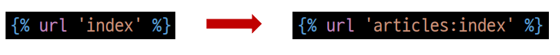
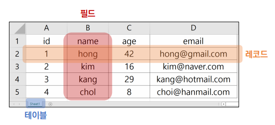

# Namespace

## 개요

- 개체를 구분할 수 있는 범위를 나타내는 namespace(이름 공간)에 대한 이해


## Namespace의 필요성

- 두번째 app pages의 index 페이지를 작성해보고 어떤 문제가 발생하는지 확인해보기

```python
# pages/urls.py
from django.urls import path
from . import views
urlpatterns = [
	path('index/', views.index, name='index'),
]
```

```python
# pages/views.py • Namespace의 필요성
def index(request):
	return render(request, 'index.html')
```

```html
<!-- pages/templates/index.html -->


	<h1>두번째 앱의 index</h1>

```

```html
<!-- articles/templates/index.html -->


    <h1>만나서 반가워요!</h1>
    <a href="">greeting</a>
    <a href="">dinner</a>
    <a href="">throw</a>
    <a href="">두번째 앱 index로 이동</a>

```


## 2가지 문제 발생

1. articles app index 페이지에 작성한 두번째 앱 index로 이동하는 하이퍼 링크를 클 릭 시 현재 페이지로 다시 이동 
   - URL namespace 
2. pages app의 index url (http://127.0.0.1:8000/pages/index/)로 직접 이동해도 articles app의 index 페이지가 출력됨 
   - Template namespace


# URL namespace

## 개요 

- URL namespace를 사용하면 서로 다른 앱에서 동일한 URL 이름을 사용하는 경우에도 이름이 지정된 URL을 고유하게 사용 할 수 있음 
- **app_name** attribute를 작성해 URL namespace를 설정

```python
# articles/urls.py
app_name = 'articles'
urlpatterns = [
	...,
]
```

```python
# pages/urls.py
app_name = 'pages'
urlpatterns = [
	...,
]
```


## URL tag의 변화



```html
<!-- articles/templates/index.html -->


    <h1>만나서 반가워요!</h1>
    <a href="">greeting</a>
    <a href="">dinner</a>
    <a href="">throw</a>
    <a href="">두번째 앱 index로 이동</a>

```

```html
<!-- catch.html -->
<a href="">다시 던지러</a>
<!-- greeting, dinner.html -->
<a href="">뒤로</a>
```

```html
<!-- throw.html -->


    <h1>Throw</h1>
    <form action="" method="GET">
        <label for="message">Throw</label>
        <input type="text" id="message" name="message">
        <input type="submit" value="던져">
    </form>
	<a href="">뒤로</a>
 
```

<span style="color:red">❖ app_name을 지정한 이후에는 url 태그에서 반드시 app_name:url_name 형태로만 사용해야 함.  그렇지 않으면 NoReverceMatch 에러가 발생</span>


## URL 참조

- “:” 연산자를 사용하여 지정
  - 예를 들어, app_name이 articles이고 URL name이 index인 주소 참조는 articles:index가 됨


# Naming  URL patterns

## Naming URL patterns의 필요성

- 만약 “index/”의 문자열 주소를 “new-index/”로 바꿔야 한다고 가정해보자 
- 그렇다면 “index/” 주소를 사용했던 모든 곳을 찾아서 변경해야 하는 번거로움이 발생함


## Naming URL patterns

- 이제는 링크에 URL을 직접 작성하는 것이 아니라 “path()” 함수의 name 인자를 정의해서 사용 
- DTL의 Tag 중 하나인 URL 태그를 사용해서 “path()” 함수에 작성한 name을 사용할 수 있음 
- 이를 통해 URL 설정에 정의된 특정한 경로들의 의존성을 제거할 수 있음 
- Django는 URL에 이름을 지정하는 방법을 제공함으로써 view 함수와 템플릿에서 특정 주소를 쉽게 참조할 수 있도록 도움

```python
# articles/urls.py
urlpatterns = [
    path('index/', views.index, name='index'),
    path('greeting/', views.greeting, name='greeting'),
    path('dinner/', views.dinner, name='dinner'),
    path('throw/', views.throw, name='throw'),
    path('catch/', views.catch, name='catch'),
    path('hello/<str:name>/', views.hello, name='hello'),
]
```


## Built-in tag – “url”

> 

- 주어진 URL 패턴 이름 및 선택적 매개 변수와 일치하는 절대 경로 주소를 반환
- 템플릿에 URL을 하드 코딩하지 않고도 DRY 원칙을 위반하지 않으면서 링크를 출력하는 방법

```html
<!-- catch.html -->


    <h1>Catch</h1>
    <h2>여기서 {{ message }}를 받았어!!</h2>
    <a href="">다시 던지러</a>

```

```html
<!-- throw.html -->


    <h1>Throw</h1>
    <form action="" method="GET">
    ...
    </form>
    <a href="">뒤로</a>

```

```html
<!-- index.html -->


    ...
    <a href="">greeting</a>
    <a href="">dinner</a>
    <a href="">throw</a>

<!-- dinner, greeting.html-->
<a href="">뒤로</a>
```


## [참고] DRY 원칙

- Don’t Repeat Yourself의 약어 
- 더 품질 좋은 코드를 작성하기 위해서 알고, 따르면 좋은 소프트웨어 원칙들 중 하나로 “소스 코드에서 동일한 코드를 반복하지 말자” 라는 의미 
- 동일한 코드가 반복된다는 것은 잠재적인 버그의 위협을 증가 시키고 반복되는 코드를 변경해야 하는 경우, 반복되는 모든 코드를 찾아서 수정해야 함
- 이는 프로젝트 규모가 커질수록 애플리케이션의 유지 보수 비용이 커짐


## Django의 설계 철학 (Templates System)

1. “표현과 로직(view)을 분리” 
   - 템플릿 시스템은 표현을 제어하는 도구이자 표현에 관련된 로직일 뿐 
   - 즉, 템플릿 시스템은 이러한 기본 목표를 넘어서는 기능을 지원하지 말아야 함
2. “중복을 배제”
   - 대다수의 동적 웹사이트는 공통 header, footer, navbar 같은 사이트 공통 디자인을 갖음 
   - Django 템플릿 시스템은 이러한 요소를 한 곳에 저장하기 쉽게 하여 중복 코드를 없애야 함 
   - 템플릿 상속의 기초가 되는 철학


## Framework의 성격

- 독선적(Opinionated) 
  - 독선적인 프레임워크들은 어떤 특정 작업을 다루는 ‘올바른 방법’에 대한 분명한 의견(규약)을 가지고 있음 
  - 대체로 특정 문제내에서 빠른 개발방법을 제시 
  - 어떤 작업에 대한 올바른 방법이란 보통 잘 알려져 있고 문서화가 잘 되어있기 때문
  - 하지만 주요 상황을 벗어난 문제에 대해서는 그리 유연하지 못한 해결책을 제시할 수 있음
- 관용적(Unopinionated) 
  - 관용적인 프레임워크들은 구성요소를 한데 붙여서 해결해야 한다거나 심지어 어떤 도구를 써야 한다는 '올바른 방법'에 대한 제약이 거의 없음 
  - 이는 개발자들이 특정 작업을 완수하는데 가장 적절한 도구들을 이용할 수 있는 자유도가 높음 
  - 하지만 개발자 스스로가 그 도구들을 찾아야 한다는 수고가 필요


## Django Framework의 성격

- ‘다소 독선적’ 
  - 양쪽 모두에게 최선의 결과를 준다고 강조
- 결국 하고자 하는 말은 현대 개발에 있어서는 가장 중요한 것들 중 하나는 **‘생산성‘ **
- 프레임워크는 우리가 하는 개발을 방해하기 위해 규칙, 제약을 만들어 놓은 것이 아님 
- 우리가 온전히 만들고자 하는 것에만 집중할 수 있게 도와주는 것 
- “수레바퀴를 다시 만들지 말라.”


# [Django 구조 이해하기 (MTV Design Pattern)](./0921/Django01.md)


# Database

## Database

- 체계화된 데이터의 모임 
- 검색 및 구조화 같은 작업을 보다 쉽게 하기 위해 조직화된 데이터를 수집하는 저장 시스템


## Database 기본 구조

1. 스키마(Schema) 
2. 테이블(Table)


## 스키마(Schema)

- 뼈대(Structure) 
- 데이터베이스에서 자료의 구조, 표현 방법, 관계 등을 정의한 구조

- 예시

| column | datatype |
| ------ | -------- |
| id     | INT      |
| name   | TEXT     |
| age    | INT      |
| email  | TEXT     |


## 테이블(Table)

- 필드와 레코드를 사용해 조직된 데이터 요소들의 집합 
- 관계(Relation)라고도 부름

1. 필드(field)
   - 속성, 컬럼(Column)
2. 레코드(record)
   - 튜플, 행(Row)




## 필드(field)

- 속성 혹은 컬럼(column) 
- 각 필드에는 고유한 데이터 형식이 지정됨 
  - INT, TEXT 등


## 레코드(record)

- 튜플 혹은 행(row) 
- 테이블의 데이터는 레코드에 저장됨 
- 예를 들어 해당 예시는 4명의 고객정보가 저장되어 있으며, 레코드는 4개가 존재


## PK (Primary Key)

- 기본 키 
- 각 레코드의 고유한 값 (식별자로 사용) 
- 기술적으로 다른 항목과 절대로 중복될 수 없는 단일 값(unique) 
- 데이터베이스 관리 및 테이블 간 관계 설정 시 주요하게 활용 됨

- 위에 예시로는 id


## PK (Primary Key) 예시

- “주민등록번호” 
- 데이터베이스에 동일한 이름, 나이를 가진 사람들의 데이터는 존재할 수 있지만 각 사람들이 가진 주민등록번 호는 절대 같을 수 없음 
- 즉, 주민등록번호는 그 사람을 나타내는 고유한 값으로써 사용할 수 있음


## 쿼리(Query)

- 데이터를 조회하기 위한 명령어 
- 조건에 맞는 데이터를 추출하거나 조작하는 명령어 (주로 테이블형 자료구조에서) 
- "Query를 날린다."  
  - ➢ “데이터베이스를 조작한다.”

