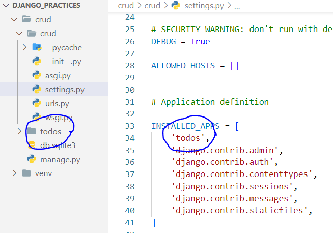
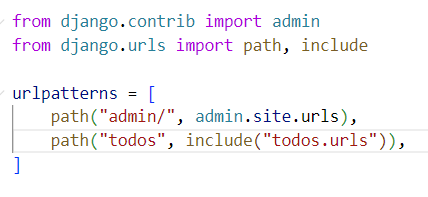
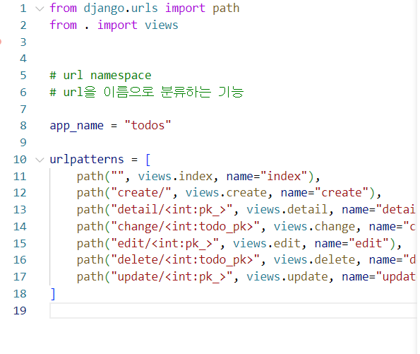
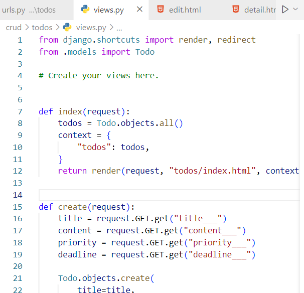
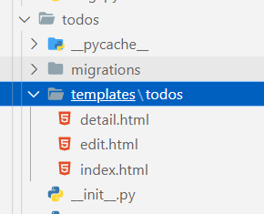
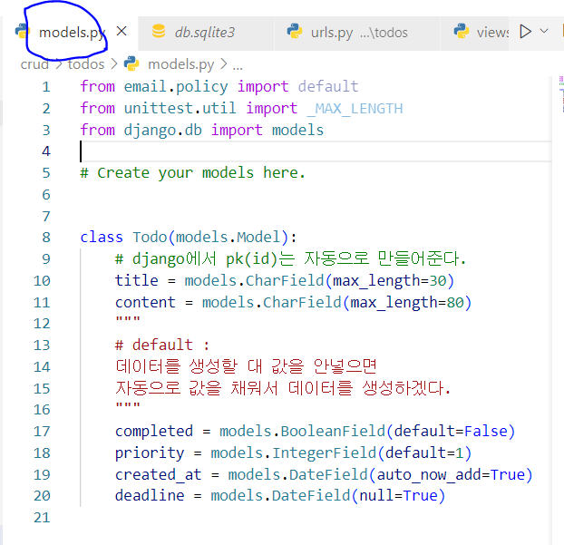

# 0929실습 기준

```bash
# 가상환경 생성
python -m venv [가상환경이름]

# 폴더 생성
mkdir [폴더명]

# 가상환경 실행
# ls 명령어 입력 후 현재 경로에서 가상환경 폴더 확인
# 윈도우
source [가상환경이름]/Scripts/actiave

# django LTS 버전 설치
pip install django==3.2.13

# 폴더 생성으로 이동
cd [폴더명]

#프로젝트 생성
$ django-admin startproject [프로젝트이름] .

# 앱 생성
# ls 명령어 입력 후 현재 경로에서 manage.py 파일 확인
python manage.py startapp [앱이름]

# 앱 등록
# 프로젝트설정폴더/settings.py - INSTALLED_APPS 리스트에 생성한 앱 추가

# 서버 실행 테스트
python manage.py runserver
```

1. settings.py에 앱등록




2. 지금은 앱이 1개이지만 여러개의 앱이 있을경우 경로의 문제가 있을 수 있기 때문에 앱의 urls.py를 추가

   그러기 위해서 프로젝트 urls.py에 사용할 주소를 등록(include)

   


3. 앱의 urls.py의 django.urls를 import해준다



4. views.py에 각각의 함수 적어주기




5. 앱 안의 templates안에 경로폴더 넣고 그 안에 index.html를 비롯한 다른 파일들 넣기(경로 문제)




6. models.py에 데이터베이스 만들기



```bash
다 생성 후
$ python manage.py migrations
$ python manage.py migrate

models.py에 변경사항이 있을경우 변경 후 위 두개의 명령어를 작성해줘야한다.
```


