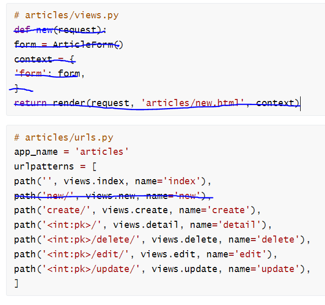
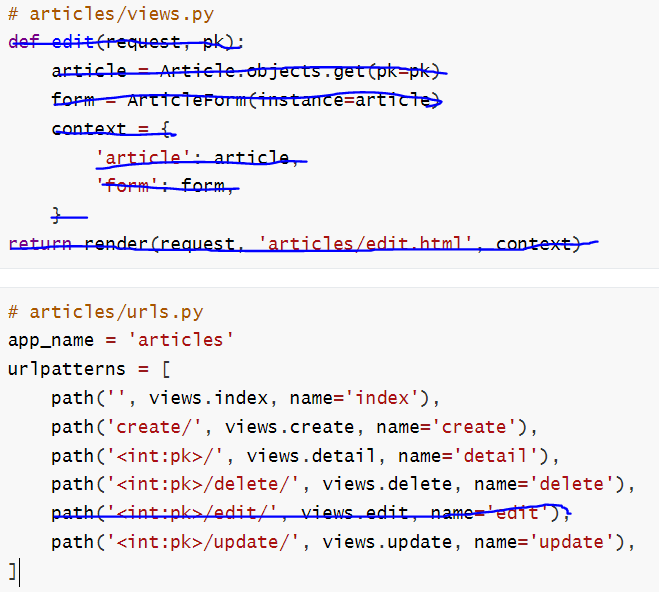

# Django ModelForm

## 개요

- DB 기반의 어플리케이션을 개발하다보면,  

  HTML Form(UI)은 Django의 모델(DB)과 매우 밀접한 관계를 가지게 됨. 

  - 사용자로부터 값을 받아 DB에 저장하여 활용하기 때문 
  - 즉, 모델에 정의한 필드의 구성 및 종류에 따라 HTML Form이 결정됨

- 사용자가 입력한 값이 DB의 데이터 형식과 일치하는지를 확인하는 유효성 검증이 반드시 필요하며 이는 서버 사이드에서 반드시 처리해야 함.


## ModelForm Class

- Model을 통해 Form Class를 만들 수 있는 helper class 
- ModelForm은 Form과 똑같은 방식으로 View 함수에서 사용


## ModelForm 선언

- forms 라이브러리의 ModelForm 클래스를 상속받음 
- 정의한 ModelForm 클래스 안에 Meta 클래스를 선언 
- 어떤 모델을 기반으로 form을 작성할 것인지에 대한 정보를 Meta 클래스에 지정

```python
# articles/forms.py

from django import forms
from .models import Article

class ArticleForm(forms.ModelForm):
    class Meta:
        model = Article
        fields = '__all__'
```


## ModelForm에서의 Meta Class (1/2)

- ModelForm의 정보를 작성하는 곳 

- ModelForm을 사용할 경우 참조 할 모델이 있어야 하는데,  

  Meta class의 model 속성이 이를 구성함

  - 참조하는 모델에 정의된 field 정보를 Form에 적용함

```python
class Meta:
    model = Article
    fields = '__all__'
```


## ModelForm에서의 Meta Class (2/2)

- fields 속성에 `__all__`를 사용하여 모델의 모든 필드를 포함할 수 있음 
- 또는 exclude 속성을 사용하여 모델에서 포함하지 않을 필드를 지정할 수 있음

```python
# articles/forms.py
class ArticleForm(forms.ModelForm):
	class Meta:
		model = Article
		fields = '__all__'
```

```python
# articles/forms.py
class ArticleForm(forms.ModelForm):
	class Meta:
        model = Article
        exclude = ('title',)
```


## ModelForm의 활용

- fields 속성에 `__all__`를 사용하여 모델의 모든 필드를 포함할 수 있음 
- 또는 exclude 속성을 사용하여 모델에서 포함하지 않을 필드를 지정할 수 있음
```python
# articles/forms.py
class ArticleForm(forms.ModelForm):
	class Meta:
		model = Article
		fields = '__all__'
```

```python
# articles/forms.py
class ArticleForm(forms.ModelForm):
	class Meta:
        model = Article
        exclude = ('title',)
```


## ModelForm 활용(1)

- ModelForm 객체를 context로 전달

```python
# articles/views.py
from .forms import ArticleForm
def new(request):
	form = ArticleForm()
	context = {
		'form': form,
	}
	return render(request, 'articles/new.html', context)
```


## ModelForm 활용(2)

- Input Field 활용

```html
<!-- articles/new.html -->


    <h1>NEW</h1>
    <form action="" method="POST">
        
        {{ form.as_p }}
    <input type="submit">
    </form>
    <hr>
	<a href="">[back]</a>

```


## From rendering options

-  `<label>`&  `<input>` 쌍에 대한 3가지 출력 옵션 

  - as_p() 
    - 각 필드가 단락(`<p>` 태그)으로 감싸져서 렌더링
  - as_ul() 
    - 각 필드가 목록 항목(`<li>` 태그)으로 감싸져서 렌더링 
    - `<ul>`태그는 직접 작성해야 한다.

  - as_table()
    - 각 필드가 테이블( 태그) 행으로 감싸져서 렌더링


## 저장 및 활용

```python
>>> from django.forms import ModelForm
>>> from .models import Article

# Create the form class.
>>> class ArticleForm(ModelForm):
... 	class Meta:
... 		model = Article
... 		fields = ‘__all__’

# Creating a form to add an article.
>>> form = ArticleForm()

# Creating a form to change an existing article.
>>> article = Article.objects.get(pk=1)
>>> form = ArticleForm(instance=article)
```

```python
>>> from .models import Article
>>> from .forms import ArticleForm

# Create a form instance from POST data.
>>> f = ArticleForm(request.POST)

# Save a new Article object from the form's data.
>>> new_article = f.save()

# Create a form to edit an existing Article, but
use POST data to populate the form.
>>> a = Article.objects.get(pk=1)
>>> f = ArticleForm(request.POST, instance=a)
>>> f.save()
```


# ModelForm with view functions

## ModelForm 활용 로직

- 요청 방식에 따른 분기 
  - HTML Form 전달 
  - 사용자 입력 데이터 수신
- 유효성 검사에 따른 분기 
  - 유효성 검사 실패시 Form으로 전달 
  - 유효성 검사 성공시 DB 저장


## CREATE

- 유효성 검사를 통과하면 
  - 데이터 저장 후 
  - 상세 페이지로 리다이렉트

- 통과하지 못하면 
  - 작성 페이지로 리다이렉트

```python
# articles/views.py
def create(request):
	form = ArticleForm(request.POST)
	if form.is_valid():
		article = form.save()
		return redirect('articles:detail', article.pk)
	return redirect('articles:new')
```


## “is_valid()” method

- 유효성 검사를 실행하고, 데이터가 유효한지 여부를 boolean으로 반환 
- 데이터 유효성 검사를 보장하기 위한 많은 테스트에 대해 Django는 is_valid()를 제공하여 개발자의 편의를 도움


## The “save()” method

- form 인스턴스에 바인딩 된 데이터를 통해 데이터베이스 객체를 만들고 저장 
- ModelForm의 하위 클래스는 키워드 인자 instance 여부를 통해 생성할 지, 수정할 지를 결정함 
  - 제공되지 않은 경우 save()는 지정된 모델의 새 인스턴스를 만듦(CREATE) 
  - 제공되면 save()는 해당 인스턴스를 수정(UPDATE)

```python
# CREATE
form = ArticleForm(request.POST)
form.save()

# UPDATE
form = ArticleForm(request.POST, instance=article)
form.save()
```


## form 인스턴스의 errors 속성 (1/3)

- is_valid()의 반환 값이 False인 경우 form 인스턴스의 errors 속성에 값이 작성되는데, 유효성 검증을 실패한 원인이 딕셔너리 형태로 저장됨

```python
# articles/views.py
def create(request):
    form = ArticleForm(request.POST)
    if form.is_valid():
        article = form.save()
        return redirect('articles:detail', article.pk)
    print(f'에러: {form.errors}')
    return redirect('articles:new')
```


## form 인스턴스의 errors 속성 (2/3)

- 공백을 넣으면

  `This field is required.` 띄워줌


## form 인스턴스의 errors 속성 (3/3)

- 이 같은 특징을 통해 다음과 같은 구조로 코드를 작성하면 유효성 검증을 실패 했을 때 사용자에게 실패 결과 메세지를 출력해줄 수 있음

```python
# articles/views.py
def create(request):
    form = ArticleForm(request.POST)
    if form.is_valid():
		article = form.save()
		return redirect('articles:detail', article.pk)
	context = {
		'form': form, 
	}
	return render(request, 'articles/new.html', context)
```


## UPDATE

- ModelForm의 인자 instance는 수정 대상이 되는 객체(기존 객체)를 지정 

- request.POST 

  - 사용자가 form을 통해 전송한 데이터 (새로운 데이터)

- instance 

  - 수정이 되는 대상

  

- edit – view 수정

````python
# articles/views.py
def edit(request, pk):
    article = Article.objects.get(pk=pk)
    form = ArticleForm(instance=article)
    context = {
        'article': article,
        'form': form,
    }
    return render(request, 'articles/edit.html', context)
````


- edit - template 수정

```html
<!– articles/edit.html -->


    <h1>EDIT</h1>
    <form action="" method="POST">
        
        {{ form.as_p }}
    	<input type="submit">
    </form>
    <hr>
    <a href="">[back]</a>
{% endblock content %
```


- update - view 수정

```python
# articles/views.py
def update(request, pk):
    article = Article.objects.get(pk=pk)
    form = ArticleForm(request.POST, instance=article)
    if form.is_valid():
        form.save()
        return redirect('articles:detail', article.pk)
    context = {
        'form': form,
        'article': article,
    }
	return render(request, 'articles/edit.html', context)
```


# Handling  HTTP requests

## Create (1/5)

- new와 create view 함수를 합침 
- 각각의 역할은 request.method 값을 기준으로 나뉨

```python
# articles/views.py
def create(request):
    if request.method == 'POST':
        form = ArticleForm(request.POST) 
        if form.is_valid():
    		article = form.save()
    		return redirect('articles:detail', article.pk)
    else:
    	form = ArticleForm()
    context = {
    	'form': form,
    }
    return render(request, 'articles/new.html', context)
```


## Create (2/5)

- 이제는 불필요해진 new의 view 함수와 url path를 삭제




## Create (3/5)

- new.html → create.html 이름변경 및 action 속성 값 수정

```html
<!– articles/create.html -->


    <h1>CREATE</h1>
    <form action="" method="POST">
        
        {{ form.as_p }}
		<input type="submit">
	</form>
    <hr>
    <a href="">[back]</a>

```


## Create (4/5)

- new.html → create.html 이름변경으로 인한 템플릿 경로 수정

```python
# articles/views.py
def create(request):
    if request.method == 'POST':
    	form = ArticleForm(request.POST) 
    	if form.is_valid():
    		article = form.save()
    		return redirect('articles:detail', article.pk)
    else:
    	form = ArticleForm()
    context = {
    	'form': form,
    }
    return render(request, 'articles/create.html', context)
```


## Create (5/5)

- index 페이지에 있던 new 관련 링크 수정

```html
<!– articles/index.html -->


<h1>Articles</h1>
    <a href=
    "">CREATE</a>
    <hr>
	...

```


## context의 들여쓰기 위치 (1/2)

- 이렇게 작성하면 if form.is_valid(): 에서 false로 평가 받았을 때 이어질 코드가 없음

```python
# articles/views.py
def create(request):
    if request.method == 'POST':
        form = ArticleForm(request.POST) 
        if form.is_valid():
            article = form.save()
            return redirect('articles:detail', article.pk)
    else:
        form = ArticleForm()
        context = {
        	'form': form,
        }
    return render(request, 'articles/create.html', context)
```


## context의 들여쓰기 위치 (2/2)

- 반면 다음과 같이 작성하면 if form.is_valid(): 에서 false로 평가 받았을 때 에러 정보가 담긴 form 인스턴스가 context로 넘어 갈 수 있음

```python
# articles/views.py
def create(request):
    if request.method == 'POST':
        form = ArticleForm(request.POST) 
        if form.is_valid():
            article = form.save()
            return redirect('articles:detail', article.pk)
    else:
    	form = ArticleForm()
    context = {
    	'form': form,
    }
    return render(request, 'articles/create.html', context)
```


## Update (1/3)

- edit과 update view 함수를 합침

```python
# articles/views.py
def update(request, pk):
    article = Article.objects.get(pk=pk)
    if request.method == 'POST':
        form = ArticleForm(request.POST, instance=article)
        if form.is_valid():
    		form.save()
    		return redirect('articles:detail', article.pk)
    else:
   		form = ArticleForm(instance=article)
    context = {
        'form': form,
        'article': article,
    }
    return render(request, 'articles/update.html', context)
```


## Update (2/3)

- new와 마찬가지로 불필요해진 edit의 view 함수와 url path를 삭제




## Update (3/3)

- edit.html → update.html 이름변경으로 인한 관련 정보 수정

```html
<!-- articles/detail.html -->
<a href="">UPDATE</a><br>
```

