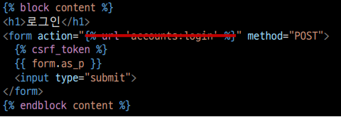

## 로그인 작성전에 로그인에 필요한 세션 알아보기

```python
# setting.py에 앱등록 부분이랑 미들웨어에 세션관리 해주는 코드 있음
INSTALLED_APPS = [
	"django.contrib.sessions",  # 세션 관리
]
MIDDLEWARE = [
	"django.contrib.sessions.middleware.SessionMiddleware",  # 세션
]
```


# 로그인

### urls.py

```python
# accounts/urls.py
from django.urls import path
from . import views
app_name = 'accounts'
urlpatterns = [
	path('login/', views.login, name='login'),
]
```

### views.py

```python
# accounts/views.py
from django.contrib.auth.forms import AuthenticationForm

def login(request):
	if request.method == 'POST':
		pass
	else:
		form = AuthenticationForm()
	context = {
		'form': form
	}
	return render(request, 'accounts/login.html', context)
```


# 로그아웃

### urls.py

```python
# accounts/urls.py
from django.urls import path
from . import views
app_name = 'accounts'
urlpatterns = [
	path('login/', views.login, name='login'),
	path('logout/', views.logout, name='logout'),
]
```

### views.py

```python
# accounts/views.py
from django.contrib.auth import logout as auth_logout
def logout(request):
	auth_logout(request)
	return redirect('articles:index')
```


# [참고] is_authenticated 코드 살펴보기

- [django/base_user.py at main · django/django · GitHub](https://github.com/django/django/blob/main/django/contrib/auth/base_user.py#L56)

```python
class AbstractBaseUser(models.Model):
	...
	def is_authenticated(self):
	"""
	Always return True. This is a way to tell if the user has been
	authenticated in templates.
	"""
	return True
```


### base.html

```html
<!-- base.html -->

	<h3>Hello, {{ user }}</h3>
	<form action="" method="POST">
	
	<input type="submit" value="Logout">
	</form>
	<a href="">회원정보수정</a>
	<form action="" method="POST">
	
	<input type="submit" value="회원탈퇴">
	</form>

	<a href="">Login</a>
	<a href="">Signup</a>

```

### articles/index.html

```html
<!-- articles/index.html -->


	<h1>Articles</h1>
	
	<a href="">CREATE</a>
	
	<a href="">새 글을 작성하려면 로그인하세요</a>
	
	...

```


# login_required

- 로그인 상태에서만 글을 작성/수정/삭제 할 수 있도록 변경

### views.py

```python
from django.contrib.auth.decorators import login_required

@login_required
def create(request):
	pass

@login_required
def delete(request, pk):
	pass

@login_required
def update(request, pk):
	pass
```


# "next" query string parameter 

### views.py

```python
# accounts/views.py
def login(request):
	if request.user.is_authenticated:
		return redirect('articles:index')
	if request.method == 'POST':
		form = AuthenticationForm(request, request.POST)
	if form.is_valid():
		auth_login(request, form.get_user())
		return redirect(request.GET.get('next') or 'articles:index')
...
```


### "next" query string parameter 주의사항

- 만약 login 템플릿에서 form action이 작성되어 있다면 동작하지 않음 
- 해당 action 주소 next 파라미터가 작성 되어있는 현재 url이 아닌 /accounts/login/ 으로 요청을 보내기 때문

### accounts/login.html


