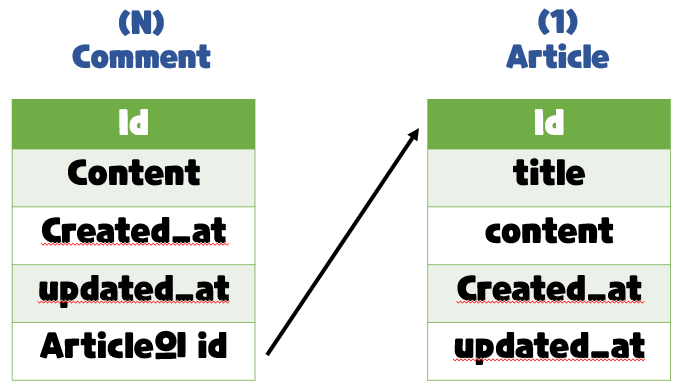

# A one-to-many relationship

## RDB(관계형 데이터베이스) 복습

- 데이터를 테이블, 행, 열 등으로 나누어 구조화하는 방식 
- RDB의 모든 테이블에는 행에서 고유하게 식별 가능한 기본 키라는 속성이 있으며, 외래 키를 사용하여 각 행에서 서로 다른 테이블 간의 관계를 만드는 데 사용할 수 있음


## RDB에서의 관계

- 1:1 
  - One-to-one relationships 
  - 한 테이블의 레코드 하나가 다른 테이블의 레코드 단 한 개와 관련된 경우

- 1:N 
  - one-to-many relationships 
  - 한 테이블의 0개 이상의 레코드가 다른 테이블의 레코드 한 개와 관련된 경우 
  - 기준 테이블에 따라(1:N, One-to-many relationships)이라고도 함

- M:N 
  - Many-to-many relationships 
  - 한 테이블의 0개 이상의 레코드가 다른 테이블의 0개 이상의 레코드와 관련된 경우 
  - 양쪽 모두에서 1:N 관계를 가짐


# Foreign Key

## 개념

- 외래 키(외부 키) 
- 관계형 데이터베이스에서 다른 테이블의 행을 식별할 수 있는 키 
- 참조되는 테이블의 기본 키(Primary Key)를 가리킴 
- 참조하는 테이블의 행 1개의 값은, 참조되는 측 테이블의 행 값에 대응됨 
  - 이 때문에 참조하는 테이블의 행에는,  참조되는 테이블에 나타나지 않는 값을 포함할 수 없음

- 참조하는 테이블 행 여러 개가, 참조되는 테이블의 동일한 행을 참조할 수 있음


## 특징

- 키를 사용하여 부모 테이블의 유일한 값을 참조 (참조 무결성) 
  - 참조 무결성 : 데이터베이스 관계 모델에서 관련된 2개의 테이블 간의 일관성 
    - 외래 키가 선언된 테이블의 외래 키 속성(열)의 값은 해당 테이블의 기본 키 값으로 존재

- 외래 키의 값이 반드시 부모 테이블의 기본 키 일 필요는 없지만 유일한 값이어야 함


# 1:N  (Article - Comment) - (글 - 댓글)

## 모델 관계 설정 (1/3)

- 게시판의 게시글와 1:N 관계를 나타낼 수 있는 댓글 구현 
- 1:N 관계에서 댓글을 담당할 Article 모델은 1, Comment 모델은 N이 될 것 
  - 게시글은 댓글을 0개 이상 가진다. 
    - 게시글(1)은 여러 개의 댓글(N)을 가진다.  
    - 게시글(1)은 댓글을 가지지 않을 수도 있다.
  -  댓글은 반드시 하나의 게시글에 속한다.


## 모델 관계 설정 (2/3)




## 모델 관계 설정 (3/3)

- 만약 comment 테이블에 데이터가 다음과 같이 작성되었다면 1번 게시글에는 1개의 댓글이, 3번 게시글에는 2개의 댓글이 작성된 것


## Django Relationship fields 종류

- OneToOneField() 
  - A one-to-one relationship

- ForeignKey() 
  - A one-to-many relationship

- ManyToManyField() 
  - A many-to-many relationship


## ForeignKey(to, on_delete, **options)

- A one-to-many relationship을 담당하는 Django의 모델 필드 클래스 
- Django 모델에서 관계형 데이터베이스의 외래 키 속성을 담당 
- 2개의 필수 위치 인자가 필요 
  - 참조하는 model class 
  - on_delete 옵션

- [Model field reference | Django documentation | Django (djangoproject.com)](https://docs.djangoproject.com/en/3.2/ref/models/fields/#foreignkey)


## ForeignKey arguments - on_delete

- 외래 키가 참조하는 객체가 사라졌을 때,  외래 키를 가진 객체를 어떻게 처리할 지를 정의 
- 데이터 무결성을 위해서 매우 중요한 설정 
- on_delete 옵션 값 
  - CASCADE : 부모 객체(참조 된 객체)가 삭제 됐을 때 이를 참조하는 객체도 삭제 
  - PROTECT, SET_NULL, SET_DEFAULT … 등 여러 옵션 값들이 존재 
  - 수업에서는 CASCADE 값만 사용할 예정


## Comment 모델 정의

- 외래 키 필드는 ForeignKey 클래스를 작성하는 위치와 관계없이 필드의 마지막에  작성됨 
- ForeignKey() 클래스의 인스턴스 이름은 참조하는 모델 클래스 이름의 단수형(소문자) 으로 작성하는 것을 권장 (이유는 이어지는 모델 참조에서 확인 예정)

```python
# articles/models.py
class Comment(models.Model):
	article = models.ForeignKey(Article, on_delete=models.CASCADE)
	content = models.CharField(max_length=200)
	created_at = models.DateTimeField(auto_now_add=True)
	updated_at = models.DateTimeField(auto_now=True)
	def __str__(self):
		return self.content
```


## Migration 과정 진행 (1/2)

- models.py에서 모델에 대한 수정사항이 발생했기 때문에 migration 과정을 진행

```bash
$ python manage.py makemigrations
```

- 마이그레이션 파일 0002_comment.py 생성 확인

-  migrate 진행

```bash
$ python manage.py migrate
```


## Migration 과정 진행 (2/2)

- migrate 후 Comment 모델 클래스로 인해 생성된 테이블 확인

- ForeignKey 모델 필드로 인해 작성된 컬럼의 이름이 article_id인 것을 확인 
- 만약 ForeignKey 인스턴스를 article이 아닌 abcd로 생성 했다면 abcd_id로 만들어짐 
  - 이처럼 명시적인 모델 관계 파악을 위해 참조하는 클래스 이름의 소문자(단수형)로 작성하는 것이 권장 되었던 이유


## 댓글 생성 연습하기 (1/7)

- shell_plus 실행

```bash
$ python manage.py shell_plus
```


## 댓글 생성 연습하기 (2/7)

-  댓글 생성

```bash
# Comment 클래스의 인스턴스 comment 생성
comment = Comment() 
# 인스턴스 변수 저장
comment.content = 'first comment'
# DB에 댓글 저장
comment.save()
# 에러 발생
django.db.utils.IntegrityError: NOT NULL constraint failed: articles_comment.article_id
# articles_comment 테이블의 ForeignKeyField, article_id 값이 저장시 누락되었기 때문
```


## 댓글 생성 연습하기 (3/7)

- 댓글 생성

```bash
# 게시글 생성 및 확인
article = Article.objects.create(title='title', content='content')
article
=> <Article: title>
# 외래 키 데이터 입력
# 다음과 같이 article 객체 자체를 넣을 수 있음
comment.article = article
# 또는 comment.article_id = article.pk 처럼 pk 값을 직접 외래 키 컬럼에
# 넣어 줄 수도 있지만 권장하지 않음
# DB에 댓글 저장 및 확인
comment.save()
comment
=> <Comment: first comment>
```


## 댓글 생성 연습하기 (4/7)

- 댓글 속성 값 확인

```bash
comment.pk 
=> 1
comment.content
=> 'first comment'
# 클래스 변수명인 article로 조회 시 해당 참조하는 게시물 객체를 조회할 수 있음
comment.article
=> <Article: title>
# article_pk는 존재하지 않는 필드이기 때문에 사용 불가
comment.article_id
=> 1
```


## 댓글 생성 연습하기 (5/7)

- comment 인스턴스를 통한 article 값 접근하기

```bash
# 1번 댓글이 작성된 게시물의 pk 조회
comment.article.pk 
=> 1
# 1번 댓글이 작성된 게시물의 content 조회
comment.article.content
=> 'content'
```


## 댓글 생성 연습하기 (6/7)

- 두번째 댓글 작성해보기

```bash
comment = Comment(content='second comment', article=article) 
comment.save()
comment.pk
=> 2
comment
=> <Comment: second comment>
comment.article_id
=> 1
```


## 댓글 생성 연습하기 (7/7)

-  작성된 댓글 확인 해보기

| id   | cotent         | created_at | updated_at | article_id |
| ---- | -------------- | ---------- | ---------- | ---------- |
| 1    | first_comment  | 2022-10-18 | 2022-10-18 | 1          |
| 2    | second_comment | 2022-10-18 | 2022-10-18 | 1          |


# 관계 모델 참조

## Related manager

- Related manager는 1:N 혹은 M:N 관계에서 사용 가능한 문맥(context) 
- Django는 모델 간 1:N 혹은 M:N 관계가 설정되면 역참조할 때에 사용할 수 있는 manager를 생성 
  - 우리가 이전에 모델 생성 시 objects라는 매니저를 통해 queryset api를 사용했던 것처럼 related manager를 통해 queryset api를 사용할 수 있게 됨

- 지금은 1:N 관계에서의 related manager 만을 학습할 것

- [Related objects reference | Django documentation | Django (djangoproject.com)](https://docs.djangoproject.com/en/3.2/ref/models/relations/)


## 역참조

- 나를 참조하는 테이블(나를 외래 키로 지정한)을 참조하는 것 
- 즉, 본인을 외래 키로 참조 중인 다른 테이블에 접근하는 것 
- 1:N 관계에서는 1이 N을 참조하는 상황 
  - 외래 키를 가지지 않은 1이 외래 키를 가진 N을 참조


```bash
article.comment_set.method()
```

- Article 모델이 Comment 모델을 참조(역참조)할 때 사용하는 매니저 
- article.comment 형식으로는 댓글 객체를 참조 할 수 없음 
  - 실제로 Article 클래스에는 Comment와의 어떠한 관계도 작성되어 있지 않음

- 대신 Django가 역참조 할 수 있는 comment_set manager를 자동으로 생성해 article.comment_set 형태로 댓글 객체를 참조할 수 있음

<span style="color:red">**❖ 1:N 관계에서 생성되는 Related manger의 이름은 참조하는 “모델명_set” 이름 규칙으로 만들어짐**</span>

- 반면 참조 상황(Comment → Article)에서는 실제 ForeignKey 클래스로 작성한 인스턴스가 Comment 클래스의 클래스 변수이기 때문에 comment.article 형태로 작성 가 능


## Related manager 연습하기 (1/5)

- shell_plus 실행

```bash
$ python manage.py shell_plus
```


## Related manager 연습하기 (2/5)

- 1번 게시글 조회하기

```bash
article = Article.objects.get(pk=1)
```


## Related manager 연습하기 (3/5)

- dir() 함수를 사용해 클래스 객체가 사용할 수 있는 메서드를 확인하기

```bash
dir(article)
[
    ...중략...,
    'comment_set'
    ,
    'content',
    'created_at'
    ,
    'date_error_message'
    ,
    'delete',
    'from_db'
    ,
    'full_clean'
    ,
    ...중략...
]
```


## Related manager 연습하기 (4/5)

- 1번 게시글에 작성된 모든 댓글 조회하기 (역참조)

```bash
article.comment_set.all() 
=> <QuerySet [<Comment: first comment>, <Comment: second comment>]>
```


## Related manager 연습하기 (5/5)

- 1번 게시글에 작성된 모든 댓글 출력하기

```bash
comments = article.comment_set.all()
for comment in comments:
	print(comment.content)
```


## ForeignKey arguments – related_name

- ForeignKey 클래스의 선택 옵션 
- 역참조 시 사용하는 매니저 이름(model_set manager)을 변경할 수 있음 
- 작성 후, migration 과정이 필요 
- 선택 옵션이지만 상황에 따라 반드시 작성해야 하는 경우가 생기기도 하는데 이는 추후 자연스럽게 만나볼 예정 
- 작성 후 다시 원래 코드로 복구

```python
# articles/models.py
class Comment(models.Model):
	article = models.ForeignKey(Article, on_delete=models.CASCADE,
								related_name='comments')
	...
```

<span style="color:red">**❖ 위와 같이 변경 하면 기존 article.comment_set은 더 이상 사용할 수 없고, article.comments로 대체됨**</span>


## admin site 등록

-  새로 작성한 Comment 모델을 admin site에 등록하기

```python
# articles/admin.py
from .models import Article, Comment
admin.site.register(Article)
admin.site.register(Comment)
```


# Comment 구현

## CREATE (1/9)

- 사용자로부터 댓글 데이터를 입력 받기 위한 CommentForm 작성

```python
# articles/forms.py
from .models import Article, Comment
class CommentForm(forms.ModelForm):
	class Meta:
		model = Comment
		fields = '__all__'
```


## CREATE (2/9)

- detail 페이지에서 CommentForm 출력 (view 함수)

```python
# articles/views.py
from .forms import ArticleForm, CommentForm
def detail(request, pk):
    article = Article.objects.get(pk=pk)
    comment_form = CommentForm()
    context = {
        'article': article,
        'comment_form': comment_form,
	}
	return render(request, 'articles/detail.html', context)
```

<span style="color:red">**❖ 기존에 ArticleForm 클래스의 인스턴스명을 form으로 작성했기 때문에 헷갈리지 않도록 comment_form으로 작성**</span>


## CREATE (3/9)

- detail 페이지에서 CommentForm 출력 (템플릿)

```html
<!-- articles/detail.html -->


    ...
    <a href="">back</a>
    <hr>
    <form action="#" method="POST">
        
        {{ comment_form }}
        <input type="submit">
    </form>

```


## CREATE (4/9)

- detail 페이지에 출력된 CommentForm을 살펴보면 아래 이미지와 같이 출력됨 
- 실 서비스에서는 댓글을 작성할 때 댓글을 어떤 게시글에 작성하는지 직접 게시글 번호를 선택 하지 않음 
- 실제로는 해당 게시글에 댓글을 작성하면 자연스럽게 그 게시글에 댓글이 작성되어야 함 
- 다음과 같이 출력되는 이유는 Comment 클래스의 외래 키 필드 article 또한 데이터 입력이 필요하기 때문에 출력 되고 있는 것 
- 하지만, 외래 키 필드는 사용자의 입력으로 받는 것이 아니라 view 함수 내에서 받아 별도로 처리되어 저장되어야 함


## CREATE (5/9)

- 외래 키 필드를 출력에서 제외 후 확인

```python
# articles/forms.py
class CommentForm(forms.ModelForm):
	class Meta:
        model = Comment
        exclude = ('article',)
```


## CREATE (6/9)

- 출력에서 제외된 외래 키 데이터는 어디서 받아와야 할까? 
- detail 페이지의 url을 살펴보면 path(‘/', views.detail, name='detail’) url에 해당 게시글의 pk 값이 사용 되고 있음 
- 댓글의 외래 키 데이터에 필요한 정보가 바로 게시글의 pk 값 
- 이전에 학습했던 url을 통해 변수를 넘기는 variable routing을 사용

```python
# articles/urls.py
urlpatterns = [
    ...,
    path('<int:pk>/comments/', views.comments_create, 
    name='comments_create'),
]
```

```python
# articles/views.py
def comments_create(request, pk):
    article = Article.objects.get(pk=pk)
    comment_form = CommentForm(request.POST)
    if comment_form.is_valid():
        # article 객체는 언제 저장할 수 있을까?
        comment_form.save()
    return redirect('articles:detail', article.pk)
```

```html
<!-- articles/detail.html -->
<form action="" method="POST">
    
    {{ comment_form }}
    <input type="submit">
</form>
```

- 작성을 마치고 보면 article 객체를 저장하지 못함 
- 그래서 save() 메서드는 데이터베이스에 저장하기 전에 객체에 대한 추가적인 작업을 진행할 수 있도록 인스턴스 만을 반환해주는 옵션 값을 제공


## The save() method

- save(commit=False) 
  - “Create, but don't save the new instance.” 
  - 아직 데이터베이스에 저장되지 않은 인스턴스를 반환 
  - 저장하기 전에 객체에 대한 사용자 지정 처리를 수행할 때 유용하게 사용

- [Creating forms from models | Django documentation | Django (djangoproject.com)](https://docs.djangoproject.com/en/3.2/topics/forms/modelforms/#the-save-method)


## CREATE (8/9)

- save 메서드의 commit 옵션을 사용해 DB에 저장되기 전 article 객체 저장하기

```python
# articles/views.py
def comments_create(request, pk):
    article = Article.objects.get(pk=pk)
    comment_form = CommentForm(request.POST)
    if comment_form.is_valid():
        comment = comment_form.save(commit=False)
        comment.article = article
        comment.save()
    return redirect('articles:detail', article.pk)
```


## CREATE (9/9)

- 댓글 작성 후 테이블 확인

| id   | content        | created_at | updated_at | article_id |
| ---- | -------------- | ---------- | ---------- | ---------- |
| 1    | first_comment  | 2022-10-18 | 2022-10-18 | 1          |
| 2    | second_comment | 2022-10-18 | 2022-10-18 | 1          |
| 3    | 댓글 작성      | 2022-10-18 | 2022-10-18 | 1          |


## READ (1/3)

- 작성한 댓글 목록 출력하기 
- 특정 article에 있는 모든 댓글을 가져온 후 context에 추가

```python
# articles/views.py
from .models import Article, Comment
def detail(request, pk):
    article = Article.objects.get(pk=pk)
    comment_form = CommentForm()
    comments = article.comment_set.all()
    context = {
        'article': article,
        'comment_form': comment_form,
        'comments': comments,
    }
    return render(request, 'articles/detail.html', context)
```


## READ (2/3)

- detail 템플릿에서 댓글 목록 출력하기

```html
<!-- articles/detail.html -->


    ...
    <a href="">back</a>
    <hr>
    <h4>댓글 목록</h4>
    <ul>
    
    <li>{{ comment.content }}</li>
    
    </ul>
    <hr>
    ...

```


## READ (3/3)

- detail 템플릿에서 댓글 목록 출력 확인하기


## DELETE (1/3)

- 댓글 삭제 구현하기 (url, view)

```python
# articles/urls.py
urlpatterns = [ 
    ...,
    path('<int:article_pk>/comments/<int:comment_pk>/delete/', views.comments_delete, name='comments_delete'),
]
```

```python
# articles/views.py
def comments_delete(request, article_pk, comment_pk):
    comment = Comment.objects.get(pk=comment_pk)
    comment.delete()
    return redirect('articles:detail', article_pk)
```


## DELETE (2/3)

- 댓글을 삭제할 수 있는 버튼을 각각의 댓글 옆에 출력 될 수 있도록 함

```html
<!-- articles/detail.html -->

    ...
    <h4>댓글 목록</h4>
    <ul>
        
            <li>
                {{ comment.content }}
                    <form action="" method="POST">
                    
                    <input type="submit" value="DELETE">
                    </form>
            </li>
        
    </ul>
    <hr>
    ...

```


## DELETE (3/3)

- 댓글 삭제 버튼 출력 확인 및 삭제 시도해보기


# Comment 추가 사항

## 개요

- 댓글에 관련된 아래 2가지 사항을 작성하면서 마무리하기 
  - 댓글 개수 출력하기 
    - DTL filter - length 사용 
    - Queryset API - count() 사용
  - 댓글이 없는 경우 대체 컨텐츠 출력하기


## 댓글 개수 출력하기 (1/3)

- DTL filter - length 사용

```python
{{ comments|length }}
{{ article.comment_set.all|length }}
```

-  Queryset API - count() 사용

```python
{{ comments.count }}
{{ article.comment_set.count }}
```


## 댓글 개수 출력하기 (2/3)

- detail 템플릿에 작성하기

```html
<!-- articles/detail.html -->
<h4>댓글 목록</h4>

	<p><b>{{ comments|length }}개의 댓글이 있습니다.</b></p>

```


## 댓글 개수 출력하기 (3/3)

- 작성 후 출력 확인


## 댓글이 없는 경우 대체 컨텐츠 출력하기 (1/2)

- DTL for empty 활용하기

```html
<!-- articles/detail.html -->

    <li>
        {{ comment.content }}
            <form action="" method="POST">
            
            <input type="submit" value="DELETE">
            </form>
    </li>

	<p>댓글이 없어요..</p>
{% endfor %
```


## 댓글이 없는 경우 대체 컨텐츠 출력하기 (2/2)

- 새로운 게시글을 작성하거나 모든 댓글을 삭제 후 확인

