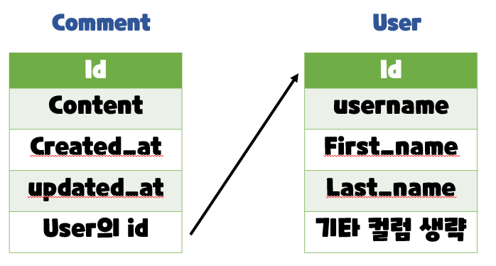

# 1:N  (User - Comment)

## 개요

- User(1) - Comment(N) 
- User 모델과 Comment 모델 간 관계 설정 
- “0개 이상의 댓글은 1개의 회원에 의해 작성 될 수 있음”


# 모델 관계 설정

## Comment와 User간 모델 관계 설정 (1/2)




## Comment와 User간 모델 관계 설정 (2/2)

- Comment 모델에 User 모델을 참조하는 외래 키 작성

```python
# articles/models.py
class Comment(models.Model):
    article = models.ForeignKey(Article, on_delete=models.CASCADE)
    user = models.ForeignKey(settings.AUTH_USER_MODEL, on_delete=models.CASCADE)
    ...
```


## Migration 진행 (1/5)

- 이전에 User와 Article 모델 관계 설정 때와 마찬가지로 기존에 존재하던 테이블에 새 로운 컬럼이 추가되어야 하는 상황이기 때문에 migrations 파일이 곧바로 만들어지지 않고 일련의 과정이 필요

```bash
$ python manage.py makemigrations
```


## Migration 진행 (2/5)

- 첫번째 화면 
  - 기본적으로 모든 컬럼은 NOT NULL 제약조건이 있기 때문에 데이터가 없이는 새로 추가되는 외래 키 필드 user_id가 생성되지 않음 
  - 그래서 기본값을 어떻게 작성할 것인지 선택해야 함 
  - 1을 입력하고 Enter 진행 (다음 화면에서 직접 기본 값 입력)
  - 실제화면

```bash
You are trying to add a non-nullable field 'user' to article without a default; we can't do 
that (the database needs something to populate existing rows).
Please select a fix:
1) Provide a one-off default now (will be set on all existing rows with a null value for 
this column)
2) Quit, and let me add a default in models.py
Select an option:
```


## Migration 진행 (3/5)

- 두번째 화면 

  - comment의 user_id에 어떤 데이터를 넣을 것인지 직접 입력해야 함 
  - 마찬가지로 1 입력하고 Enter 진행 
  - 그러면 기존에 작성된 댓글이 있다면 모두 1번 회원이 작성한 것으로 처리됨

  - 실제화면

```python
Please enter the default value now, as valid Python
The datetime and django.utils.timezone modules are available, so you can do e.g.
timezone.now
Type 'exit' to exit this prompt
>>>
```


## Migration 진행 (4/5)

- migrations 파일 생성 후 migrate 진행

```bash
$ python manage.py migrate
```


## Migration 진행 (5/5)

- comment 테이블 스키마 변경 및 확인


# CREATE

## 개요

- 인증된 회원의 댓글 작성 구현하기
- 작성하기 전 로그인을 먼저 진행한 상태로 진행


## 외래 키 데이터 누락

- 댓글 작성 시 NOT NULL constraint failed: articles_comment.user_id 에러 발생

- “NOT NULL 제약 조건이 실패했다. articles_comment 테이블의 user_id 컬럼에서” 
- 댓글 작성 시 외래 키에 저장되어야 할 작성자 정보가 누락 되었기 때문

- 댓글 작성 시 작성자 정보가 함께 저장될 수 있도록 save의 commit 옵션을 활용

```python
# articles/views.py
def comments_create(request, pk):
    article = Article.objects.get(pk=pk)
    comment_form = CommentForm(request.POST)
    if comment_form.is_valid():
        comment = comment_form.save(commit=False)
        comment.article = article
        comment.user = request.user
        comment.save()
    return redirect('articles:detail', article.pk)
```


# READ

## 댓글 작성자 출력 

- detail 템플릿에서 각 게시글의 작성자 출력

```html
<!-- articles/detail.html -->


    ...
    <h4>댓글 목록</h4>
    ... 
    <ul>
        
        <li>
        {{ comment.user }} - {{ comment.content }}
        <form action="" method="POST">
        
        <input type="submit" value="DELETE">
        </form>
    ...
```

- 출력 확인하기


# DELETE

## 댓글 삭제 시 작성자 확인

- 이제 댓글에는 작성자 정보가 함께 들어있기 때문에 현재 삭제를 요청하려는 사람과 댓글을 작성한 사람을 비교하여 본인의 댓글만 삭제 할 수 있도록 함

```python
# articles/views.py
def comments_delete(request, article_pk, comment_pk):
    comment = Comment.objects.get(pk=comment_pk)
    if request.user == comment.user:
    	comment.delete()
    return redirect('articles:detail', article_pk)
```

- 추가로 해당 댓글의 작성자가 아니라면, 삭제 버튼을 출력하지 않도록 함

```html
<!-- articles/detail.html -->


    ...
    <ul>
    
    <li>
        {{ comment.user }} - {{ comment.content }}
        
        <form action="" method="POST">
        
        <input type="submit" value="DELETE">
        </form>
    
    ...
```

- 다른 계정으로 접속하여 detail 템플릿에서 다른 회원이 작성한 댓글을 확인


