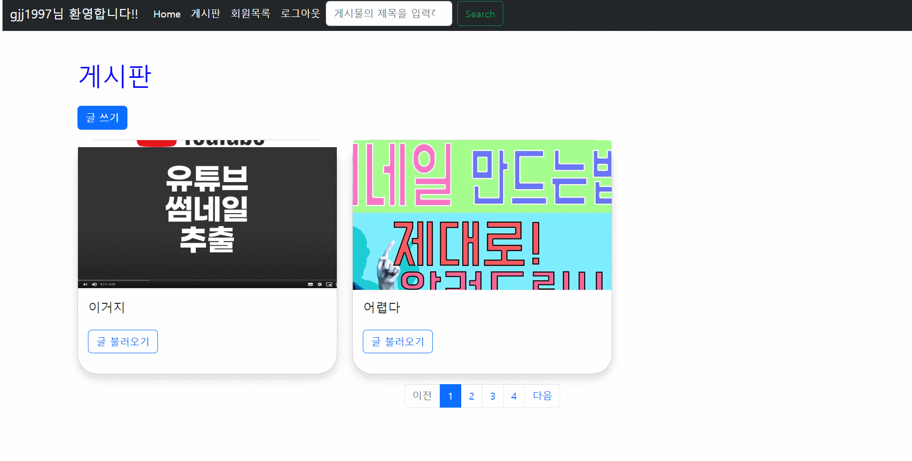

# Paginator추가

```python
# views.py
from django.core.paginator import Paginator # django안에 있는 템플릿 import

# 게시물을 보여주는 index페이지에 pagination을 추가
def index(request):
    # 게시글을 가져와서..
    articles = Article.objects.order_by("-pk")
    # template에 객체 전달
    # Template에 전달한다.
    
    # 각 게시물을 한페이지에 2개씩 지정
    paginator = Paginator(articles, 2)
    # 1페이지를 액티비티로
    page = request.GET.get("page", 1)
    page_obj = paginator.get_page(page)
    context = {
        "articles": articles, # page_obj로 생략가능
        "page_obj": page_obj,
    }
    return render(request, "articles/index.html", context)
```


```html
<!-- articles/index.html -->
 --> 로 변경

<!-- views.py에서page_obj가 전체 데이터를 2개씩 쪼개놓은거라 for article in page_obj이렇게 for문으로 작성해야한다 -->
```


# 회원정보(accounts/detail.html) 작성 댓글 목록 추가

```html
<!-- accounts/detail.html -->
<h3>작성한 댓글</h3>
    <p class="text-muted">{{ user.comment_set.count }}개를 작성하였습니다.</p>
    <table class="table">
        <thead>
            <tr class="thead-dark">
                <th>작성 댓글</th>
                <th>댓글 내용</th>
            </tr>
        </thead>
        <tbody>
            
            <tr>
                <td>{{ forloop.counter}}</td>
                <td><a href="">{{comment.content}}</a></td>
            </tr>
            
        </tbody>
    </table>
```

