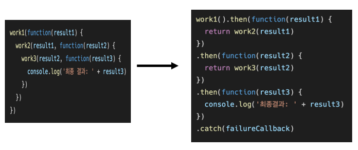

# Axios

## Axios

- “Promise based HTTP client for the browser and Node.js” 
- 브라우저를 위한 Promise 기반의 클라이언트 
- 원래는 “XHR”이라는 브라우저 내장 객체를 활용해 AJAX 요청을 처리하는데, 이보다 편리한 AJAX 요청이 가능하도록 도움을 줌 
  - 확장 가능한 인터페이스와 함께 패키지로 사용이 간편한 라이브러리를 제공

```python
axios.get('https://jsonplaceholder.typicode.com/todos/1') //Promise return
	.then(..)
    .cathc(..)
```

```html
<!-- XMLHttpRequest -->
<script>
    const xhr = new XMLHttpRequest()
    const URL = 'https://jsonplaceholder.typicode.com/todos/1'
        xhr.open('GET', URL)
        xhr.send()
        xhr.onreadystatechange = function (event) {
            if (xhr.readyState === XMLHttpRequest.DONE) {
                const status = event.target.status
                if (status === 0 || (status >= 200 && status < 400)) {
                    const res = event.target.response
                    const data = JSON.parse(res)
                    console.log(data.title)
                } else {
                    console.error('Error!')
            }
        }
    }
</script>
<!-- XMLHttpRequest -->
```

```html
<!-- Axios -->
<script src="https://unpkg.com/axios/dist/axios.min.js"></script>
<script>
	const URL = 'https://jsonplaceholder.typicode.com/todos/1'
	axios.get(URL)
		.then(res => console.log(res.data.title))
		.catch(err => console.log('Error!’))
</script>
```


## Promise

- 비동기 작업을 관리하는 객체 
  - 미래의 완료 또는 실패와 그 결과 값을 나타냄 
  - 미래의 어떤 상황에 대한 약속 
- 성공(이행)에 대한 약속 
  - .then() 
- 실패(거절)에 대한 약속 
  - .catch()


- .then(callback) 
  - 이전 작업(promise)이 성공했을 때(이행했을 때) 수행할 작업을 나타내는 callback 함수 
  - 그리고 각 callback 함수는 이전 작업의 성공 결과를 인자로 전달받음 
  - 따라서 성공했을 때의 코드를 callback 함수 안에 작성

- .catch(callback) 
  - .then이 하나라도 실패하면(거부 되면) 동작 (동기식의 ‘try - except’ 구문과 유사) 
  - 이전 작업의 실패로 인해 생성된 error 객체는 catch 블록 안에서 사용할 수 있음


- 각각의 .then() 블록은 서로 다른 promise를 반환 
  - 즉, .then()을 여러 개 사용(chaining)하여 연쇄적인 작업을 수행할 수 있음 
  - 결국 여러 비동기 작업을 차례대로 수행할 수 있다는 뜻

- .then()과 .catch() 메서드는 모두 promise를 반환하기 때문에 chaining 가능

- 주의 
  - 반환 값이 반드시 있어야 함 
  - 없다면 callback 함수가 이전의 promise 결과를 받을 수 없음


- .finally(callback) 

  - Promise 객체를 반환 
  - 결과와 상관없이 무조건 지정된 callback 함수가 실행 
  - 어떠한 인자도 전달받지 않음 
    - Promise가 성공되었는지 거절되었는지 판단할 수 없기 때문

  - 무조건 실행되어야 하는 절에서 활용 
    - .then()과 .catch() 블록에서의 코드 중복을 방지


- callback Hell → Promise (2/2)




- .then()을 여러 번 사용하여 여러 개의 callback 함수를 추가할 수 있음 (Chaining) 
- callback 함수는 JavaScript의 Event Loop가 현재 실행 중인 Call Stack을 완료하기 이전에는 절대 호출되지 않음 
  - Promise callback 함수는 Event Queue에 배치되는 엄격한 순서로 호출됨 
  - 비동기 작업이 성공하거나 실패한 뒤에 .then() 메서드를 이용한 경우도 마찬가지