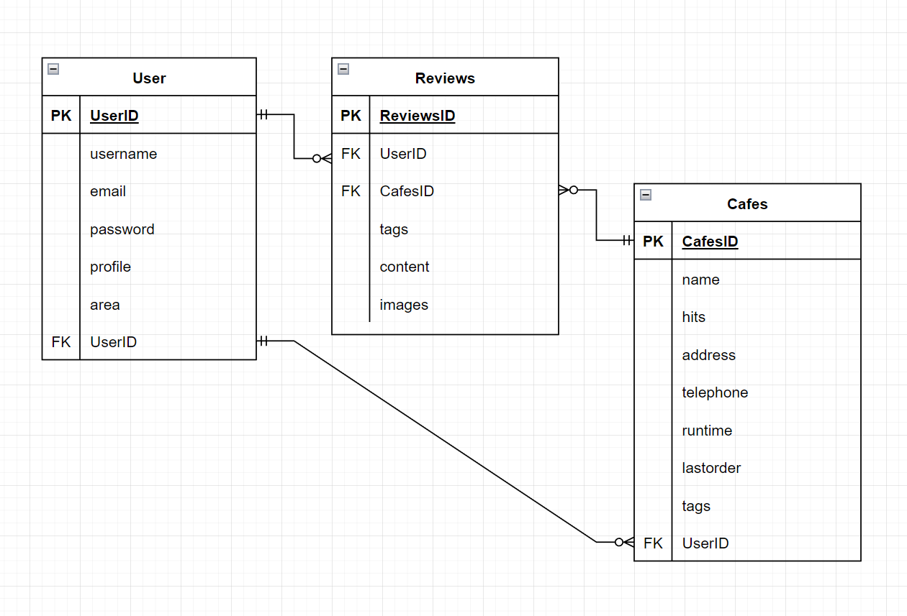
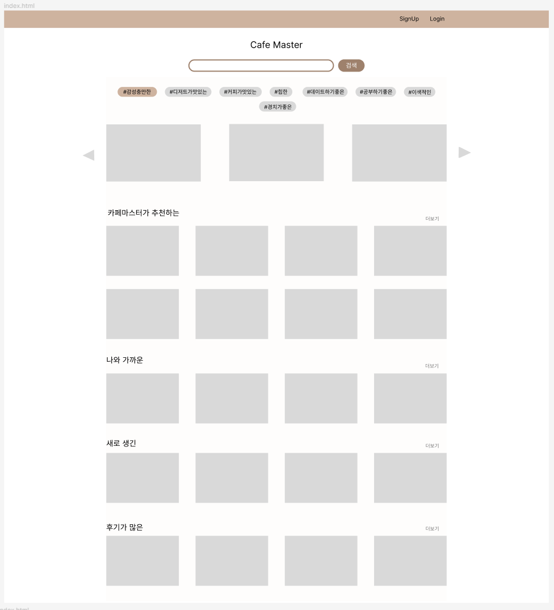
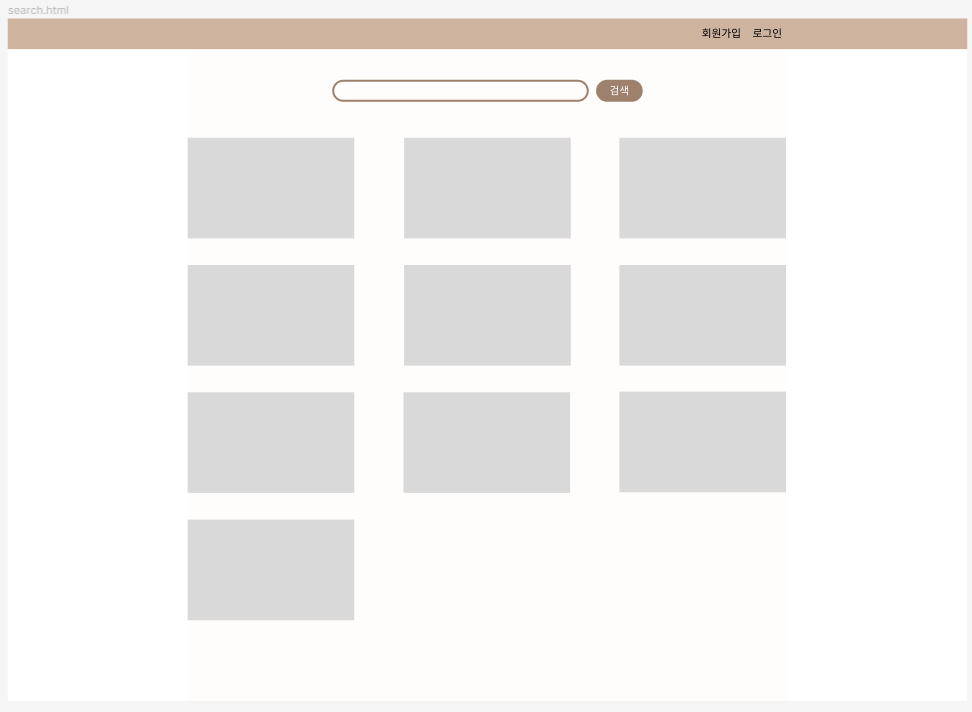
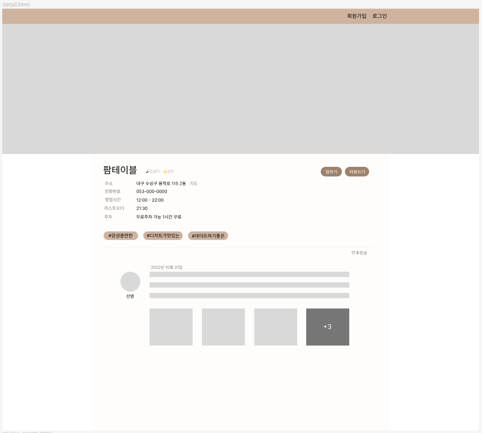
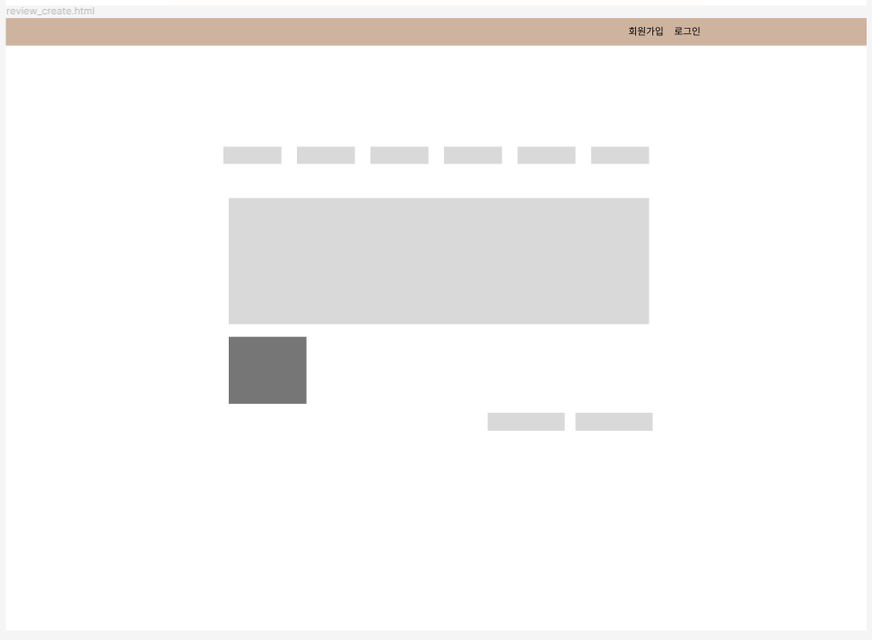
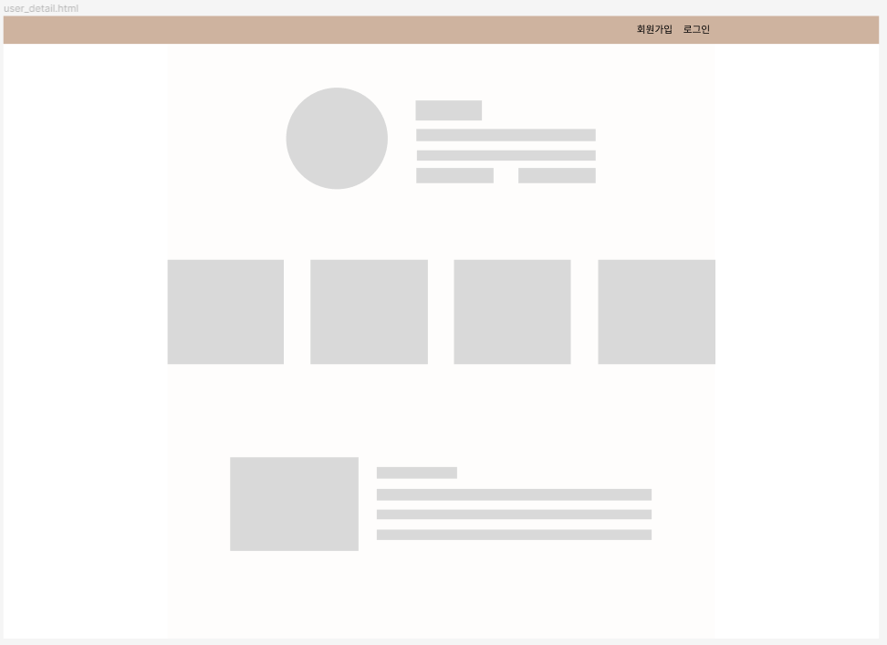

- 프로젝트 개요

  | 프로젝트 목적 | 웹 프레임워크 Django와 HTML / CSS / JavaScript를 활용한 콘텐츠 기반 커뮤니티 웹 플랫폼 개발 |
  | ------------- | ------------------------------------------------------------ |
  | 프로젝트 기간 | 10.31 (월) ~ 11.07 (월)                                      |
  | 발표 날짜     | 11.08 (화)                                                   |
  | 팀명          | CafeMaster                                                   |
  | 주제          | 맛집 정보 및 후기 공유 커뮤니티 서비스                       |
  | 팀장          | 박선영                                                       |
  | 발표자        | 문재윤                                                       |
  | PPT 제작자    | 간정진                                                       |
  | PPT 제작자    | 이현성                                                       |

  

  ## 주제 사전 조사 & 분석

  🔎 선택한 주제와 유사한 서비스를 조사하고 분석합니다. 참고할 사이트와 자료를 기록

  [망고플레이트: 나만의 맛집 검색](https://www.mangoplate.com/)

  https://www.siksinhot.com/

  ⚙️서비스 주요 기능

  - 회원관리
    - 회원가입
    - 로그인
    - 로그아웃
    - 회원 프로필
    - 위치 정보
    - 팔로우
    - 맛집 좋아요
  - 리뷰 작성 CREATE
    - 해시태그
    - 별점
    - 글 작성
    - 사진
    - 이어쓰기
  - 리뷰 목록 READ
    - 카테고리별로 맛집 보여주기
    - 위치 정보 기반으로 맛집 보여주기
      - 크게크게
      - 로그인X: 서울 기준 맛집 보여주기
      - 로그인O: 회원 위치 기준 맛집 보여주기
    - 랜덤 맛집
    - 신상 카페
  - 검색
    - 지역
    - 카페 이름
    - 드롭다운 → 지역

  **해시태그**

  \#감성이충만한 #디저트가맛있는 #힙한 #커피가맛있는 #풍경이예쁜 #공부하기좋은 #데이트하기좋은 #이색적인

## DB 모델링(ERD)

🧾 서비스를 구현하기 위한 데이터베이스의 ERD를 작성

## 화면설계(피그마)

🎨 PPT / 피그마 / 카카오 오븐 등의 도구를 활용해서 화면을 설계 합니다. 최소 페이지의 레이아웃은 설계

## 실제 웹사이트 화면

