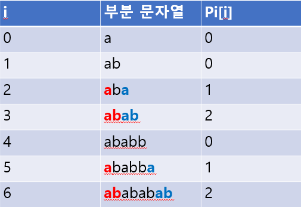
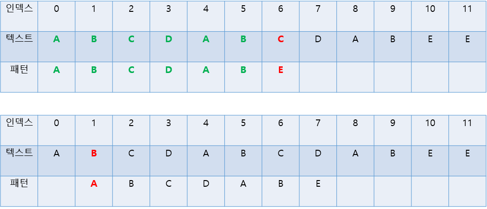
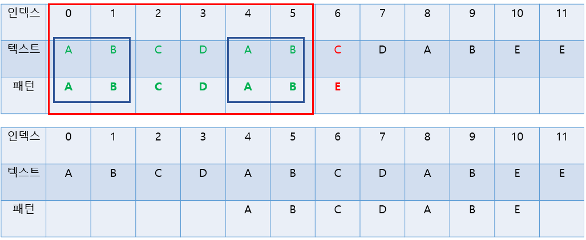
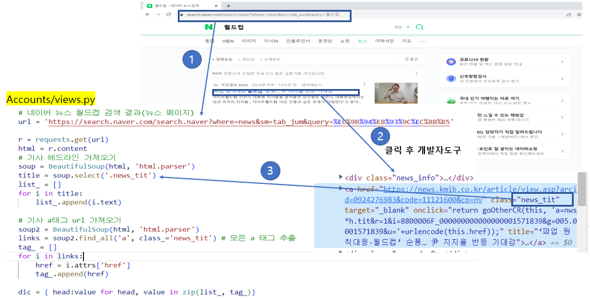
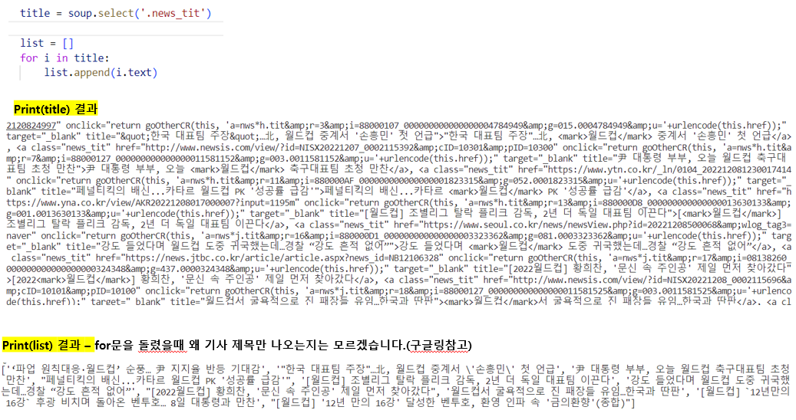
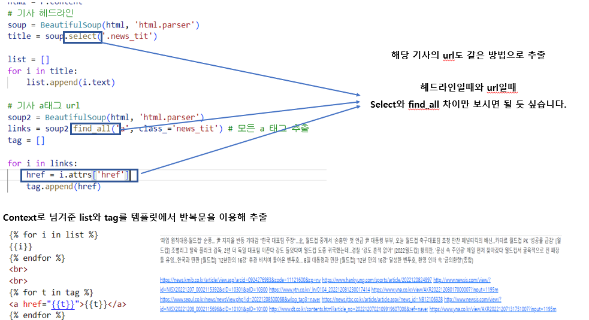
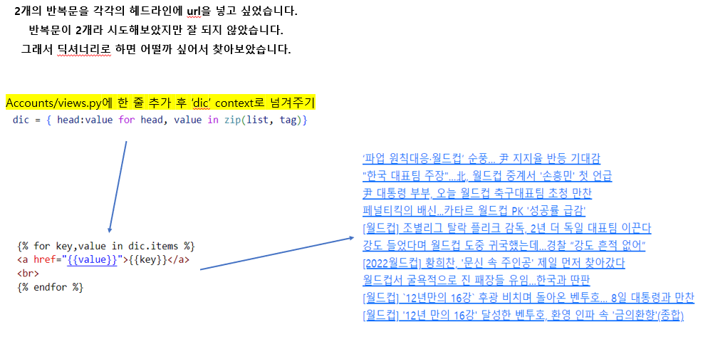

## annotate

>  mysql 문법에서 group_by라고 생각.

accounts/view.py 

- 활동지수에 따른 직업부여(감독 조건)

```python
comments = (
        user.comment_set.values("players_id")
        .annotate(play=Count("players_id"))
        .order_by("players_id")
    )

    comment_count = len(comments) # 선수별 작성된 글 개수
    
    job = "벤치"
    if user.exp < 30:
        job = "벤치"
    elif user.exp >= 30 and user.exp < 80:
        job = "선수"
    elif user.exp >= 80 and comment_count > 12:
        job = "감독"
    else:
        job = "선수"
```

```python
print(comments)
<QuerySet [{'players_id': 1, 'play': 1}, {'players_id': 15, 'play': 6}, {'players_id': 17, 'play': 1}, {'players_id': 18, 'play': 3}, {'players_id': 20, 'play': 2}]>
```

감독이 되기위한 조건 : 활동지수 80점이상 & 각 선수피셜 13개 이상

각각의 선수를 뽑기위해 anootate를 사용하여, 위에 print(comments)의 결과를 len을 이용하여 길이를 저장


## KMP 알고리즘

> KMP(Knuth, Morris, Pratt) 알고리즘은 찾고자 하는 문자열(Pattern)을 주어진 문자열(Text)에서 빠르게 찾아내는 방법 중 하나입니다.

❓왜 KMP알고리즘을 사용할까?

> "ABCABABCDE"에서 패턴 "ABC"가 어디서 등장하는지 찾는 시간 복잡도는
>
> 텍스트의 길이를 N, 패턴의 길을 M이라 할때, O(NM)이다.
>
> KMP알고리즘을 이용하면 O(N+M)에 문자열 검색을 할 수 있다.


✅알고리즘을 이해하기 위해 먼저 알아야 할 2가지

1. 접두사와 접미사
   - 예시
   - <banana의 접두사>
     - b
     - ba
     - ban
     - bana
     - banan
     - banana
   - 이 6개가 banana의 접두사 이다.
   - <banana의 접미사>
     - a
     - na
     - ana
     - nana
     - anana
     - bananana
   - 이 6개가 banana의 접미사 이다.


2. pi 배열
   - pi[i]는 주어진 문자열의 0~i 까지의 부분 문자열 중에서 **접두사 == 접미사**가 될 수 있는 부분 문자열 중에서 가장 긴것의 길이




#### 텍스트 "ABCDABCDABEE"에서 패턴 "ABCDABE"를 찾는 상황을 생각해봅시다.



-> 틀리다 다음 인덱스로..

하나씩 확인하면서 가면 시간이 오래걸린다



그래서 KMP알고리즘을 이용


#### pi배열을 구하는 코드

```python
def comment_table(p):
    table = [0] * len(p)
    i = 0
    for j in range(1, len(p)): 
        while i > 0 and p[i] != p[j]:
            i = table[i - 1]
        if p[i] == p[j]:
            i += 1
            table[j] = i
    return table

p = 'ababbab'
print(table) # [0,0,1,2,0,1,2]
```

- 위에서 j가 0부터가 아닌 1부터 시작하는 이유 -  0번째 값은 무조건 0이된다. 한글자 짜리 문자열에는 접두사, 접미사가 없기 때문이다. 

``

#### KMP 알고리즘

```python
def KMP(p, t):
    ans = []
    table = comment_table(p)
    i = 0
    for j in range(len(t)):
        while i > 0 and p[i] != t[j]:
            i = table[i - 1]
        if p[i] == t[j]:
            if i == len(p) - 1:
                ans.append(j - len(p) + 2)
                i = table[i]
            else:
                i += 1
    return ans

print(kmp('xabxxbaxbaxbaxbaxabxbaxbabx', 'abx')) # [1, 17, 24]
print(kmp('abababab', 'abab')) # [0, 2, 4]
```


## 크롤링









- 웹 페이지는 정적 페이지와 동적 페이지로 구분
  - 정적 페이지 : URL 주소만 입력하면 웹 브라우저로 HTML 문서를 마음대로 가져다 사용할 수 있음
  - 동적 페이지 : 로그인을 해야 페이지가 보이는 상황, 네이버 지도처럼 실시간으로 내용이 추가되거나 수정되는 페이지는 웹 드라이버로 제어가 필요하다
- URL만으로 정보수집이 가능한 정적 페이지는 Beautifulsoup를, 동적 페이지를 다룰 때는 selenium을 이용
