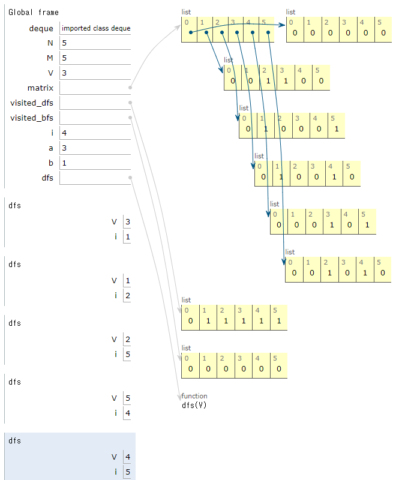
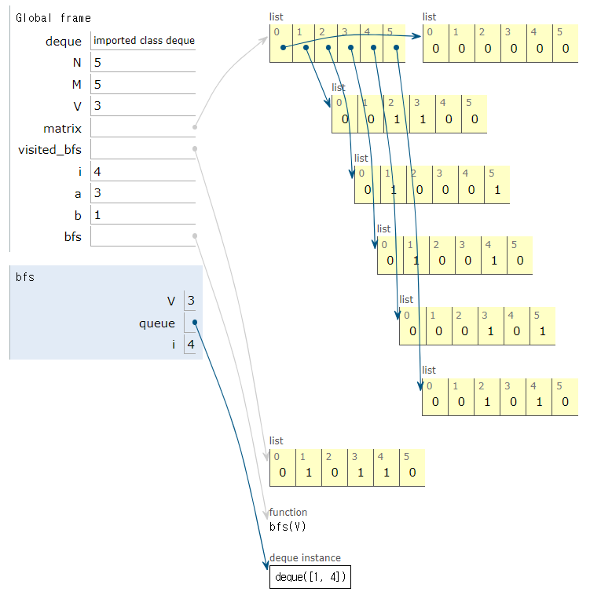
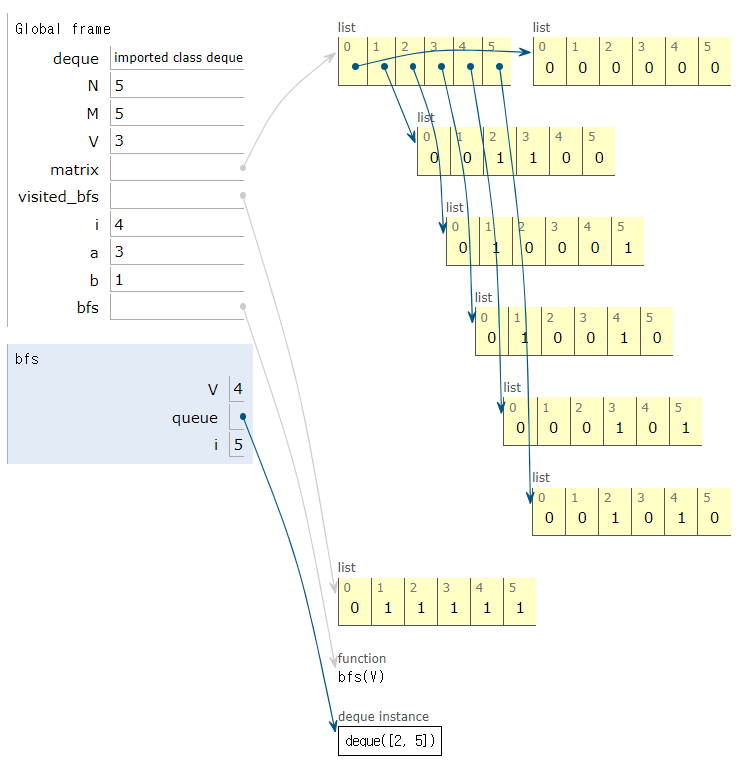

## DFS(깊이우선탐색)

```python
from collections import deque

# n=정점개수, m=간선개수, v=탐색시작점
N, M, V = list(map(int, input().split()))

# 인접영행렬(그래프의 간선이 하나도 없는 빈 이차원 행렬)
matrix = [[0]*(N+1) for i in range(N+1)]

#방문한곳 체크기록할 리스트
visited_dfs = [0]*(N+1)

# 입력받는 값에 대해 영형렬에 1삽입(인접리스트생성)
for i in range(M):
  a,b=map(int,input().split())
  matrix[a][b]=matrix[b][a]=1

def dfs(V):
  visited_dfs[V]=1
  print(V,end=' ')
  #재귀
  for i in range(1, N+1):
    if(visited_dfs[i]==0 and matrix[V][i]==1):
      dfs(i)

dfs(V)
```

```python
입력값
5 5 3
5 4
5 2
1 2
3 4
3 1
3 1 2
```

```bash
(1) 탐색시작노드를 스택에 삽입하고 방문처리를 한다.
(2) 스택의 최상단 노드에 방문하지 않은 인접한 노드가 하나라도 있으면 그 노드를 스택에 넣고 방문처리한다. 방문하지않은 인접노드가 없으면 스택에서 최상단 노드를 꺼낸다.
(3) 더 이상 2번의 과정을 수행할 수 없을때까지 반복
```


### dfs(3)결과




## BFS(너비우선탐색)

```python
from collections import deque
# n=정점개수, m=간선개수, v=탐색시작점
N, M, V = list(map(int, input().split()))

# 인접영행렬
matrix = [[0]*(N+1) for i in range(N+1)]

#방문한곳체크기록할 리스트
visited_bfs = [0]*(N+1)

for i in range(M):
a,b=map(int,input().split())
matrix[a][b]=matrix[b][a]=1

def bfs(V):
#방문해야할 곳을 순서대로 넣을 큐
queue=deque([V])
visited_bfs[V]=1

    #큐안에 데이터없을때까지
    while queue:
    	V=queue.popleft()
    	print(V, end=' ')
    	for i in range(1, N+1):
        	if(visited_bfs[i]==0 and matrix[V][i]==1):
            	queue.append(i)
            	visited_bfs[i]=1
	        
bfs(V)
```

```python
입력값
5 5 3
5 4
5 2
1 2
3 4
3 1
3 1 2
```

```bash
(1) 탐색시작노드를 큐에 삽입하고 방문처리를 한다.
(2) 큐에서 노드를 꺼낸 뒤에 해당노드의 인접노드중에서 방문하지 않은 노드를 모두 큐에 삽입하고 방문처리한다.
(3) 더 이상 2번의 과정을 수행할 수 없을 때까지 반복한다.
```


### bfs(3)결과




### bfs(2)결과

